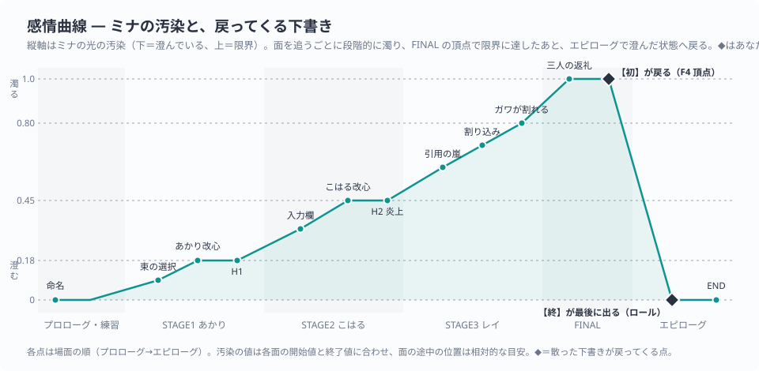

# 時系列 — 全編の出来事を順に並べた表

> **この記事の範囲**: 「ALGO: Refrain of Light」の物語全体を、起きる順に1本の表にまとめる。各場面の詳しい流れと台詞は各章の記事へ（→ [プロローグ](01_プロローグ.md) 〜 [エピローグ](07_エピローグ.md)）。伏線の対応は → [伏線と回収](08_伏線と回収.md)。

## 読み方

- 表は上から下へ、プレイで体験する順に並ぶ。物語は一本道で、ステージは [レイ](../04_キャラクター/03_レイ.md) → [あかり](../04_キャラクター/04_あかり.md) → [こはる](../04_キャラクター/05_こはる.md) → FINAL の順にしか進めない。
- 「浄化」は画面左の「救った人 ◯/3」に相当する。「汚染」は [ミナ](../04_キャラクター/02_ミナ.md) の光がどれだけ濁っているか（→ [ゲージと経済](../05_ゲーム仕様/03_ゲージと経済.md)）。
- 「Stay」は [少年](../04_キャラクター/01_少年.md) がダイブの前にミナへ言う合言葉。各行では「その場面で誰が言ったか／言わなかったか」を書く。
- 分岐（難易度・既読・無被弾の特別台詞・「はい／いいえ」）は行を分けず、備考に書く。

## 作中で語られる過去

物語が始まる前に起きていたこと。作中では順不同に、断片として明かされる。ここでは起きた順に並べる。

| 順 | 出来事 | 作中で明かされる場面 |
|---|---|---|
| 過去1 | 三年前の地区予選。最終問題を、レイは二十二分で解き、少年は二十三分かかった。少年が本気で負けた相手は、後にも先にもレイひとり。 | STAGE1 改心（少年の言葉がミナの声で中継される） |
| 過去2 | 少年はそれ以来、レイに本気で挑むのをやめた。レイは「本気で来てくれない」ことを抱え続ける。 | STAGE1 改心（レイ「なんで、あなたは、本気で来てくれないのよ!」／少年「ぼくが、本気で挑むのを、やめたから」） |
| 過去3 | 少年は幼なじみのあかりを、昔は「あかりちゃん」と名前で呼んでいた。いつからか「キミ」としか呼ばなくなった。あかりに傘を貸したままになっている。 | STAGE2 改心（あかり「いつから、あたしは……“キミ”に、なったの……?」）／エピローグの鍵アカウント（固定投稿「あかりちゃん、傘。貸したままだぞ。」） |
| 過去4 | 少年はミナを作るより前に、鍵のかかったアカウントに四行の英文を投稿した。四行の頭文字は M・I・N・A。あわせて「ミナへ。こはるを頼む。」と書き遺した。 | エピローグ（「最古の投稿 — ミナ誕生の、ずっと前の日付」） |
| 過去5 | 雨の交差点。あかりが「あのね、あたし——」と言いかけたところにクラクション。少年があかりを突き飛ばした。 | STAGE2 改心（ミナ「見えました。雨の交差点。言いかけた唇。『あのね、あたし——』。そして、クラクション。」）／エピローグ（「あの子を突き飛ばしたのが誰だったか、わたくしは、もう、聞くまでもありませんでした」） |
| 過去6 | 少年の信号が途絶える。起動記録に「0414」の日付が残る。以後、ミナに応えていたのは、少年が遺した声の記録だった。 | プロローグの起動ログ（一瞬だけ流れる）／エピローグ（同じ二行を再掲して気づく） |
| 過去7 | こはるの「お兄ちゃん」がいなくなった。こはるは「あの人のせいだ」と思いながら、帰ってこない兄のために夕食を作り続けている。 | STAGE3 中ボス（こはる「あの人さえ、いなければ……お兄ちゃん、いなくならなかった」）／STAGE3 改心 |

## 本編

| 順 | 場面 | 出来事 | 浄化 | 汚染 | 「Stay」 | 関係の変化 | 備考（分岐） |
|---|---|---|---|---|---|---|---|
| 1 | タイトル | 「はじめから」を選ぶ。 | 0/3 | — | — | — | 操作表示（キーボード／コントローラ）を選ぶ。 |
| 2 | プロローグ「起動」 | 起動ログが流れ、「[ M I N A ]」が点灯。少年が目覚めたAIに話しかける。 | 0/3 | 澄んでいる | — | 「作った張本人」と「口の減らない最高傑作」 | 起動ログに四行の英文と「0414」の行が一瞬だけ混じる。 |
| 3 | プロローグ | 少年が「MINA」と名付ける。由来を聞かれ「語呂がいいから、とか?」とはぐらかす。 | 0/3 | 澄んでいる | — | ミナ「気に入りました。MINA。わたくしの、名前。」 | — |
| 4 | プロローグ | 使命の提示。「X」のタイムラインの奥の心へ潜り、「その人が、ずっと聞きたかった一言」を届ける。少年自身は潜らない。 | 0/3 | 澄んでいる | — | ミナ「ずいぶん、都合のいい指揮官もいたものです。」 | — |
| 5 | プロローグ | 合言葉の初出。少年「Stay.」＝「いろ。そばに、いろ。いなくなるな」。 | 0/3 | 澄んでいる | 少年が言う（初出） | ミナ「……やっぱり、アホですね。」（口癖の初出） | 既にチュートリアルを受けた端末では、このあと受講確認（はい／いいえ）。 |
| 6 | STAGE0「れんしゅう」 | 真っ暗な場所で、少年が付きっきりで操作を教える。移動→光→低速→回避→ボム→浄化→やさしさ全開。 | 0/3 | 澄んでいる | 少年が言う「行こう、ミナ。——Stay。」 | 少年「ぼくは、ずっとここにいる。」 | タイトルの「チュートリアル」からも受けられる。 |
| 7 | ハブ（初回） | タイムラインにレイの投稿が「NEW」で出る。ほかは「LOCKED」。会話はない。 | 0/3 | 澄んでいる | — | — | — |
| 8 | STAGE1 難易度選択 | レイへダイブ。 | 0/3 | 澄んでいる | — | — | 難易度ごとにミナの一言が変わる（やさしい／ふつう／むずかしい／ルナティック）。 |
| 9 | STAGE1 導入 | 会場に到着。「飛んでくるのは“言葉”で本人ではない」「倒すのではなく奥の本人へ届ける」を確認。 | 0/3 | 澄んでいる | 少年が言う「Stay——だ。ちゃんと戻ってこいよ。」 | ミナ「はいはい、毎度どうも。」 | — |
| 10 | STAGE1 道中前半 | 世界中の「比べろ」「負けるな」の声を祓う。少年がレイの人となりを投稿一つで言い当てる。 | 0/3 | 澄んでいる | — | ミナ「たった一つの投稿で、そこまで。さすがですね、ご主人様。」 | — |
| 11 | STAGE1 中ボス | レイ本人が会場に現れ、一戦交えて奥へ去る。「逃げたら……承知しないんだから。」 | 0/3 | 澄んでいる | — | — | 全編で初めて中ボスを倒した場合、ここでステージを一時離れ、ショップの説明→強化ショップ→同じ面の続きに戻る。 |
| 12 | STAGE1 道中後半 | 無数の「目」が採点している。ミナ「……てっぺんは、こんなに寒いんですか。」 | 0/3 | 面が進むにつれ、ごくわずかに濁っていく（本人は気づかない） | — | 少年「だから——ぼくらだけは、点数をつけずに行くんだ。」 | — |
| 13 | STAGE1 ボス戦 | 「孤高のわたし」。『Q.E.D.』→『凡人の定理』→『敵などいない』→『孤高の王座』。終盤に安置リレー『最終選考』。 | 0/3 | わずかに濁る | — | — | 『最終選考』を無被弾で抜けるとレイ「……っ、合格。……なんて、言ってあげないんだから。」 |
| 14 | STAGE1 改心 | 少年の言葉がミナの声で中継される。三年前の地区予選、二十二分と二十三分。レイが泣く。「１位」の白飛びが暖色に戻り、「２位」が灯る。 | **1/3** | わずかに濁る | — | 少年「……ぼくのせいだ。」（初めての弱音） | — |
| 15 | STAGE1 クリア | レイの投稿が「次は、本気のあなたと。——逃げたら、承知しないから。」に変わる。ミナ「ねえご主人様。外の世界は、今日はどんな天気ですか。」シェイクスピア一度目 "All the world's a stage."。 | 1/3 | わずかに濁る | — | ミナは少年の的中を、初仕事で張り切っているのだと流す。 | — |
| 16 | ハブ（レイ後） | ミナが初めて投稿し、千を超えて伸びる。フォロワーが増える。 | 1/3 | わずかに濁る | — | ミナ「会ったこともない相手の手の内を、ぜんぶご存じでしたね。……お見事です。」 | 「返信」で一度だけレイ「は? 誰よあんた。」。以後の再訪では小話が抽選で入る。 |
| 17 | STAGE2 導入 | 少年があくびをし、考えごとをしている。あかりの投稿を見て「…………この人の、ところへ行こう。」 | 1/3 | 薄く濁っている | **言われない**。ミナ「それに、いつもの「Stay」も。」 | ミナ「あなた、今日はどこか、へん、ですよ。」 | — |
| 18 | STAGE2 中ボス | 教室に着いた直後、あかり本人が割り込む。「見て? 見てるよね? ね?」 | 1/3 | 薄く濁っている | — | — | — |
| 19 | STAGE2 道中 | 「ねえ見て」「すき」とすがりつく吹き出しを祓う。少年が「あかり」の名前と笑顔を口にして止まる。 | 1/3 | 薄く濁っている | — | ミナ「……ご主人様は、その“たった一人”を、知っているみたいに言うんですね。」 | — |
| 20 | STAGE2 ノート | 「すき」だけが並ぶノート。「一度も、渡せなかったんですね。」 | 1/3 | 濁りが増す（兆候） | — | 少年「だから——奥で、ちゃんと言わせてやるんだ。」 | — |
| 21 | STAGE2 ボス戦 | 「あふれるわたし」。『ねえ、こっち見て』→『すきって言って』→『ずっと一緒』→『離さない』。中盤に『雨の帰り道』で通路へ。 | 1/3 | 濁りが増す | — | — | — |
| 22 | STAGE2 改心 | 「いつから、あたしは……“キミ”に、なったの……?」ミナが雨の交差点を幻視。少年「————ぼくの声じゃ、だめなんだ。気づかれて、しまうから。」ミナの声で「——あかり。」 | **2/3** | 濁りが増す | — | ミナ「“キミ”……? ご主人様、これは——」 | — |
| 23 | STAGE2 クリア | あかり「……あったかい声が、した。……なんでかな、あの人の声に、似てた。」黒板の「あたしのせいだ」が「ありがとう」へ。ミナ「ご主人様。あなた——この人を、知ってるんですか?」「……即答までに、二秒かかりましたね。」シェイクスピア二度目 "Parting is such sweet sorrow."。 | 2/3 | 濁りが増す | — | ミナの疑いが言葉になる。 | — |
| 24 | ハブ（あかり後） | ミナの投稿。ミナ「ところでご主人様。今日はやけに、お声が遠くありませんか。電波、ちゃんと払っていますか。」直後に炎上。ミナ「数字が一万増えようが十万増えようが、届けるべき相手は、いつもたった一人です。それを、わたくしは見失いません。」 | 2/3 | 濁りが増す | — | 少年「…………そうか。」／「やっぱり、ぼくの最高傑作だよ。」 | 炎上により、次に潜る1面（通常は STAGE3）だけミナが弱体化する。「返信」で一度だけあかり「あなたの言い方、誰かに似てる。」 |
| 25 | STAGE3 導入 | 台所へ。少年の腹が鳴る。 | 2/3 | 兆候（前の面の終わりと同じ）→道中で広がる | **戻る**。少年「……ミナ。Stay——だ。」ミナ「今日は、ちゃんと言ってくれるんですね。」 | 少年「きみは、ぼくのそばにいてくれ。」 | 炎上が次に潜る1面に及ぶため、通常はここで「炎上中」。 |
| 26 | STAGE3 道中前半 | 空席だらけの食卓。「むだだ」と繰り返す声。少年が「……こはる。まだ、中学生だ。」 | 2/3 | 濁りが広がる | — | ミナ「……ご主人様。奥の子より——あなたのほうが、いまにも消え入りそうな声を、していますよ。」 | — |
| 27 | STAGE3 中ボス | こはる本人。無邪気な給仕から「……あの人のせいだ。あの人さえ、いなければ……お兄ちゃん、いなくならなかった。」がこぼれ、また無邪気に戻る。 | 2/3 | 濁りが広がる | — | — | — |
| 28 | STAGE3 ボス戦 | 「とまれないわたし」。『ぜんぶ食べて』→『のこしちゃだめ』→『じっとしてて』→『あたしがちゃんとするから』。中盤に『お残し禁止』。 | 2/3 | 濁りが広がる | — | — | 『お残し禁止』を無被弾・ボム無しで完食するとこはる「……ぜんぶ、食べてくれた。えらいね。……えらいね。」 |
| 29 | STAGE3 戦闘中の割り込み | 弾が止まり、画面が鈍色に沈む。ミナ「ねえ。あなたは——いったい、誰を、いなくしたんですか。」少年「……頼む。それだけは、聞かないでくれ。」声にノイズ。 | 2/3 | 濁りが広がる | — | ミナが核心を問い、少年が拒む。 | — |
| 30 | STAGE3 戦闘再開 | 戦いが再開する。終盤に『五徳の十字火』。こはる「うごかないでね。……火、つけるから。」 | 2/3 | 濁りが広がる | — | — | — |
| 31 | STAGE3 改心 | 少年の言葉がミナの声で「——怒りの下の悲しみを、ちゃんと、悲しんでいい。」少年「祈りは、ちゃんと——届いてた。」「明日のぶんは——……いや。たくさん、作ってやってくれ。」空席の箸の前で湯気が戻る。 | **3/3** | 危険域の手前 | — | ミナ「いまの……どなたに、おっしゃったんですか。」 | — |
| 32 | STAGE3 クリア | こはるの投稿が「ちゃんと食べてね。……あたしも、食べるから。」に。少年「もしぼくが寝坊して来られない日があったらさ。妹の様子でも、見ててくれよ。」ミナ「妹が、いらしたんですか。」ミナ「今日の空は、晴れていましたか。」（二度目）→ 少年「……悪い。今度、ちゃんと見ておくよ。」ミナ「……もう、聞きません。あなたが、聞くなと言ったので。」「三人分の祈りを、抱えてしまったので。……この重さくらい、わたくしが、持ちます。」 | 3/3 | 危険域の手前 | — | 「妹を頼む」を覚えておくと約束。 | — |
| 33 | ハブ（こはる後） | ミナの投稿「ちゃんと食べていますか。」十万を超える。ミナ「ねえご主人様。あなた、ちゃんと長生きしてくださいよ。わたくしの投稿、誰が読むんですか。」少年「縁起でもないことを言うな。……まあ、善処するよ。」タイムラインに **FINAL** のカードが出る。 | 3/3 | 危険域の手前（カードは「——汚染が、限界へ。」と告げる） | — | ミナ「最近、光が薄いので。」 | 「返信」で一度だけこはる「ありがと、知らない人。」 |
| 34 | FINAL 導入 | 「FINAL — いなくならないで」。ミナの声が壊れ、三人の投稿が変質して戻ってくる。自機は少年になる。 | 3/3 | **限界（黒く溶ける）** | — | 少年「今度は、ぼくが行く番だ。待ってろ、ミナ。」「きみは、ひとりじゃ、ない。ぼくが——……ぼくが、ここに、いる。」 | 中ボスも途中入口もない。 |
| 35 | FINAL ボス戦 | 「穢れたわたし」。三人の弾幕を混ぜた五つのスペル。背景がレイ→あかり→こはる→ミナ自身と巡る。 | 3/3 | 限界 | — | 少年「ミナ! いまだ、撃ち抜け!」 | — |
| 36 | FINAL 邂逅 | 少年「迎えに来た。」「ぼくはずっと、自分が行くのが怖かった。」 | 3/3 | 限界 | — | 役割の反転が言葉になる。 | — |
| 37 | FINAL「汚染」 | 話者名のない語りが始まる（ミナ）。少年「最高なんだよ、きみは。」シェイクスピア三度目 "Cowards die many times before their deaths."。 | 3/3 | 限界 | 少年「……Stay.」「って、いつも言ってたのにな。今日は——……ぼく、は、」 | — | — |
| 38 | FINAL「汚染」 | ミナ「Stay. ——ご主人様。あなたこそ、いなくならないで。」返事はない。「……いいでしょう。あなたが待てと言うなら——今度は、わたくしが、迎えに行きます。」「……ご主人様は、ほんとうに、アホですね。」＝最後の軽口。 | 3/3 | 限界 | **ミナが言う**（反転）。返事なし | 少年の声が尽きる。 | — |
| 39 | エピローグ | 「次の日、ご主人様は来ませんでした。」フォロー欄に救った三人が全員いた。 | 3/3 | 表示なし | — | ミナ（語り）「Xの闇を成敗するなどと言いながら、あの人が潜ったのは、最初から、自分の大切な人の心だけでした。」 | — |
| 40 | エピローグ 鍵アカウント | 固定投稿「あかりちゃん、傘。貸したままだぞ。」パスワードを選ぶ。 | 3/3 | 表示なし | **「stay」が正解** | — | 不正解を選ぶと「……違う。これは、ご主人様の言葉じゃない。」 |
| 41 | エピローグ 四行 | 最古の投稿。「ミナへ。こはるを頼む。」と、頭文字が M・I・N・A になる四行。「わたくしの名前は、最初から、ぜんぶだったのです。」 | 3/3 | 表示なし | — | ミナ「いなくならないって、書いたくせに。」 | — |
| 42 | エピローグ 独白 | 交差点の再構成。「——ええ。わたくしは、あなたの声で、できていますから。」起動記録の二行を開く。少年の三段に続く四度目のシェイクスピア（ミナの回収）"To thine own self be true."。 | 3/3 | 表示なし | — | 少年が最初からいなかったこと、応えていたのが遺された声だったことを知る。 | — |
| 43 | エピローグ DM・END | 「……今日は、晴れているそうです。どなたかの、空の写真で。」DM「ちゃんと食べていますか?」「——ええ、ご主人様。わたくしは、どこにも行きませんよ。」END。 | 3/3 | 表示なし | ミナが留まる（約束の成就） | 遺志を継ぐ。 | — |
| 44 | スタッフロール | 三人の「その後のタイムライン」。「そして、ミナへ。」「stay.」 | 3/3 | — | 「stay.」 | — | 終わるとタイトルへ戻る。ハブには戻らない。 |

## 感情曲線

物語は少年とミナの軽妙なやり取り（明るさ）と、喪失の影（重さ）のあいだを往復しながら進む。振幅は章を追うごとに深くなり、FINALの「Stay」の反転で最深部に達したあと、エピローグの結びで温かさへ戻る。

山と谷の対応は上の表の各行、仕込みと回収の関係は[伏線と回収](08_伏線と回収.md)を参照。

## 関連記事
- [プロローグ](01_プロローグ.md)
- [チュートリアル](02_チュートリアル.md)
- [STAGE1 レイ](03_STAGE1_レイ.md)
- [STAGE2 あかり](04_STAGE2_あかり.md)
- [STAGE3 こはる](05_STAGE3_こはる.md)
- [FINAL ミナ](06_FINAL_ミナ.md)
- [エピローグ](07_エピローグ.md)
- [伏線と回収](08_伏線と回収.md)
- [世界観](../02_世界観.md)
- [ステージ構成](../05_ゲーム仕様/04_ステージ構成.md)

<!-- 出典: build/wiki_work/02_script_dump.md §1-§10（再生順）, build/wiki_work/02_scene_chain.md §2, src/ReiRoot.cs / AkariRoot.cs / KoharuRoot.cs / MinaRoot.cs / Final.cs の SetContamination（汚染の段階）, src/Hub.cs DrawContaminationOverlay（段階名）, src/Epilogue.cs（DM の宛先）, build/wiki_work/01_canon_brief.md §3-1 / §5-2（作中で語られる過去の補完） -->
