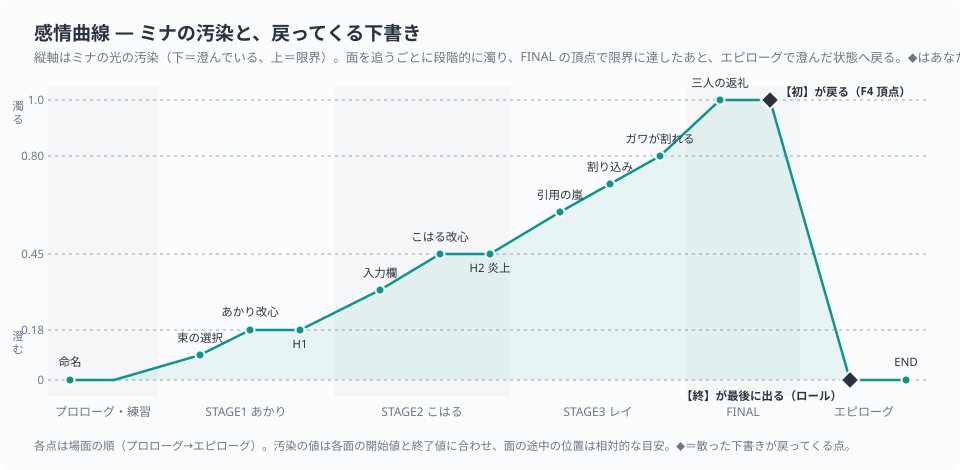

# 時系列 — 全編の出来事を順に並べた表

> **この記事の範囲**: 「ALGO: Refrain of Light」の物語全体を、起きる順に1本の表にまとめる。各場面の詳しい流れと台詞は各章の記事へ（→ [プロローグ](01_プロローグ.md) 〜 [エピローグ](07_エピローグ.md)）。伏線の対応は → [伏線と回収](08_伏線と回収.md)。

## 読み方

- 表は上から下へ、プレイで体験する順に並ぶ。物語は一本道で、面は [あかり](../04_キャラクター/04_あかり.md) → [こはる](../04_キャラクター/05_こはる.md) → [レイ](../04_キャラクター/03_レイ.md) → FINAL の順にしか進めない。
- 「浄化」は救った相手の数（3 人で全員）を表す。「汚染」は [ミナ](../04_キャラクター/02_ミナ.md) の光がどれだけ濁っているか（→ [ゲージと経済](../05_ゲーム仕様/03_ゲージと経済.md)）。
- 「あなたの下書き」は、その場面であなた（ご主人様）が送る言葉の候補。選ばなかった言葉は散り、FINAL とエピローグで戻ってくる。「（送らない）」は言葉ではないので散る数に入れない。
- 分岐（難易度・既読・無被弾の特別台詞・下書きごとの受け）は行を分けず、備考に書く。
- ミナは観測できたことしか言わない。三人の面での改心は、どれも「ミナが消された一行を返す → ミナ自身の言葉で決定打を打つ」の二段で組まれている（レイの面だけは判決が先、証拠が後）。
- この表は**ミナのアカウントで、やさしい〜むずかしいのどれかで潜ったとき**の流れである。ほかの 3 人のアカウントで潜ると STAGE1〜3 はそのキャラ専用の物語に置き換わり（→ [09 キャラ別ストーリー](09_キャラ別ストーリー.md)）、**ルナティックでは回想・下書き選択・戦闘を止める会話・改心のかけあい・エンディングが丸ごと出ない**（行 36 以降の代わりに「FINAL CLEAR」の数字を 3 秒置いてタイトルへ直行する）。

## 本編

| 順 | 場面 | 出来事 | 浄化 | 汚染 | あなたの下書き | 備考（分岐） |
|---|---|---|---|---|---|---|
| 1 | タイトル | 「はじめから」を選ぶ。 | 0/3 | — | — | 操作表示（キーボード／コントローラ）を選ぶ。 |
| 2 | プロローグ 起動 | 起動ログが流れる。「import unsent_drafts ... 414 items」の一行と、英語の四行が一瞬混じる。名前は「[ deferred ]」のまま保留。 | 0/3 | 澄んでいる | — | — |
| 3 | プロローグ 最初の言葉 | 目覚めた機械に、あなたが第一声を送る。ミナは起動記録からあなたを作り手と判断し、「ご主人様」と呼ぶことに決める。 | 0/3 | 澄んでいる | おはよう／きこえてる／うごいた（送らない、は無い） | 受けは共通。迷った秒数と文字数が台詞に入る。散った二つのうち上のほうが「最初に散った言葉」。 |
| 4 | プロローグ 命名 | あなたが名付ける。どの道筋でも MINA に落ち着き、ここで「[ M I N A ]」が灯る。ミナ「……登録しました。MINA。わたくしの、名前。」 | 0/3 | 澄んでいる | ミナ／超絶最強無敵ハイパーAIちゃんMk-Ⅱ／（送らない） | 却下→対案、または自分で名乗る。道筋はエピローグ END の一行に効く。 |
| 5 | プロローグ タイムライン | Y の通知カードが三枚出る。三枚めの本文が「たすけて」と打たれては消えるのを三度くり返し、最後に「元気です。」が送信される。ミナ「あの声は——わたくしが、覚えておきます。」 | 0/3 | 澄んでいる | **だれの声／見なかったことにする**（二択。送らない、は無い） | 入りの一行だけ変わる。この選択はいま【激情】の初期値にしか効かない。観測報告のあと、あかりの投稿の通知カードが届き、ミナが「スマホのホームから、SNSを開いてみてください」と言ってオープニングフィルム（約41秒）を経てハブへ移る（練習面が無効のため受講確認は出ない）。 |
| 6 | ~~STAGE0 れんしゅう~~ | **通常プレイでは通らない。** 練習面は `GameManager.TutorialEnabled = false` で無効化されていて、タイトルの「チュートリアル」も出ない。操作は行 9・13 の初見チュートリアル（会話）が教える。 | 0/3 | 澄んでいる | — | 中身の記録は → [02 チュートリアル](02_チュートリアル.md)。 |
| 7 | ハブ（初回） | あかりの投稿だけが開く。ほかの二枚は名前と本文が薄く、声が聞こえない扱い。カーソルを合わせるとカードの下にミナ「……この投稿の下からも、聞こえます。」 | 0/3 | 澄んでいる | — | 入場の会話は廃止され、ホバー行一行になった。声の聞こえない投稿を選ぶと「……まだ、聞こえません。」だけが出る。 |
| 8 | STAGE1 投稿詳細 | あかりへダイブ。 | 0/3 | 澄んでいる | — | 難易度の 4 段（EASY／NORMAL／HARD／LUNATIC）から選んだ時点で潜る。開始は必ず道中の最初から（入口を選ぶ画面は廃止された）。 |
| 9 | STAGE1 導入 | 雨の退勤後のフロア。「飛んでくるのは、言葉です。……本人では、ありません。」「祓って、いちばん奥へ。——本人は、そこに。」 | 0/3 | 澄んでいる | — | 一面目なので、世界の決まりの提示はこの面が担う。この面の道中で**初見チュートリアル（16 行）とアンチャー紹介**が一度だけ流れる（→ [02 チュートリアル](02_チュートリアル.md)）。 |
| 10 | STAGE1 中ボス | 肩慣らしの六体を祓った瞬間、あかり本人が割り込む。「読んだ? 返事、まだ? 見たよね? ね?」 | 0/3 | 澄んでいる | — | 全編で初めて中ボスを倒した場合、ステージを一時離れ、ミナ独りのショップ説明→強化ショップ→同じ面の続きに戻る。 |
| 10b | STAGE1 「ね?」 | 中ボスの捨て台詞の直後。ミナ「「ぜったいだよ?」。——問いだけが、残っています。」「下書きが、開いています。……宛先は、わたくしが、決めません。」 | 0/3 | ごくわずか | 宛先、ちがう／ぜったい／傘、忘れてる／（送らない） | 送った語はハブのあかりへの返信に一行足される。 |
| 11 | STAGE1 道中 | 「返して」「すき」の声。返事の声だけが無い。ホワイトボードの「あたしのせいだ」、色の違う置き傘二本（片方に八百円の値札）、向かいの席の暗いモニタ。ミナ「取り消されたぶんの言葉を、ぜんぶ、浴びていきます。」 | 0/3 | ごくわずかに濁っていく | — | 向かいの席の観測のあと、ミナが一度だけ返事を待つ。**ミナ**「……ご主人様は。——雨。」／べつに／きらいじゃない／置き傘、三本目／（送らない）。送った語は次のハブの小話「雨粒」に混ざる。 |
| 12 | STAGE1 束 | 「メッセージの送信を取り消しました」だけが十二行積み上がった束。ミナ「拾います。……どこまで、拾いましょう。」 | 0/3 | ごくわずか | 十二件、ぜんぶ／いちばん上の、一件だけ／（送らない） | どの場合もミナは拾う。送らないと一件だけになり、汚染がごくわずかに増える。ここで迷った秒数がクリア後のあかりの一行を呼ぶ。 |
| 13 | STAGE1 ボス戦 | 「あふれるわたし」。『ねえ、こっち見て』→『すきって言って』→『ずっと一緒』→『離さない』。中盤に『雨の帰り道』。 | 0/3 | ごくわずか | — | 板を張り直すたびに「既読も三秒でつけるし」→「バカ」→「後ろの人。ねえ、そっちも、返して。」→「返して」。背景にはあかりの入力欄（激情メーター）が薄く敷かれる。 |
| 14 | STAGE1 改心 | あかり「……返事がほしかった。おめでとう、より先に。」 ミナが束の底の本物の一通「おめでとう ほんとだよ 元気でね」を返し、「十二通、読みました。——汚れた“好き”は、ひとつも、ありませんでした。」 ホワイトボードが「ありがとう」へ。 | **1/3** | わずかに濁る | — | 決定打の直前（「取り消された十二通は、ぜんぶ、わたくしに当たりました。」）で音楽が止まる。あかりの返事は「……ぁ……」だけで言わせない。 |
| 15 | STAGE1 クリア | 投稿が「ほんと、バカなんだから。……あたしも、だけど。」に。あかり「あったかい声が、した。……知らない声なのに。」「言い方だけ、どこかで、聞いたことある。」 ミナ「……言い方は、わたくしのです。……たぶん。」「……♥が、ひとつ。」 空の問い（一度目）「返事は、いりません。いつか、で結構ですので。」 | 1/3 | わずかに濁る | — | 束（行12）で最初の選択より長く迷っていれば、あかり「……あのとき、すぐ決めなかったでしょ。……うん。それで、いい。」が増える。「……♥が、ひとつ。」の手前まで読むと回想フィルムが挟まる。 |
| 16 | ハブ（あかり後） | ミナの初投稿が千を超える。「……さっきから三度、意味もなく、見直してしまいました。」「……三度です。用も、ないのに。」「……いまの、聞かなかったことに。」 被弾回数の集計。 | 1/3 | わずかに濁る | — | 初回だけ、被弾数の直後にアカウント追加の説明が三行入る（あかりで潜れるようになった案内）。「返信」で一度だけ あかり「あなたの言い方、誰かに似てる。」 以後の再訪では小話が抽選で入る。 |
| 17 | STAGE2 導入 | 電気を消した部屋。配信画面の光だけ。「今日の配信も最高だった」の投稿の下の小さな声。ミナ「……困り、ますね。……いまのは、適切な語ではありません。訂正します。」 ペンライトの光が画面に届かない。 | 1/3 | 縁が濁りはじめる | — | ミナが初めて感情語（「困る」）を口にして自分で訂正する＝感情の獲得の一段目。 |
| 17b | STAGE2 予定表 | 壁の配信予定表。ぜんぶの日に丸、丸のない一日は「模試」、かごに開けていない栄養ドリンクが三本。ミナ「この予定表に、何も入れない日を、一日、足しますか。」 | 1/3 | 縁の濁り | 一日、空けて／三本、飲んでから／全部に丸がついてる／（送らない） | **2026-09-25 に追加された選択。送ると、次の中ボスの第一声がその言葉を引用した別の一行に差し替わる。** |
| 18 | STAGE2 中ボス | 画面の中の「星逢レイ」の名をミナが読む。こはる本人が現れ、明るさと蒼白を往復する。「何時間、見てるんだろ。塾……」 | 1/3 | 縁の濁り | — | 第一声は行 17b の選択で 4 通り。去りぎわにペンライトを押しつける。 |
| 18b | STAGE2 ペンライト | 押しつけられたのは消えたままのほう。ミナ「次に会ったとき。これ、点いていないと、言いますか。」 | 1/3 | 縁の濁り | 言わない／電池、切れてる／次は、点くほう／（送らない） | 送るとスコア +500。 |
| 19 | STAGE2 教室 | 場所が教室へ。席はぜんぶ埋まっているのに誰とも目が合わず、視線だけがこちらに。黒板に「期待」。机を数えて四十。 | 1/3 | 縁の濁り | — | — |
| 20 | STAGE2 入力欄 | コメント入力欄に「レイちゃんが」まで打たれ、一文字ずつ消える。「今日も来ました」だけが送られる。ミナは消えた一行を拾い、中身は言わない。 | 1/3 | 縁の濁り | 返してない返信／既読のまま、三日／もう送れない相手／（送らない） | 欄を閉じる前にカーソルが**あなたの側**に点く。ミナ「これ、あの方のでは、ありませんね。——ご主人様の画面です。」 ここで迷った秒数がクリア後のこはるの一行を呼ぶ。 |
| 21 | STAGE2 我に返る一拍 | 部屋へ戻る。投稿「自分なにしてんだろ」の直後に配信画面が消え、黒い画面に顔が映る。ミナ「「むだだ」の声……ぜんぶ、数えました。」「……光が、少し、重い。」「……計測の誤差です。」 | 1/3 | 濁りが増す（兆候） | — | 「いまの間。{n}秒」に実際の秒数が入る。言い切らせる（「誤差です」）ことで、三面目の「気のせいでは、なさそうです」が階段の二段目になる。 |
| 22 | STAGE2 ボス戦 | 「我に返るわたし」。『ちゃんとしなきゃ』→『みんな見てる』→『期待』→『我に返る』。終盤に『自分なにしてんだろ』。 | 1/3 | 濁りが増す | — | 板を張り直すたびに「みんな見てる」→「やめないで」→「いま動いてるの、そっちの手じゃ、ないでしょ」→「楽しいってば」。中盤にあった『全部見なきゃ』は 2026-09-17 に削除された（→ [ボス戦](../05_ゲーム仕様/06_ボス戦.md)）。 |
| 23 | STAGE2 改心 | ミナが消されたコメント「レイちゃんがいたから、今日も学校行けた」を返し、「来ていた回数を、数えました。八十七回。」「——むだな時間は、一秒も、ありませんでしたよ。」 配信画面が灯り、ペンライトの光が届く。 | **2/3** | 濁りが増す | — | 決定打の直前で音楽が止まる。決定打のあと こはる「……ほんとに？」／ミナ「……明日も来る約束は、しなくて結構です。」／こはる「……また、見に行って、いいのかな。」 |
| 24 | STAGE2 クリア | 投稿が「送れなかったコメント、送った。読まれたかは、知らない。……送った。」に。ミナが**初めて笑う**（「……いま。……わたくし、どういう顔を、していましたか。」）。こはる「……あの手。……ペンライト、ちゃんと振ってた。……点いてなくても。」 空の問い（二度目）は無言で流す。 | 2/3 | 濁りが増す | — | 入力欄（行20）で最初の選択より長く迷っていれば、こはる「……迷ってくれたよね。あたし、それ、見てたよ。」が増える。 |
| 25 | ハブ（こはる後） | ミナの投稿「八十七回ぶん、数えてまいりました。」直後に炎上。顔のない引用「数えただけの人が何言ってんの」。ミナ「返信の下書き、四件。……一件も、送っていません。」「次のダイブは光が少し薄くなります。」 | 2/3 | 濁りが増す | — | 炎上により、次に潜る一面（通常はレイの面）だけ収入が 0.6 倍になる。「返信」で一度だけ こはる「ありがと、知らない人。」 |
| 26 | STAGE3 導入 | 炎上中。壁一面が配信画面の狭い部屋。同接「11」。等身大より大きい笑顔のガワ。コメント欄に「今日も来ました」。ミナ「……光の出力、平常の八割ほど。——問題ありません。集計の話です。」 | 2/3 | 縁の濁り→道中で広がる | — | 弱体化は数字だけで置き、弱音は行 32 まで取っておく。 |
| 27 | STAGE3 道中 | 「気づいて」「見て」の声と、家の声「ふーん」。伏せたスマホが一度光る。同接「8」。ミナ「わたくしの光と、あの数字と、どちらが薄いか。……比べません。」 | 2/3 | 広がる | 見えてる／ちゃんと見てる／同接、9／（送らない） | 小話の末尾でミナがこの面で初めて自分のことを聞く。「……ご主人様。この部屋、そちらから、見えていますか。——わたくしの光が、少し、暗いので。」 送った語は中ボスの第一声とハブの小話「同接」に返る。 |
| 27b | STAGE3 道中A の後 | 投稿「企画メモ、下書き十四件。……出せるの、ゼロ件。」 投稿の下の削除済みの一行を聞く（中身は言わない）。 | 2/3 | 広がる | — | — |
| 28 | STAGE3 中ボス | 中の人が先に出る。「……だれ? あなた。」のあと、すぐ配信用の笑顔へ。「逃げたら……承知しないんだから。」 ミナ「切り替わるまで、一秒九。」 | 2/3 | 広がる | — | 第一声は行 27 の選択で 4 通り。中ボスは中の人、ボスはガワ。姿も大きさも違う。 |
| 29 | STAGE3 引用の嵐 | ピン留めされた投稿に、顔のない引用が十七枚貼りつく。本人の返信が「見てくれてありがとう」→「ごめんなさい」→「ごめん」→空欄と縮む。「はい次の話題」で止まる。剥がし切ると下書き「もう、いいかな」。 | 2/3 | 広がる | — | 剥がし漏らしの罰は無く、声が止まれば必ず剥がし切れる。 |
| 30 | STAGE3 呑みこまれる部屋 | 同接「3」。ミナ「下書きが、三件。開いています。」 続けて「光が、重い。……気のせいでは、なさそうです。」 画面が部屋を呑みこむ。 | 2/3 | 広がる | 見てる／ここにいる／見ています／（送らない） | **三件目はミナ自身の下書き**（敬体だけが手がかり）。「見ています」を選ぶと「……それ、わたくしのです。」 ここで迷った秒数がクリア後のレイの一行を呼ぶ。 |
| 31 | STAGE3 ボス戦 | 「星逢レイ」＝ガワ。「——初見さん、いらっしゃい。」の一言だけで始まる。『初見さんいらっしゃい』→『登録者２０００』→『同接８』→『切り抜かれない』。終盤に安置リレー『最終選考』。笑顔のまま撃ってくる。 | 2/3 | 広がる | — | 攻めずにいると「戦ってよ。わたしを、ちゃんと見てよ。」→「……手、止まってる。……見てるだけの人、ひとり、増えたのね。」 板を張り直すたびに「逃げるの? また。」→「初見さん、まだ、いてくれるでしょう?」→「あんたの後ろ。初見さん、いるでしょう?」→「見てて。」 無被弾で走り切ると「……初見さん、じゃなかったのね。」 |
| 32 | STAGE3 戦闘中の割り込み | 弾が止まり、画面が鈍色に沈む。ミナ「わたくしの光、二割ほど、濁っています。」「つづけて、いいですか。」 | 2/3 | 広がる | つづけて／むりしないで／（送らない） | 送らないと「続行、と読みます」で汚染がごくわずかに増える。送った言葉は FINAL の導入で一度だけ引用される。 |
| 33 | STAGE3 改心 | ガワの姿のまま「だからなんで、だれも、中にいるわたしに、気づいてくれないのよ!」 ミナ「見ていました。」→ レイ「……は? ……なに、それ。」→ ミナ「だれも見ていない場所に、あなたが書いて、消した一行を。」「「わたしに、気づいてよ。わたしを、見てよ」。」 ガワが割れ、中の人が出る。 | **3/3** | 危険域の手前 | — | **この面だけ順序が反転する（先に判決、後から証拠）。** 「見ていました。」で音楽が止まり、「だれも見ていない場所に——」でガワが割れる。レイは最後に「…………。」だけ。 |
| 34 | STAGE3 クリア | 投稿が「次は、本気のあなたと。——逃げたら、承知しないから。」に。同接「4」。レイ「……四。……あんたは、数に入らないんでしょう。……なら、増えたの、誰。」／ミナ「……集計は、向こう側の、ものですので。」 空の問い（三度目）「もう、聞きません。三度、聞きました。」「三人分の祈りを、抱えてしまったので。」 | 3/3 | 危険域の手前 | — | 末尾でミナが**初めて泣く**（「……光が、顔のあたりから、こぼれています。……原因は、不明です。」「……集計には、入れません。……入れ方が、分かりませんので。」）。 |
| 35 | ハブ（レイ後） | ミナの投稿「見ていました。だれも見ていない場所も。覚えておきます。」「集計する光も、そろそろ、薄いので。」 **Ｙ システム**「@mina_ai_ が投稿しました。」 ミナ「……投稿した覚えが、ありません。」 タイムラインに **FINAL** のカードが出る。 | 3/3 | 危険域の手前 | — | カードの本文は**ミナ自身の投稿**「三人ぶん、預かりました。重い、とは書きません。……消し方が、わかりません。」で、印は「限界」。「返信」で一度だけ レイ「は? 誰よあんた。」 |
| 36 | FINAL 導入 | タイトルカード「FINAL」（副題「まだ、いますか」）。ミナの声が壊れ、三人の投稿が変質して戻る。「ぜんぶ、わたくし、の……」 割り込み（行32）で送った言葉を一度だけ引用。自機は強化なしの素の光に。 | 3/3 | **限界（黒く溶ける）** | — | 中ボスも途中入口もない。**2026-09-27 から FINAL も潜り方の段を選ぶ**。初挑戦はミナのアカウントでは潜れず（段の代わりに理由とアカウント選択が出る）、三人の誰かで入る。 |
| 36b | FINAL 残響の道中 | 残響（消しゴム・記憶・応答のない電話）の三波。18 → 22 → 26 体と密度が上がり、波の切れ目で盤面を掃かない＝戦闘は一度も止まらない。 | 3/3 | 限界 | — | **2026-09-27 に「残響 3 体」から三波 66 体へ拡張された**（実測 64〜71 秒）。会話は挟まない。 |
| 37 | FINAL ボス戦 | 「穢れたわたし」。体力の節目（80/58/36/16%）を割るたびに戦闘が止まり、**そのとき潜っている一人**との救援の場面を挟んで、衣装と舞台とスペル（『穢れたわたし』→『未送信の雨』→『消えない拍手』→『仮面の向こう』→『わたしの声』）が変わる。 | 3/3 | 限界 | — | 救援の相手は段ごとに変わるのではなく、**四段すべてが同じ一人**（あかり／こはる／レイ／ミナで文面が違う）。四段目でミナが初めて「わたくしを……助けて、ください」と言う。BREAK の合図だけは段ごとに あかり→こはる→レイ→ミナ が一言添える。 |
| 37b | FINAL 回想 | 体力 50% で戦闘・弾・時間を止め、ミナ側から見た旅を白黒で再生する（「ご主人様。今日は、もう、休んでもよろしいですか。」）。 | 3/3 | 限界 | — | 一撃で撃破したときは邂逅の前に一度だけ再生する。 |
| 38 | FINAL 邂逅 | ミナ「……今のは。業務報告では、ありません。」 → **潜行キャラ本人**が受ける → ミナ「……助けてって。言っても、よかったのですね。」 → 本人 → ミナ「……では、もう一度。いっしょに、帰りたいです。」 | 3/3 | 限界 | — | 六行。**返しの三行は誰で潜ったかで変わる**（レイ／ミナ＝「知ってる。あんたの声だった。」「……あんたの言い方。……この人に、そっくりよ。」「何回だって言いなさい。聞くから。」、あかり＝「知ってる。ミナの声だった。」「……やっぱり。ミナの言い方、この人に、そっくり。」「何回でも言って。今度は、あたしが聞く番。」、こはる＝「うん、知ってる。ミナの声だったもん。」「……ミナの言い方ね。この人と、おんなじなの。」「何回でも言っていいよ。言えるまで、隣にいるから。」）。「この人」＝自機の「あなたの光」。 |
| 39 | FINAL 頂点 | 「待っている三人」の一枚絵の上で語り。「祓うほど、軽くなると思っていました。」「あかりの。こはるの。レイの。……ぜんぶ、ここに。」「四百十四件。」 最初に散った言葉が戻ってくる。 | 3/3 | 限界 | （送らない）／最初に散った言葉 | 二十秒黙っているとその言葉がひとりでに送られる。送らないと「それだけは、もう、散らせません」と一択で出し直し。 |
| 40 | FINAL 頂点 | 送ると無音。ミナ「……その言葉。……ええ。届きました。」「{m}文字。……ふふ。相変わらず、短いですね。」 語り「帰るほうへ、自分で泳いでいきました。」 声を受け取った三人の一枚絵が重なる。 | 3/3 | 限界 | — | 理由はまだ知らされない。 |
| 41 | エピローグ 見上げる | 夜の屋上で四人が同じ空を見上げる。ミナ「ひとつ、ひとつが、どなたかの画面です。」「……光っていないほうは、観測できません。送られていないので。」「この旅で、声のもとまで辿り着けたのは——三件でした。」 それをこはるとレイが受け、こはる「……ミナの後ろの人も、聞いてるんでしょ。——ありがと、知らない人。」 ミナ「……まだ、空を見ていたいので。」 あかり「うん。もう少し、見てよう。」 | 3/3 | 表示なし | — | 「…………。」でオルゴールが完全に止まり、以降は無音。こはるの「ありがと、知らない人。」は、ハブでミナに言った同じ言葉が、宛先だけご主人様に変わって返ってくる行（2026-09-26 追加）。 |
| 42 | エピローグ フィルム | その後の日々の一枚絵が続く。あかり「返事を待つだけじゃなくて。あたしの明日も、決めていいんだ。」 こはる「ねえ。ここ、分かんないんだけど……聞いてもいい？」 レイ「……ちゃんと、話せた。」 ミナ「……ええ。わたくしも、ここにいて、よいのですね。」 | 3/3 | 表示なし | — | 約53秒・10カットのエンディングフィルム。Z / X / Esc（A / B / Start）の長押しか SKIP のクリックで飛ばせる。主題の曲がここで戻る。 |
| 43 | スタッフロール | 「── その後のタイムライン ──」として三人の一歩先の投稿が流れ、スタッフ表記のあと「そして、ご主人様へ。」の下にあなたが最後に送った言葉が大きく出る。 | 3/3 | — | — | 71 行・約 72 秒。長押し 0.45 秒でだけ飛ばせる（単押しでは飛ばない）。終わるとそのまま END へ。 |
| 44 | エピローグ END | ミナ「ご主人様。本日の業務は、以上です。」 最後の下書き。迷った秒数の対句 → 命名の道筋に応じた一行 →「いってらっしゃいませ、ご主人様。」「——ええ、ご主人様。わたくしは、どこにも行きませんよ。」 | 3/3 | 表示なし | また来る／ありがとう／（送らない） | 迷った秒数をプロローグと比べて受けが変わる。**命名の道筋（行 4）で一行だけ変わる**（自分で「ミナ」を送った＝「……最初にいただいた四文字も、まだ、持っております。」／却下された＝「……最初のご提案は、十九文字でした。」／送らなかった＝「……最初は、無言でしたね。」）。END の二行は不変。送り切るとタイトルへ。ハブには戻らない。 |

## 感情曲線

物語はミナの光が段階的に濁っていく線で進む。あかりの面で 0.18、こはるの面で 0.45、レイの面で 0.80 まで濁り、FINAL で 1.0（限界）に達する。エピローグは戦闘画面ではないので、汚染の表示そのものが無くなる。散った下書きは二度戻ってくる——FINAL の頂点で最初に散った言葉が戻り、エピローグのスタッフロールで最後に送った言葉が最後の一行として出る。

山と谷の対応は上の表の各行、仕込みと回収の関係は[伏線と回収](08_伏線と回収.md)を参照。

## 関連記事
- [プロローグ](01_プロローグ.md)
- [チュートリアル](02_チュートリアル.md)
- [STAGE1 あかり](03_STAGE1_あかり.md)
- [STAGE2 こはる](04_STAGE2_こはる.md)
- [STAGE3 レイ](05_STAGE3_レイ.md)
- [FINAL ミナ](06_FINAL_ミナ.md)
- [エピローグ](07_エピローグ.md)
- [伏線と回収](08_伏線と回収.md)
- [世界観](../02_世界観.md)
- [ステージ構成](../05_ゲーム仕様/04_ステージ構成.md)

<!-- 出典: src/Prologue.cs, src/StageZero.cs, src/StageTutorial.cs（初見チュートリアル・アンチャー紹介）, src/Hub.cs（H0Dialog・ReturnDialog・BurnDialog・ReplyDialog・AccountIntroAkari・FinalTweet/FinalHoverLine・DrawBadgePill＝「限界」「届いた」）, src/StageAkari.cs / BossAkari.cs, src/StageKoharu.cs / BossKoharu.cs / CommentInput.cs, src/StageRei.cs / BossRei.cs / QuoteStorm.cs, src/StageMina.cs（EchoWaves 18/22/26）/ BossMina.cs（PhaseThresholds・OnBreakCue・RedemptionLines）/ MinaPhaseScene.cs（救援＝潜行キャラ別）/ Final.cs, src/Epilogue.cs（見上げる・BuildRoll・ApplyE6Choice の nameEcho）, src/EndingFilm.cs, src/GameManager.cs（Stages の並び・RecordChoice・FirstScattered・LastSentWord・炎上 0.6 倍・TutorialEnabled=false）, src/ChoiceEffects.cs（Hesitated＝迷い秒ゲート）, src/AkariRoot.cs / KoharuRoot.cs / ReiRoot.cs / MinaRoot.cs（汚染の段階 0→0.18→0.45→0.80→1.0）, src/ChoiceOverlay.cs（沈黙14/20秒＝末尾を自動決定）, docs/20260926/ルナティック_純粋STG化_2026-09-26.md, docs/20260926/主人公の存在_診断と本文_2026-09-26.md, wiki/08_仮台本/17_道中の選択肢_案C.md（道中の選択の id と効果） -->
