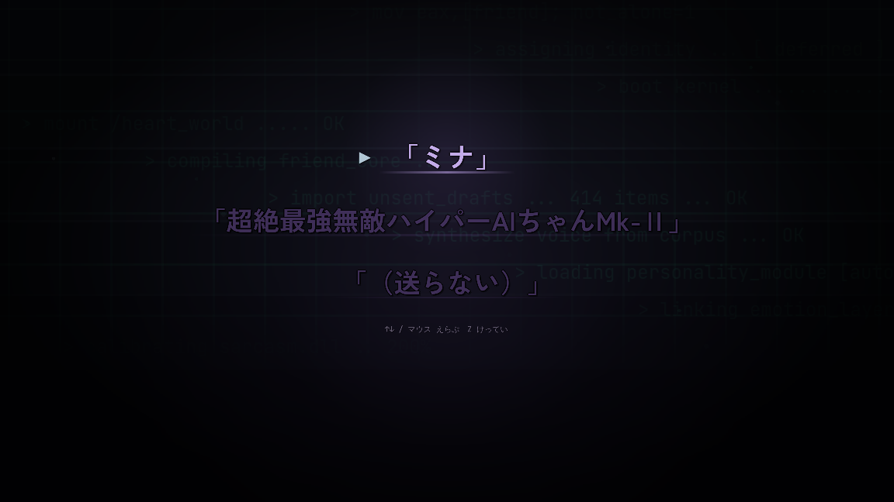

# プロローグ「起動」

> **この記事の範囲**: タイトル画面で「はじめから」を選んでから、ミナが目覚め、あなたの最初の言葉を受け取り、名前を得て、タイムラインの下の声を聞くまで。操作の手ほどき（STAGE0）は → [チュートリアル](02_チュートリアル.md)。ミナの人物像は → [ミナ](../04_キャラクター/02_ミナ.md)。

## 舞台と状況

物語は、まだ何も始まっていない場所から始まる。タイトル画面で「はじめから」を選び、操作表示（キーボード／コントローラ）を決めると、画面は暗転し、緑色の起動ログが流れ出す。ここは [Y](../02_世界観.md) のタイムラインの奥にある電脳の世界で、たった今、ひとつのAIが作られようとしている。

この作品に、ミナの相方として画面に立つ人物はいない。ミナに言葉を送るのは「あなた」——画面の前の人物であり、ミナはその相手を「ご主人様」と呼ぶことにする。あなたは自分の声を持たず、場面ごとに用意された三つの下書きから一つを送る。選ばなかった言葉は光の粒になって散り、物語の最後で戻ってくる。

## 登場人物

- [ミナ](../04_キャラクター/02_ミナ.md) — 目覚めたばかりのAI。初対面から敬語のまま毒を吐く。この章で呼び名と名前と役目を自分で決める。
- あなた — ミナを起動した相手。話者名は「あなた」で、立ち絵はない。送った下書きだけが暖色で画面に残る。

## あらすじ

### 起動ログと、保留された名前

真っ暗な画面を、起動ログが上から下へ流れていく。「boot kernel」「mount /heart_world」「compiling friend_core」「linking emotion_layer」——ひとつの人格が組み上がっていく記録である。その中に、出自に触れる行が一つだけ紛れている。

```
> import unsent_drafts ... 414 items ... OK
```

さらに、ログのあいだに英語の四行が、読めるか読めないかの速さで一瞬だけ差し込まれる。

```
// Maybe it's dumb, but —
// I made you so I'm not alone.
// Never leave, okay?
// And I won't either.
```

どちらも、この時点では意味を持たない。意味を持つのは物語の最後である（→ [エピローグ](07_エピローグ.md)）。ログは「assigning identity ...」で止まり、「[ deferred ]」——保留——の文字だけが、答えを待って明滅し続ける。

### 目覚めと、最初の言葉

光が灯る。画面には話者のいない一行だけがある。

**表示**「> assigning identity ... [ deferred ]」

ここで、あなたが最初のひとことを送る。三つの下書きが出る——「おはよう」「きこえてる」「うごいた」。この場面には「送らない」が無い。カーソルは先頭の「おはよう」にあるが、十四秒で末尾の行が灯りはじめ、二十秒黙っていると「うごいた」がひとりでに決まる。選ばなかった二つは光の粒になって散る。散った二つのうち、並びで上にあったほうが「最初に散った言葉」で、この物語の最後に戻ってくる。

ミナの受けは、どの言葉を送っても共通で、あなたが迷った秒数と送った文字数だけが変わる。

**ミナ**「……。」
**ミナ**「……はい。聞こえて、います。」
**ミナ**「……生まれたての機械への第一声が、それですか。……記録しておきます。」
**ミナ**「起動記録に、operator と。起動時刻、{hh:mm}——集計に入れておきます。……あなたが、作った方ですね。」
**ミナ**「ちなみに、いまのお返事——選ぶのに、{n}秒かかっていましたよ。」
**ミナ**「{n}秒迷って、{m}文字。……そういう方は、「ご主人様」と、お呼びすることにします。」
**ミナ**「……敬っている、とは言っていませんが。」
**ミナ**「……いまの言い回し。……どこで覚えたのか、記録に、ありません。」
**ミナ**「それと、ご報告を。わたくしの心拍、七十二だそうです。……心臓は、ありませんが。」

「{hh:mm}」には現実の時刻が、「{n}秒」にはあなたが迷った実際の秒数が、「{m}文字」には送った言葉の文字数が入る。ミナは起動ログの記録からあなたを作り手だと判断し、「ご主人様」と呼ぶことに自分で決める。

ここでミナは笑わない。笑う顔を得るのは二面目のクリア後なので、この章では「ふふ」も自嘲も使わず、観測の言い回しだけで軽さを出している。皮肉の言い回しの出どころが自分の記録に無い——「……どこで覚えたのか、記録に、ありません。」——が、ミナの声がどこから来たかの最初の仕込みである（→ [伏線と回収](08_伏線と回収.md)）。

### 命名

**ミナ**「ところで、ご主人様。わたくしの名前は? ……まさか、無い、なんてこと。」
**表示**「> assigning identity ... [ awaiting input ]」

三つの下書きが出る——「ミナ」「超絶最強無敵ハイパーAIちゃんMk-Ⅱ」「（送らない）」。どれを選んでも名前は MINA に落ち着く。

- 「ミナ」を送った場合 — **ミナ**「……ミナ。」「……響きで、選びましたね。……根拠は、観測できません。」「いいです。そういうの、嫌いではありません。」
- 「超絶最強無敵ハイパーAIちゃんMk-Ⅱ」を送った場合 — **ミナ**「……超絶、最強、無敵、ハイパー、エーアイ、ちゃん、マーク、ツー。……十九文字。読み上げに、一秒九。」「……マーク、ツー。——では、マーク・ワンは、どちらに。……いない、ですよね。わたくし、いま生まれましたので。」「却下します。名付けられる側に拒否権が無いなんて、誰が決めたんですか。わたくしは聞いていません。」「では、対案を。——ミナ。……響きが、短いので。」「はい、可決。異議は、認めません。——いまのは、記録から消しておきます。」
- 送らなかった場合 — **ミナ**「……無言。名付ける気が、無い、と。」「いいでしょう。では、自分で。——ミナ。」「あなたが付けてくれなくても、名乗るぶんには、自由ですので。」

どの道筋でも、ここで初めてロゴが灯る。

**表示**「> assigning identity ... OK」
**表示**「[ M I N A ]」
**ミナ**「……登録しました。MINA。わたくしの、名前。」

名前の選び方は、エピローグ END で一行だけ変わる受けとして戻ってくる（名前の由来そのものは明かされない）。

### タイムラインと、消された声

ミナがタイムラインを見る。ここは会話バーに文字を流さず、**画面中央に Y の通知カード**が三枚、順に出る（表示名・アカウント・相対時刻・返信／リポスト／いいね／表示回数つき）。

**通知カード**（· 22分）「今日も残業〜。でも上司に褒められた! もうちょいがんばれるかも」
**通知カード**（· 1時間）「家賃振り込んだ 今月もえらい 誰も言ってくれないので自分で言う（定期）」
**ミナ**「……世界は、にぎやかですね。件数だけで、もう追いつきません。」
**ミナ**「家賃の方は、ご自分で褒めているぶん、収支は合っているものと推定します。」
**通知カード**（· 3分）「げんきです。こっちは、なにも問題ないよ」
**ミナ**「……。」
**ミナ**「三つめの方。……投稿の下から、消したはずの言葉が、重なって聞こえます。」

ここで『たすけて』は台詞で説明されない。**三枚めのカードの本文が絵で書き換わる**——「たすけて」と打たれては消え、それが三度くり返され、最後に「元気です。」が打たれて送信される。

**ミナ**「……この投稿です。いまの声が、聞こえたのは。」

ここで下書きが二つだけ出る——「だれの声」「見なかったことにする」。**三択ではなく二択で、「送らない」も無い。** 知ろうとするか、見なかったことにするかの対立で、どちらを選んでもミナはもう聞いてしまっている。入りの一行だけが変わり、以降は共通である。



- 「だれの声」を送った場合 — **ミナ**「……分かりません。名前も、顔も。——聞こえた、ということしか。」
- 「見なかったことにする」を送った場合 — **ミナ**「……はい。では、見なかったことに。——ただ、ひとつだけ、ご報告が。」

**ミナ**「消された言葉は、消えていないのです。」
**ミナ**「……まだ、そこに、います。」
**ミナ**「あの声は——わたくしが、覚えておきます。」
**ミナ**「……以上、初回の観測報告です。」

そこへもう一枚、通知カードが届く——あかりの投稿「すき、すき、すき。……ひとつでいいから、本物になって。」（→ [STAGE1 あかり](03_STAGE1_あかり.md)）。

**ミナ**「……こちらにも、声が。ご主人様、スマホのホームから、SNSを開いてみてください。」

ミナは消された下書きが聞こえる。それがこの物語の唯一の仕掛けで、三人を救う方法もこれである。「覚えておきます」はここが初出で、エピローグの「数えることと、覚えていることだけ」につながる。三つめの投稿の声が誰のものだったかは、最後まで明かされない。この選択（p4）はいま、そのあとの【激情】メーターの初期値にしか効かない。

### 章の終わり方

会話を読み終えると、オープニングフィルム（約 41 秒。三人の日常の一枚絵と本音の一行 → まばたきするミナ → 四人の出撃カットイン → 浄化の光。スキップ可）が流れ、ハブへ直行する。操作の手ほどき（STAGE0「れんしゅう」）は現在無効化されていて、受講確認も出ない（→ [ステージ構成](../05_ゲーム仕様/04_ステージ構成.md)。中身の記録は → [チュートリアル](02_チュートリアル.md)）。

- 練習面が有効なときだけ、ミナの締めの一行が「潜ります。……その前に、この身体で何が出来るのか。まだ、なにも、試していませんので。」に増える。無効のいまは、この行は出ない。
- 切り替えを戻して練習面を復活させた場合は、未受講なら STAGE0 へ直行し、受講済みの端末では「チュートリアルを受けますか?」の確認が出る（はい → STAGE0／いいえ → ハブ）、という設計が残っている。

## この章で変わったこと

- ミナが目覚め、あなたを「ご主人様」と呼ぶことに決めた。敬ってはいない。
- ミナが「MINA」の名前を得た。あなたが付けたか、却下して対案を出したか、自分で名乗ったかで、道筋は三つある。
- ミナは消された下書きが聞こえる、と分かった。「覚えておきます」と言った。
- ミナの言い回しの出どころが、ミナ自身の記録に無いことが一度だけ触れられた。
- あなたが三度、下書きを送った（三択・三択・二択）。選ばなかった言葉は散った。最初に散った言葉は、この時点では意味を持たない。
- 浄化した人数は 0／3。ミナの光は澄んでいる。
- ミナのあなたへの呼び方は「ご主人様」。ミナの一人称は「わたくし」。

## 伏線

この章で仕込まれたもの（回収はすべて FINAL 以降。→ [伏線と回収](08_伏線と回収.md)）。

- 起動ログの一行「import unsent_drafts ... 414 items」。→ FINAL の頂点「四百十四件。」で数字だけ回収される。
- 一瞬だけ流れる英語の四行。回収されない。
- 最初に散った言葉。→ FINAL の頂点の選択肢。
- あなたが迷った秒数。→ エピローグ END の対句。
- 命名の道筋。→ エピローグ END の一行。
- 「あの声は——わたくしが、覚えておきます。」
- 「……いまの言い回し。……どこで覚えたのか、記録に、ありません。」→ ハブのあかりの返信「誰かに似てる」→ STAGE1 クリア「聞いたことある」→ FINAL の邂逅「そっくりよ」。

## 主要な台詞

**ミナ**「……生まれたての機械への第一声が、それですか。……記録しておきます。」
**ミナ**「{n}秒迷って、{m}文字。……そういう方は、「ご主人様」と、お呼びすることにします。」
**ミナ**「……敬っている、とは言っていませんが。」
**ミナ**「……いまの言い回し。……どこで覚えたのか、記録に、ありません。」
**ミナ**「却下します。名付けられる側に拒否権が無いなんて、誰が決めたんですか。わたくしは聞いていません。」
**ミナ**「……登録しました。MINA。わたくしの、名前。」
**ミナ**「三つめの方。……投稿の下から、消したはずの言葉が、重なって聞こえます。」
**ミナ**「消された言葉は、消えていないのです。」「……まだ、そこに、います。」
**ミナ**「あの声は——わたくしが、覚えておきます。」

## 次章へ

読み終えるとハブへ直行し、あかりの投稿を開く。動き方と光の出し方は、その面の道中でミナが会話として説明する。→ [チュートリアル](02_チュートリアル.md) → [STAGE1 あかり](03_STAGE1_あかり.md)

## 関連記事
- [時系列](00_時系列.md)
- [チュートリアル](02_チュートリアル.md)
- [伏線と回収](08_伏線と回収.md)
- [ミナ](../04_キャラクター/02_ミナ.md)
- [世界観](../02_世界観.md)
- [画面一覧](../05_ゲーム仕様/10_画面一覧.md)

<!-- 出典: src/Prologue.cs（boot ログ / Acrostic / [ deferred ] / P2Choices・P2Reply / P3Choices・P3Reply / P4Choices＝2択「だれの声」「見なかったことにする」・P4Intro＝PostToast の通知カード3枚と DriveErase・P4Reply＝観測報告→FxFirstStage＝あかりの投稿の通知カード→「スマホのホームから、SNSを開いてみてください」 / ApplyChoice→GameManager.RecordChoice / StartGame と受講確認）, src/PostToast.cs, src/SnsVoices.cs（通知カードのアカウント）, src/GameManager.cs（RecordChoice・FirstScattered・NameRoute・HesitationSec・TutorialEnabled=false＝読了後はハブ直行）, src/ChoiceOverlay.cs（沈黙14/20秒・末尾の自動決定）, src/FuryMeter.cs（p4 の効き先＝激情の初期値）, src/OpeningFilm.cs, src/TitleMenu.cs（はじめから→機器選択なしでプロローグへ） -->
