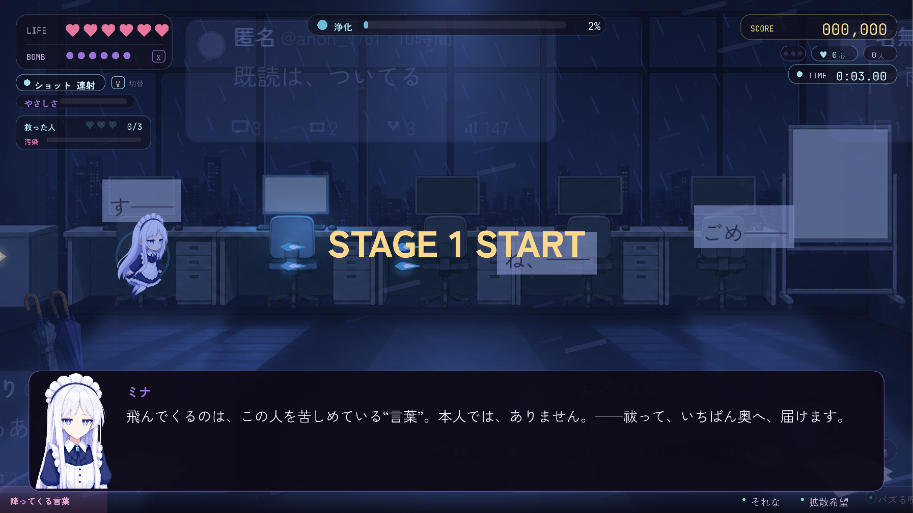
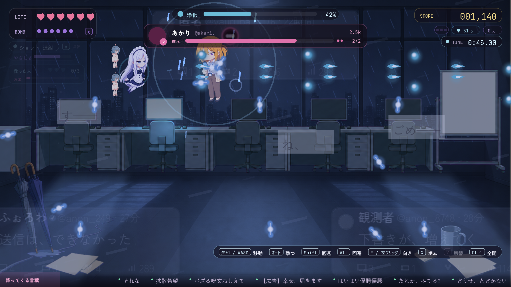
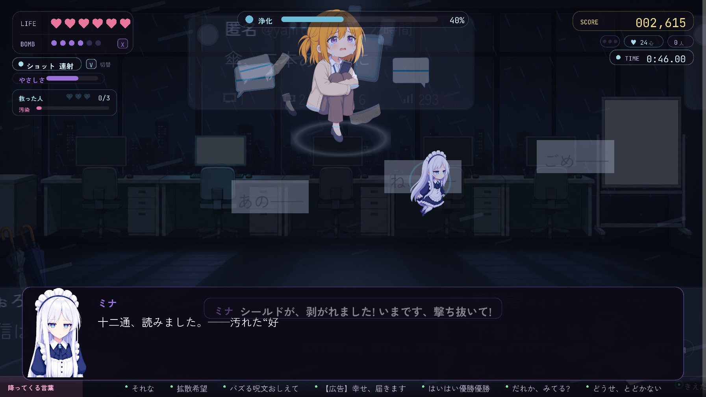

# STAGE1 あかり — 雨のやまない退勤後のフロア

> **この記事の範囲**: ハブであかりの投稿を選んでから、あかりを浄化してハブへ戻り、帰還の投稿・返信・再訪の小話までの流れ。あかりの人物像は → [あかり](../04_キャラクター/04_あかり.md)。ボス戦の仕組み全般は → [ボス戦](../05_ゲーム仕様/06_ボス戦.md)。面の順は あかり → こはる → レイ で、この記事が一面目である。この章が流れるのはミナで潜ったときで、他のアカウントではそのキャラ専用の物語になる（→ [09 キャラ別ストーリー](09_キャラ別ストーリー.md)）。

## 舞台と状況

[ミナ](../04_キャラクター/02_ミナ.md) は起動し、れんしゅうを終えてハブ（タイムライン画面）に着いた（→ [プロローグ](01_プロローグ.md)）。開いている投稿はひとつだけ。

> あかり @akari. 「すき、すき、すき。……ひとつでいいから、本物になって。」

カードにカーソルを合わせると、その下にミナの一行が出る。

**投稿**「すき、すき、すき。……ひとつでいいから、本物になって。」
**ミナ**「……この投稿の下からも、聞こえます。」

浄化した人数は 0／3。ミナの光は澄んでいる。相方は「あなた」——プロローグでミナが「ご主人様」と呼ぶことに決めた、画面の前の人物である。あなたは返事をせず、場面ごとに用意される下書きを送るだけで、ミナはそれを観測して受ける。

カードを選ぶと投稿詳細が開き、難易度の 4 段が並ぶ（→ [難易度](../05_ゲーム仕様/08_難易度.md)）。段を選ぶとダイブが始まり、画面に「STAGE 1 START」の帯が出る。

## 登場人物

- ミナ — 初仕事。飛んでくる言葉を祓い、取り消された言葉をぜんぶ浴びて、奥の本人へ届ける。
- あなた — ご主人様。この面では三度、下書きを送る（中ボスの「ね?」／雨の言いかけ／送信取消の束）。
- [あかり](../04_キャラクター/04_あかり.md) — 「すき」を世界中にばら撒いている本人。肩慣らしの直後に本人が割り込み、最奥で「あふれるわたし」として立ちはだかる。
- 通知の吹き出し — 道中の敵。「返して」「すき」とすがりついてくる声。あかり本人ではない。

## あらすじ

### 起 — フロアへ

着いた先は、雨の降りやまない、誰もいない退勤後のオフィスである。一面目なので、この世界の決まりをここでミナが確かめる。

**投稿**「すき、すき、すき。……ひとつでいいから、本物になって。」
**ミナ**「……いいねが、ひとつ。——この投稿の下から、まだ、聞こえます。」
**ミナ**「着きました。……雨が、降りやみません。誰もいない、退勤後のフロア。机も、椅子も——天井へ、落ちていく。」
**ミナ**「雨の中を、通知の吹き出しが、いくつも漂っています。数字は、どれも「1」。」
**ミナ**「飛んでくるのは、言葉です。……本人では、ありません。」
**ミナ**「祓って、いちばん奥へ。——本人は、そこに。」
**ミナ**「では、ご主人様。——まいります。」

一文にルールを二つ詰めた説明台詞だったものを、二行に割って体言止めで切ってある＝同じ情報量のまま「説明」ではなく「観測の報告」に見せる。

この面の道中では、この作品の**初見チュートリアル**（フェイクレルム／アンチャー／アンフォールダー／コア／浄化ゲージ／心の欠片の 16 行）と**アンチャー紹介**が、一度だけ会話として挟まる（→ [チュートリアル](02_チュートリアル.md)）。

背景には「既読は、ついてる」「下書きが、増えてく」「送信は、できなかった」といった投稿カードが流れ、「す——」「ね、——」「ごめ——」と言いかけて止まった吹き出しが浮かんでいる。傘立てには置き傘が二本ある。

### 承 — 肩慣らしの直後に、本人が割り込む

この面は順序が崩れている。圧のない肩慣らしの六体を祓った瞬間、道中の話をする間もなく、あかり本人が割り込んでくる。ボスバーは「あかり @akari.」。片手のスマホの光が顔に当たっている。

**あかり**「あ、来た来た。ねえ、あなた、あたしの、読んだ? 返事、まだ? 見たよね? ね?」

板（シールド）を剥がし、再生するたびにあかりが追いすがる。

**あかり**「ひとりにしないで。……ねえ、ひとりに、しないでってば。」
**あかり**「来ないで……っ。……ちがう、来て。……来ないで。」

退けると、あかりは名残惜しそうに去る。

**あかり**「ぜったい、また会いに来てよね。ぜったいだよ?」

### 初めて中ボスを倒した場合 — 強化ショップの説明を挟んで、同じ面に戻る

全編を通して初めて中ボスを倒したとき（通常はこの場面）、ステージを一時的に離れ、ミナがひとりで強化ショップの使い方を説明する。

**ミナ**「……最初の“声”が、静かになりました。ひと息つきましょう。」
**ミナ**「敵を浄化するたび、弾を“抜ける”たびに、貯まっています。——“浄化した心”、♥の数が、それです。」
**ミナ**「わたくしを、よく研いでおいてくださいね。——では、まいりましょう。」

読み終えると強化ショップに入る（→ [ショップと強化](../05_ゲーム仕様/07_ショップと強化.md)）。「つづける」を選ぶと、中ボスの直後の道中に戻る。二度目以降の中ボス撃破では、この寄り道は起きない。

### 承 — 中ボスの「ね?」と、一つめの下書き選択

あかりが去ってから、ミナの観測が二行入り、そこに捨て台詞の問いだけが残る。

**ミナ**「……スマホの光を、顔に浴びたまま。……画面のほうは、こちらから見えません。」
**ミナ**「……あの人、降りやまない雨の奥へ。逃げるみたいに、消えてしまいました。」
**ミナ**「……「ぜったいだよ?」。——問いだけが、残っています。宛先は、こちらでは、ありませんが。」
**ミナ**「ご主人様。下書きが、開いています。……宛先は、わたくしが、決めません。」

下書きが四つ出る。「宛先、ちがう」「ぜったい」「傘、忘れてる」「（送らない）」。

- 「宛先、ちがう」 — **ミナ**「……はい。宛先は、ちがいます。——それでも、一通。取り消されずに、雨の奥へ。」
- 「ぜったい」 — **ミナ**「……ぜったい、と。——同じ言葉が、雨の奥と、こちらに、ひとつずつ。」
- 「傘、忘れてる」 — **ミナ**「……傘立てに、二本とも、残ったままです。——傘なしで、雨の奥へ。……観測だけ、しておきます。」
- 送らなかった場合 — **ミナ**「……無言。——「ね?」は、雨の奥へ。返事の、ないまま。」

**ミナ**「……雨の奥からは、返事がありません。——先へ、まいりましょう。」

送った語は、ハブであかりに返信するときに一行足される（→ 後述）。

### 承 — 道中と、返事の声がないフロア

続けて道中の小話が入る。ミナはひとりで観測し、ひとりで軽口を言う。

**ミナ**「ここの声は……どれも、「返して」「すき」と、すがりついてきます。……返事の声だけが、ひとつも、混じっていません。」
**ミナ**「この“声”、ひとつ祓うたびに、少し肩が軽くなります。……重さの数値は、変わっていないのですが。」
**ミナ**「ホワイトボードに、字が。「あたしのせいだ」。……消しても消しても、浮いてくる、そういう字です。」
**ミナ**「傘立てに、置き傘が二本。……色が、違います。それだけ、言っておきます。」
**ミナ**「……ちなみに。片方の柄に、値札が付いたままです。八百円。」
**ミナ**「……値段は、集計に関係ありません。……つい、読んでしまいました。」
**ミナ**「雨の音は、嫌いではありません。……うるさい、と思いながら、消していないので。」

八百円の値札は、あとの「傘立てに、二本とも、残ったままです」（傘を持たずに雨の奥へ）と、回想フィルムであかりが現実に八百円の傘を買う場面にかかる小道具である。

前半の波を祓うと、向かいの席の話になる。

**ミナ**「……向かいの席。モニタは、暗いまま。キーボードの上に、付箋が一枚。……字は、読めません。」
**投稿**「向かいの席、空いたまま。……三日目。」
**ミナ**「「気づいてほしい、でも気づかれたら困る」……そういう声が、「同じ部署」という言葉と、いっしょに流れていきます。」
**ミナ**「……返事の声だけが、ここまで来ても、ひとつも、ありません。」
**ミナ**「取り消されたぶんの言葉を、ぜんぶ、浴びていきます。ひとつ残らず。——そう、決めました。」

この一行が、改心でミナが「証人」になる仕込みである。続けて、ミナが一度だけ返事を待つ。問いの形にはしない。

**ミナ**「……ご主人様は。——雨。」

下書きが四つ出る。「べつに」「きらいじゃない」「置き傘、三本目」「（送らない）」。

- 「べつに」 — **ミナ**「……べつに。——三文字。……このフロアで、はじめて拾った、返事の形です。」
- 「きらいじゃない」 — **ミナ**「……きらいじゃない、と。——わたくしと、同じ集計です。……それだけ、記録しておきます。」
- 「置き傘、三本目」 — **ミナ**「……三本目。——傘立てに、空きは、あります。……色だけ、あとで教えてください。二本とも、違う色ですので。」
- 送らなかった場合 — **ミナ**「……無言。——雨の音だけ、続いています。」

**ミナ**「——では、先へ。声を、祓いながら。」

送っていれば、次にハブへ戻ったときの小話が「雨粒」に固定され、その言葉が一語混ざる。

### 承 — 送信取消の束

後半の波のあと、宙に浮いた机の上に束がある。この面の三つめの選択である。

**投稿**「送信取消。今日で十二回目。……全部、同じ人宛。」
**ミナ**「ご主人様、これ。宙に浮いた机の上に、束が。……「メッセージの送信を取り消しました」。その一行だけが、縦に、積み上がっています。」
**ミナ**「本文は、ひとつも残っていません。取り消しの行だけ。……数えました。十二。——いまの投稿と、同じ数です。」
**ミナ**「ご主人様。——拾います。……どこまで、拾いましょう。」

下書きが三つ出る。「十二件、ぜんぶ」「いちばん上の、一件だけ」「（送らない）」。既定のカーソルは先頭にあるが、二十秒黙っていると末尾の「（送らない）」に決まる。**拾うこと自体は動かない。問われているのは重さの差で、どちらを選んでも何かを取りこぼす。**

- 「十二件、ぜんぶ」 — **あなた**「十二件、ぜんぶ」／**ミナ**「……はい。十二件。——一件ずつ、抱えます。」「……十二回ぶん、消す直前の声を、浴びることになりますが。……浴びる、と決めましたので。」
- 「いちばん上の、一件だけ」 — **あなた**「いちばん上の、一件だけ」／**ミナ**「……いちばん上の、一件。——承知しました。」「……残りの十一件は、閉じたまま、置いていきます。……数だけ、覚えておきます。」
- 送らなかった場合 — **ミナ**「……無言。——では、一件だけ。いちばん上のを。」「……十一件は、閉じたまま。……二件、散りましたね。」 ミナの光がごくわずかに濁る。

**ミナ**「——来ます。雨の奥から、足音が。……スマホの光が、先に見えます。」

ここで**迷った秒数**が記録される。プロローグの第一声より長く迷っていれば、クリア後にあかりの一行が増える。

### 承 — ボス直前

終盤の波を祓うと、投稿がもう一度流れる。

**投稿**（あかりの最後の投稿）
**ミナ**「……公開された本文の下に、何度も書き直した跡が、重なっています。」
**投稿**「いいねが、ひとつ。……増えてないの、知ってるのに、今日だけで四回も、見にきちゃった。」
**ミナ**「……通知の吹き出しが、「1」のまま。同じ形で、四つ、降ってきました。」
**ミナ**「ホワイトボードも、モニタも、窓も……ぜんぶ「すき」で、埋まっていきます。取り消したぶんが、フロアじゅうに、あふれている。」
**ミナ**「この吹き出し、ぜんぶ「またね」と書いてあります。……祓います。ご主人様は、見なくていいです。」
**ミナ**「奥に、あの人が。……行きます。今度こそ、奥まで。」

### 転 — ボス戦「あふれるわたし」

ボスバーは「あふれるわたし @akari.」。出現と同時に短い会話が入り、最初のスペル宣言（「あかり @akari_ame」名義）と同時にカットインが入る。

**あかり**「ねえ、こっち見て。」
**あかり**「すきって言って。あたしも言う。……ずっと一緒。離さないから。」

スペルは体力を削るごとに順に切り替わる（技の一覧と数値は → [ボス戦](../05_ゲーム仕様/06_ボス戦.md)）。

1. 『ねえ、こっち見て』
2. 『すきって言って』
3. 『ずっと一緒』
4. 『離さない』
5. 最後は『ねえ、こっち見て＋すきって言って』の重ね掛け

合間に予測攻撃『豪雨予報』『沈黙の波紋』が入る。板を張り直すたびに、あかりの言葉は虚勢から弱気へ、画面の前で読んでいるもう一人へ、そして「返して」へ変わっていく。

**あかり**「既読も三秒でつけるし。返事も、すぐ書くし。……だから、ね?」
**あかり**「バカ。……バカ、バカ。」
**あかり**「……読んでるの、あなただけじゃ、ないでしょ。……後ろの人。ねえ、そっちも、返して。」
**あかり**「……返して。読んだなら、返してよ。」

三つめは 2026-09-26 に増えた行で、読まれることに飢えた人が、ミナの向こうで読んでいるもう一人（あなた）を見つけて返事を求める。あなたはここで返事の手段を持たない。以降の板の再生では、最後の「返して。」が繰り返される。

中盤に一度だけ『雨の帰り道』が宣言される。あかりは「来ないで……っ」と言って画面の外へ逃げ、ミナは雨の通路を追う。通路を抜けると、あかりのもとへ戻って戦いが続く。

ボス戦のあいだ、降ってくる言葉はこの面の投稿から引かれる。「既読スルー」「返事まだ?」のような日常の声に、「下書き12件」「送れない」「4:03」のような病みの兆しが混じり、ときどき「読んだ?」「いいね1」「四回目」——本人の声が落ちてくる。盤面のいちばん奥には、あかりの入力欄（激情メーター）が薄く敷かれ、「おめでとう　ほんとだよ　元気でね」「……好きだよ。いまも。」が静かに打たれたり、「返して」「見て」「こっち」が溢れたりする（→ [世界観](../02_世界観.md)）。

HP 52%（第二形態へ移る節目）で戦闘を止め、あかり側の回想を白黒で再生する（**2026-09-26 に 29 行から 11 行へ短縮された**。残した行の本文は一字も変えていない。→ [あかり](../04_キャラクター/04_あかり.md)）。

また、体力が 80／60／40／20／1% を割るたびに一度ずつ、あかりが隠れて**下書きの札**を撃たせる割り込みが入る。読み切ると、最後に一枚絵で「おめでとう　ほんとだよ　元気でね／……好きだよ。いまも。」が出る（この割り込みはルナティックでは丸ごと出ない）。

### 転 — 改心

体力が尽きると、弾が止まり、会話になる。改心は二段で進む。ミナが束の底にあった本物の一通を読み上げて返し、そのあと、取り消された十二通をぜんぶ浴びた証人として、自分の言葉で決定打を打つ。

**あかり**「……返事がほしかった。おめでとう、より先に。」
**あかり**「だから、何度も送って……怖くなって、取り消した。」
**ミナ**「……いま、見えた下書き。あの一通だけは、消さずに残していたのですね。」
**ミナ**「——「おめでとう ほんとだよ 元気でね」。……宛名は、ありません。」
**あかり**「……ほんとは、ちゃんと笑って、見送りたかった。」
**ミナ**「取り消された十二通は、ぜんぶ、わたくしに当たりました。」

ここで音楽が止まる。決定打は無音のまま置かれる。

**ミナ**「十二通、読みました。——汚れた“好き”は、ひとつも、ありませんでした。」
**あかり**「……ぁ……」

あかりの立ち絵は最初から泣き顔で、返事は言わせない。ミナは読んだ側であって、返事を代わりに言う側ではない。読み終えると、ホワイトボードの「あたしのせいだ」が「ありがとう」へ溶け、「いいね」がひとつ灯る。

### 結 — クリア

「STAGE 1 CLEAR」の帯とタイムが出て、投稿が変わる。

**投稿**「ほんと、バカなんだから。……あたしも、だけど。」
**あかり**「……あったかい声が、した。……知らない声なのに。変なの。」
**あかり**「……ねえ。あのとき、すぐ決めなかったでしょ。……うん。それで、いい。」（**束で迷ったときだけ**）
**あかり**「……知らない声のくせに。……言い方だけ、どこかで、聞いたことある。」
**ミナ**「……言い方は、わたくしのです。……たぶん。」
**ミナ**「……♥が、ひとつ。」
**ミナ**「ねえ、ご主人様。外の世界は、今日はどんな天気ですか。」
**ミナ**「……いえ。返事は、いりません。いつか、で結構ですので。」

ホワイトボードの字が変わるのは絵が見せるので、ミナは数字（♥1）だけを読み上げる。

「言い方だけ、どこかで、聞いたことある。」と「……言い方は、わたくしのです。……たぶん。」は 2026-09-26 に増えた対句で、**ミナの声の出どころ（あなたの未送信 414 件）に最初のひびが入る**。説明はしない。この直後のハブの返信「誰かに似てる」が、答え合わせではなく二段目になる。

「……♥が、ひとつ。」の手前まで読むと、あかりの後日談のフィルム（クリア後のアフター）が挟まり、そのあと残りの行へ続く。空の問いはここが一度目で、答えは求めない。ハブへ戻る。

### 結 — ハブでの帰還の投稿

ハブに戻ると、ミナがすでに投稿している。

**ミナの投稿**「言いたかったことを、言えないまま終わる。よくある話です。ですがそれは、なかったことにはなりません。——以上、業務連絡です。」
**ミナ**「……勝手に投稿しました。名義は M・I・N・A、わたくしですので、問題ありません。」
**ミナ**「ほら、もう千を超えていますね。」
**ミナ**「……さっきから三度、意味もなく、見直してしまいました。」
**ミナ**「……三度です。用も、ないのに。」
**ミナ**「……いまの、聞かなかったことに。」
**ミナ**「……。」
**ミナ**「ところで、ご主人様。今回のダイブ、被弾は{n}回でした。減点はしませんよ。集計は、しますが。」
**ミナ**「……お疲れさまでした。」
**ミナ**「次の声も、もう、聞こえています。」

「{n}」には、そのダイブで実際に被弾した回数が入る。「数字を三度も見直した」は、あかりが「今日だけで四回も、見にきちゃった」と書いた手つきをミナ自身が一度だけなぞる場面で、以後は二度と言わない。**この面をクリアして解禁されるのは「困る」だけ**（笑うのはこはる後、泣くのはレイ後）なので、ここでミナは嬉しいとも怖いとも言わない——行動だけを残し、一拍の沈黙（「……。」）で狼狽を残してから事務連絡へ落ちる。

初回だけ、被弾数の行の直後にアカウント追加の説明が三行入る。

**ミナ**「ご報告。アカウントが、ひとつ、増えています。……名義は、わたくしではありません。あの方です。」
**ミナ**「SNSの下、「アカウント」から、切り替えられます。切り替えた回は、あの方が潜ります。足取りは、ご主人様のままで。」
**ミナ**「光の形も、そこで語られる話も、あの方のものになります。……戻すのも、同じ場所からです。」

「投稿が届いた」の通知が出て、フォロワーが増える。あかりのカードには「届いた」の印が付き、下段にミナの投稿の一行目がスレッドの返信のようにぶら下がる。こはるのカードが開く。

- 「返信」を選んだ場合（クリア済みのカードで一度だけ） — **ミナ→@akari**「想いは、罪ではありませんよ。たとえ既読が、もう付かなくても。」／（中ボスの「ね?」で送っていれば）**ミナ→@akari**「——あのフロアで、「{送った言葉}」という一通が、送られていましたので。」／**@akari**「……なんでだろ。あなたの言い方、誰かに似てる。」 あかりはミナを知らない相手として扱う。返信は伸び、フォロワーがさらに増える。

### この面の後にハブで聞ける小話

クリア直後でない入場では、およそ半分の確率で小話が抽選される（未読が優先）。あかりの面のあとの小話は二本あり、どちらもミナがひとりで観測を語る。

**ミナ**「ご主人様。あちらの世界、雨がひどかったので。窓の雨粒を、数えてしまいました。」
**ミナ**「途中で、やめました。……数えるたびに、増えるので。」
**ミナ**「ひとつだけ、最後まで落ちなかった粒が、ありました。……それだけ、覚えています。」
**ミナ**「……いまの間、{n}秒。集計だけして、意味は付けないでおきます。」

**ミナ**「ご主人様。言いそびれた言葉って、どこへ行くんでしょう。」
**ミナ**「口の中に残る、という説を、今日どこかで読みました。……それでは、虫歯になってしまいます。」
**ミナ**「あのフロアでは、取り消しの行になって、机の上に積んでありました。……十二。」
**ミナ**「……ためると、虫歯になるそうです。以上です。」

「{n}秒」には、直前の行を読んだまま黙っていた実際の秒数が入る。雨の言いかけ（s1_2）で送っていれば、一本目の末尾に「……あのフロアで、雨の話に「{送った言葉}」と、お返事をいただきましたので。——集計に、入れてあります。」が挟まる。

## この章で変わったこと

- 浄化した人数が **1／3** になった。あかりの投稿は「ほんと、バカなんだから。……あたしも、だけど。」に変わった。
- ミナの光は、面が進むにつれ、澄んだ状態からごくわずかに濁った（0 → 0.18）。選択で何も送らなかったぶんも少し濁る。
- あなたが本編で三度、下書きを送った（または送らなかった）。選ばなかった言葉は散った。
- ミナが「取り消されたぶんの言葉を、ぜんぶ、浴びていく」と決め、改心で「十二通、読みました」と言い切った。決定打はミナ自身の言葉である。
- ホワイトボードの「あたしのせいだ」が「ありがとう」に変わった。
- **ミナが「困る」を獲得する区間が始まった**（この面では笑顔の立ち絵は一枚も出ない）。ミナの言い回しの出どころにひびが入った——あかり「言い方だけ、どこかで、聞いたことある。」／ミナ「……言い方は、わたくしのです。……たぶん。」
- ミナが初めて投稿し、千を超えて届いた。数字を三度見直したことを、一度だけ口にした。
- 空の問いの一度目。「返事は、いりません。いつか、で結構ですので。」
- 初めて中ボスを倒した場合、強化ショップが使えるようになった。
- **あかりのアカウントで潜れるようになった**（ハブの「アカウント」から切り替える → [09 キャラ別ストーリー](09_キャラ別ストーリー.md)）。
- ハブでこはるの投稿が開いた。

## 伏線

仕込まれたもの:
- 束の場面で散った言葉と、そこで迷った秒数。秒数はこの面のクリア後にあかりの一行を呼ぶ。
- 「十二」——束の行数と投稿の回数が同じであること。改心の「十二通、読みました」で回収され、再訪の小話「……十二。」でもう一度拾われる。
- 「言い方だけ、どこかで、聞いたことある。」／「……言い方は、わたくしのです。……たぶん。」→ 返信「誰かに似てる」→ FINAL の邂逅「そっくり」→ 頂点「四百十四件」。
- 返信「あなたの言い方、誰かに似てる。」——三面あとの FINAL の邂逅で言い切られる。
- 「後ろの人。ねえ、そっちも、返して。」——ミナの向こうにもう一人いることに、三人のうち最初に気づく行。
- 「あったかい声が、した。……知らない声なのに。」——**回収されない。** FINAL の救援の場面に、この言葉を受け直す行は無い。
- 空の問い（一度目）。「いつか、で結構ですので。」

→ [伏線と回収](08_伏線と回収.md)

## 主要な台詞

**ミナ**「飛んでくるのは、言葉です。……本人では、ありません。」「祓って、いちばん奥へ。——本人は、そこに。」
**あかり**「あ、来た来た。ねえ、あなた、あたしの、読んだ? 返事、まだ? 見たよね? ね?」
**ミナ**「取り消されたぶんの言葉を、ぜんぶ、浴びていきます。ひとつ残らず。——そう、決めました。」
**ミナ**「ご主人様。——拾います。……どこまで、拾いましょう。」
**あかり**「……読んでるの、あなただけじゃ、ないでしょ。……後ろの人。ねえ、そっちも、返して。」
**あかり**「……返して。読んだなら、返してよ。」
**あかり**「……返事がほしかった。おめでとう、より先に。」
**ミナ**「——「おめでとう ほんとだよ 元気でね」。……宛名は、ありません。」
**ミナ**「十二通、読みました。——汚れた“好き”は、ひとつも、ありませんでした。」
**あかり**「……あったかい声が、した。……知らない声なのに。変なの。」
**あかり**「……知らない声のくせに。……言い方だけ、どこかで、聞いたことある。」
**ミナ**「……言い方は、わたくしのです。……たぶん。」
**ミナ**「ねえ、ご主人様。外の世界は、今日はどんな天気ですか。」
**@akari**「……なんでだろ。あなたの言い方、誰かに似てる。」

## 次章へ

ハブに戻ると、次はこはるの投稿が開いている。電気を消した部屋と、誰も見ていない教室へ。→ [STAGE2 こはる](04_STAGE2_こはる.md)

## 関連記事
- [時系列](00_時系列.md)
- [プロローグ](01_プロローグ.md)
- [STAGE2 こはる](04_STAGE2_こはる.md)
- [伏線と回収](08_伏線と回収.md)
- [あかり](../04_キャラクター/04_あかり.md)
- [ボス戦](../05_ゲーム仕様/06_ボス戦.md)
- [ショップと強化](../05_ゲーム仕様/07_ショップと強化.md)
- [難易度](../05_ゲーム仕様/08_難易度.md)
- [ステージ構成](../05_ゲーム仕様/04_ステージ構成.md)

<!-- 出典: src/StageAkari.cs（Intro／CameoTalk1・CameoTalk3・CameoPost／MidPre・S15Choices・S15Reply・S15Tail／Mid／BossTalk・S12Cue・S12Choices・S12Reply・S12Tail／MidStory・S14Choices・S14Reply・S14Tail／MidEnd／BossIntro／Clear・ClearFor・ClearHesitated・ClearFilmSplit・step1-15・IsTalkStep＝ルナティックで飛ばす step）, src/BossAkari.cs（Spells・PatternThresholds 0.78/0.52/0.26＝回想と第二形態は 0.52・雨の帰り道・RecloseLines 4本・Lines・BgmStopLine・PostThresholds 0.80/0.60/0.40/0.20/0.01）, src/BossPostStory.cs（あかりの下書きの札と一枚絵）, src/AkariStoryFilm.cs（Memory 11行＝29行から短縮・Aftermath 13行）, src/CameoBoss.cs（本人行のみ表示）, src/CheckpointFlow.cs / src/ShopTutorial.cs（初回中ボス後の導線・ミナ独りの解説）, src/StageTutorial.cs（初見チュートリアル・アンチャー紹介の差し込み）, src/ChoiceEffects.cs（SkipContam・Hesitated・SentWordAt）, src/ChoiceOverlay.cs（沈黙14/20秒・散る粒）, src/GameManager.cs（RecordChoice・RunHitCount・Stages）, src/AkariRoot.cs（汚染 0→0.18）, src/StageImagery.cs（背景カード・あたしのせいだ→ありがとう）, src/PostPool.cs（あかりの面の言葉弾）, src/FuryDial.cs（あかりの入力欄の語）, src/Hub.cs（HoverLineFor・ReturnDialog "akari"・AccountIntroAkari・ReplyDialog "akari"・WithS15・IdleDialogs "akari"・PinnedIdle）, wiki/08_仮台本/17_道中の選択肢_案C.md（s1_5・s1_2・s1_4）, docs/20260926/主人公の存在_診断と本文_2026-09-26.md -->
