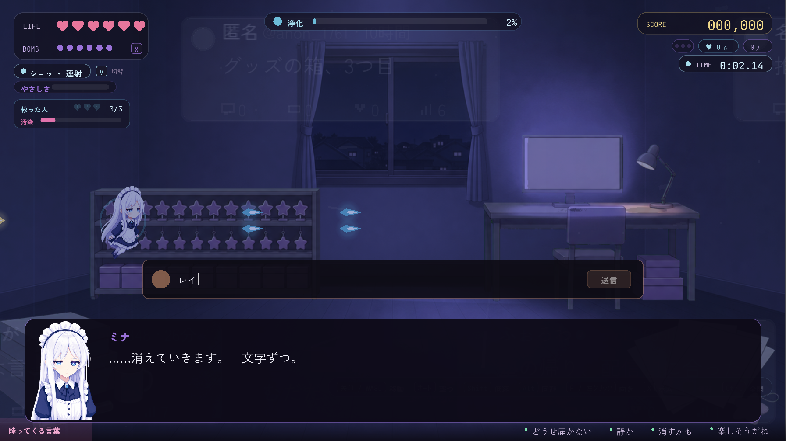
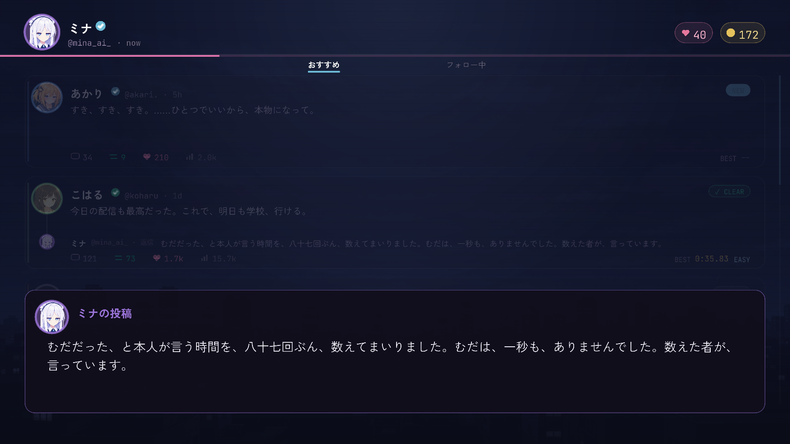

# STAGE2 こはる — 電気を消した部屋と、誰も見ていない教室

> **この記事の範囲**: ハブでこはるの投稿を選んでから、こはるを浄化してハブへ戻り、帰還の投稿・炎上・返信・再訪の小話までの流れ。こはるの人物像は → [こはる](../04_キャラクター/05_こはる.md)。ボス戦の仕組み全般は → [ボス戦](../05_ゲーム仕様/06_ボス戦.md)。面の順は あかり → こはる → レイ で、この記事が二面目である。この章が流れるのはミナで潜ったときで、他のアカウントではそのキャラ専用の物語になる（→ [09 キャラ別ストーリー](09_キャラ別ストーリー.md)）。

## 舞台と状況

[あかり](../04_キャラクター/04_あかり.md) を救い、浄化した人数は 1／3（→ [STAGE1 あかり](03_STAGE1_あかり.md)）。[ミナ](../04_キャラクター/02_ミナ.md) の光は、前の面の終わりからわずかに濁っている。ハブでは次の投稿が開いている。

> こはる @koharu 「今日の配信も最高だった。これで、明日も学校、行ける。」

明るい投稿である。ミナは投稿の下の小さな声を聞き、その中身を本人の前まで言わない。この面には、あなたが下書きを送る場面が三つある（壁の予定表／消えたペンライト／入力欄のカーソル）。

## 登場人物

- ミナ — 消された一行を拾い、「むだだ」の声をぜんぶ祓って、ぜんぶ数える。この面のクリアで**初めて笑う**。
- あなた — ご主人様。三度、下書きを送る。入力欄の場面では、カーソルがあなた自身の画面に点く。
- [こはる](../04_キャラクター/05_こはる.md) — 推しの配信を見ている間だけ、ぜんぶ忘れていられる高校生。道中で本人が先に現れ、最奥で「我に返るわたし」として立ちはだかる。
- 「むだだ」と繰り返す声 — 道中の敵。合間に学校の声と家の声が同じ色で混じる。こはる本人ではない。

## あらすじ

### 起 — 部屋へ

着いた先は電気を消した部屋である。壁一面が配信の画面で、光はそこからしか来ない。

**ミナ**「ご主人様。……暗いですね。電気の消えた部屋に、画面の光だけ。」
**投稿**「今日の配信も最高だった。これで、明日も学校、行ける。」
**ミナ**「……にぎやかな投稿ですね。——この投稿の下からも、聞こえます。……ずいぶん、小さな声が。」
**ミナ**「壁一面が、画面。中で、笑っている人がひとり。……こちらへ向いて、笑っています。」
**ミナ**「机の下に、箱が三つ。……開けられた跡は、ひとつだけ。」
**ミナ**「……小さいのに、消えません。……どう、処理すべきか。」
**ミナ**「……困り、ますね。……いまのは、適切な語ではありません。訂正します。」
**ミナ**「……この声は、ここからでは、届きません。——降ります。」

**ミナが初めて感情語を口にする場面である。** あかりの面をクリアして解禁されたのは「困る」だけで、ここでミナは自分の言葉を処理できずに言い直す。動機を言い切る旧台詞（「放っておけないので」）はこの面からも落ちていて、観測の帰結として足が動く形になっている。

続けて、道中に入る前の観測が入る。

**ミナ**「ペンライトの光が、画面に向かって、振られています。……届いていません。画面まで。」
**ミナ**「ここの声は……「むだだ」と、繰り返しています。合間に、「今日も明るいね」と、「模試、どうだった」が。同じ色の声で。」
**ミナ**「わたくしも振ってみたいのですが。……どちらへ振るのでしょう。集計するより、難しそうです。」

背景には棚に並んだ星形のグッズ、机の下の箱、「グッズの箱、3つ目」といった投稿カードが流れる。

### 承 — 壁の予定表（一つめの下書き選択）

道中Aの末尾。壁に配信の予定表がある。

**ミナ**「壁に、予定表が。日付に、丸。……ぜんぶの日に、丸がついています。」
**ミナ**「丸の下に、小さい字で、時間が足してあります。……直近の三日。足された時間が、日ごとに、増えています。」
**ミナ**「丸のない日が、一日。……そこには、丸の代わりに、二文字。「模試」。」
**ミナ**「……かごに、栄養ドリンクが三本。買われたまま、開けられていません。」
**ミナ**「ご主人様。……この予定表に、何も入れない日を、一日、足しますか。」

**2026-09-25 に増えた選択で、こはるの本音（休みたい）に道中で唯一まっすぐ触れる場所である。** 下書きは「一日、空けて」「三本、飲んでから」「全部に丸がついてる」「（送らない）」。ミナは価値判断をせず、集計の結果だけを差し出す。

- 「一日、空けて」 — **ミナ**「……一日、と。——では、どこに足しましょう。丸のない日は、もう、埋まっていますが。」「……間に、一行、引いておきます。何も書かない一行を。……読める方が、いらっしゃるかは、分かりません。」
- 「三本、飲んでから」 — **ミナ**「……三本。——承知しました。かごの位置を、手の届くところへ。」「……買った方は、飲むつもりだったのだと思います。推定です。……買うところまでは、できておられますので。」
- 「全部に丸がついてる」 — **ミナ**「……はい。ぜんぶに、丸。——欠けは、ありません。」「……欠けがない、というのは。……ひとつも、抜いていない、ということですね。」
- 送らなかった場合 — **ミナ**「……無言。——では、足しません。予定表は、このままで。」「……三件、こちらで預かります。……かごの三本と、同じ数でした。」

**ミナ**「——先へ。予定表は、壁に、残しておきます。……消す権利は、こちらにありませんので。」

**送った言葉は、このあとの中ボスの第一声に引用されて返ってくる。**

### 承 — 中ボス、明るさと蒼白の往復

前半の波を祓うと、画面の中の人物についてミナが一行だけ言う。

**ミナ**「……画面の中の人。星逢レイ、と、名前が出ています。笑顔が、こちらを向いたまま、動きません。」

そこへこはる本人が現れる。ボスバーは「こはる @koharu」。制服で、片手に消えたペンライト、もう片手にスマホ。**第一声は、予定表の選択で四通りに分かれる**（ボス戦で会う前から、もう聞かれていた、という画になる。三本とも「あ、来た来た。」の書き出しは保たれる）。

- 送っていない／（送らない） — **こはる**「あ、来た来た。……「あたし、なにしてんだろ」って顔、してた? ……してないよ。してないってば。」
- 「一日、空けて」 — **こはる**「あ、来た来た。……「一日、空けて」って、言ってたでしょ。……どこ空けんの? 空いてないってば、どこも。」
- 「三本、飲んでから」 — **こはる**「あ、来た来た。……「三本、飲んでから」? ……飲んだよ。……うそ。開けてない。……開けてないけど、買ったもん。」
- 「全部に丸がついてる」 — **こはる**「あ、来た来た。……「全部に丸がついてる」って。……でしょ? ぜんぶだよ。ぜんぶ、ちゃんと。……ちゃんとしてるでしょ?」

板が再生するたびに、こはるの顔は明るさと蒼白のあいだを往復する。

**こはる**「見てって、これ。推しの配信。今日も来てるんだ、あたし。……」
**こはる**「……何時間、見てるんだろ。塾……」
**こはる**「——なんでもない。ね、楽しいでしょ? 楽しいってば。」

退けると、こはるはペンライトを押しつけて去る。

**こはる**「はい、これ。ペンライト。振ってみて。楽しいから。ぜったい、楽しいから。」

初めて中ボスを倒した場合の強化ショップの説明は、通常は一面目で済んでいる（→ [STAGE1 あかり](03_STAGE1_あかり.md)）。

### 承 — 消えたペンライト（二つめの下書き選択）

中ボスが去った直後。押しつけられたのは、消えたままのほうである。

**ミナ**「……押しつけられました。ペンライト。——消えたままの、ほうです。」
**ミナ**「……あの方、二本持っていて。点くほうを、ご自分で持って行かれました。」
**ミナ**「ご主人様。……次に会ったとき。これ、点いていないと、言いますか。」

問われているのは処遇ではなく、**嘘に付き合うかどうか**である。下書きは「言わない」「電池、切れてる」「次は、点くほう」「（送らない）」。

- 「言わない」 — **ミナ**「……言わない、と。——では、振ります。点いているように。」「……あの方も、そうしていました。……知っていて、振っていたのだと思います。推定です。」
- 「電池、切れてる」 — **ミナ**「……はい、切れています。——次に会ったら、そう言います。」「……「楽しいでしょ?」と聞かれた直後に、なりますが。……ご命令ですので。」
- 「次は、点くほう」 — **ミナ**「……点くほうを、と。——それは、次があるという前提の言い方ですね。」「……記録しておきます。次、と。」
- 送らなかった場合 — **ミナ**「……無言。——では、何も言わずに。」「ペンライト、こちらに、残りました。……消えたままで。」

**ミナ**「——先へ。「むだだ」の声を、祓いながら。」

送るとスコアが 500 入る（どの言葉でも同額）。

### 承 — 教室

後半の波に入ると、場所が部屋から教室へ切り替わる。席は全部埋まっているのに、誰とも目が合わない。

**ミナ**「……場所が、変わりました。教室。席は、ぜんぶ埋まっています。——誰とも目が合わないのに、視線だけが、こちらに。」
**ミナ**「黒板に、二文字。「期待」。……消す人が、いないようです。」
**投稿**「今日も明るいねって言われた。……何の話してたか、覚えてない。」
**ミナ**「……明るい声で、投稿しています。明るい、と、言われたことを。」
**ミナ**「机を、数えました。四十。……座っている人の顔は、ひとつも、見えません。」
**ミナ**「期待、という字は、画数が多いですね。……消すのも、手間がかかりそうです。」

### 承 — 入力欄（三つめの下書き選択）

道中の中盤、配信画面の下のコメント入力欄が画面に現れる。文字が一つずつ打たれ、一つずつ消える。

**ミナ**「ご主人様、これ。配信画面の下に、コメントの入力欄が。……文字が、打たれています。」

入力欄に「レイちゃんが」まで打たれる。

**ミナ**「……消えていきます。一文字ずつ。」

末尾から消えたあと、「今日も来ました」だけが打ち直され、送信ボタンが一度灯る。

**ミナ**「……「今日も来ました」。それだけが、残って——送られました。」
**ミナ**「消えたほうの一行は、拾っておきます。……中身は、本人の前で。」
**ミナ**「……画面の中の笑顔は、いまの一行を、読んだでしょうか。——観測できません。向こう側ですので。」

そして入力欄は閉じず、**カーソルがあなたの側に点く。**

**ミナ**「……入力欄の、カーソル。——まだ、点いています。」
**ミナ**「……これ、あの方のでは、ありませんね。——ご主人様の画面です。」
**ミナ**「打ちかけて、消した跡が。……宛先だけ、残っています。……どなたか、とは、伺いません。」

プロローグで言った「消された言葉は、消えていない」が、ここではあなたの側へ向く。下書きは「返してない返信」「既読のまま、三日」「もう送れない相手」「（送らない）」。宛先は決めない。

- 「返してない返信」 — **ミナ**「……返していない、と。——では、まだ、送れますね。」「……急かしては、いません。……欄が、開いていると、申し上げただけで。」
- 「既読のまま、三日」 — **ミナ**「……三日。——では、七十二時間ですね。」「……わたくしの心拍と、同じ数でした。……関係は、ありません。数えてしまっただけで。」
- 「もう送れない相手」 — **ミナ**「…………。」「……はい。——それでも、下書きは、残ります。」「……消えていないぶんは、わたくしが、聞いております。宛先が、どこであっても。」
- 送らなかった場合 — **ミナ**「……無言。——はい。伺いません。」「……三件、こちらで預かります。あの一行と、同じところに。」

**ミナ**「——カーソルが、消えました。……先へ。」

ここで**迷った秒数**が記録される。プロローグの第一声より長く迷っていれば、クリア後にこはるの一行が増える。

### 承 — 我に返る一拍

終盤の波で教室から部屋へ戻る。祓い終えると、投稿の直後に配信画面が消える。

**投稿**「配信終わった。部屋の電気つけた。……自分なにしてんだろ。」
**ミナ**「……画面が、消えました。黒い画面に、顔が映っています。ペンライトを、持ったまま。」
**ミナ**「「むだだ」の声。ここまでで、ぜんぶ、祓いました。——ぜんぶ、数えました。」
**ミナ**「……光が、少し、重い。」
**ミナ**「……計測の誤差です。」
**ミナ**「……ちなみに、いまの間。{n}秒。……いえ、集計しただけです。」

「{n}秒」には、直前の行を読んだまま黙っていた実際の秒数が入る。「ぜんぶ、数えました」が、改心の決定打の仕込みである。「誤差です」とミナが**言い切る**ので、プレイヤーが先に気づき、三面目の「気のせいでは、なさそうです」でミナが遅れて追いつく——濁りの階段はここで初めて段になる。

### 転 — ボス戦「我に返るわたし」

消えた画面の前の部屋で戦う。ボスバーは「我に返るわたし @koharu_light」。出現と同時に短い会話が入り、最初のスペル宣言（「こはる @koharu_light」名義）と同時にカットインが入る。

**ミナ**「消えた画面の前に、あの人が。……顔が映るほうを、向いたまま。」
**ミナ**「視線が、部屋じゅうに。……どれも、顔が、ありません。」
**ミナ**「——ぜんぶ、数えます。ひとつ残らず。」

スペルは順に切り替わる（技の一覧と数値は → [ボス戦](../05_ゲーム仕様/06_ボス戦.md)）。

1. 『ちゃんとしなきゃ』
2. 『みんな見てる』
3. 『期待』
4. 『我に返る』
5. 最後は『ちゃんとしなきゃ＋みんな見てる』

合間に予測攻撃『画面の光』『視線のかたまり』『既読の線』が入る。板を張り直すたびに、こはるは言う。

**こはる**「みんな見てる。……見てるもん。ちゃんとしなきゃ、だめだもん。」
**こはる**「やめないで……止まったら——」
**こはる**「……ねえ。いま動いてるの、そっちの手じゃ、ないでしょ。……あたし、手は、見るもん。」
**こはる**「……なんでもない。楽しいってば。」

三つめは 2026-09-26 に増えた行で、「みんな見てる」と言い張る子が本当に見ているのは手だけ（自分が打って消す手を見続けてきた人）である。自機の足取りはご主人様のものなので、こはるはミナの向こうの手を見つける。以降の板の再生では、取り繕いの「楽しいってば。」が繰り返される。

止まったら、我に返る。それがこのボス戦の型である。盤面の奥にはこはるの入力欄（激情メーター）が敷かれ、「休んでも、好きでいたい。」「でも今日は、もう休みたい。」が打たれたり、「ちゃんと」「見てる」「みんな見てる」が溢れたりする。

HP 52% で戦闘を止め、こはる側の回想を白黒で再生する（**2026-09-26 に 27 行から 10 行へ短縮された**。残した行の本文は一字も変えていない）。また体力の節目ごとに、こはるが隠れて下書きの札を撃たせる割り込みが五回入り、最後に一枚絵が出る。

> **『全部見なきゃ』は 2026-09-17 に削除された。** 中盤に一度だけ「アーカイブ、ぜんぶ残ってるから。ぜんぶ、見て。ね?」と宣言してアーカイブの弾を並べ、時間内に見切れるかを問うギミックだったが、ユーザー指示で丸ごと落ちた（無被弾・ボム無しで見切ったときの残機 +1 の報酬も一緒に消えた）。いまは HP 52% を跨いでも宣告も台詞も出ず、そのまま進む（→ [ボス戦](../05_ゲーム仕様/06_ボス戦.md)）。

終盤に一度だけ『自分なにしてんだろ』が宣言される。

**こはる**「……うごかないで。いま、鏡、見ちゃうから。」

降ってくる言葉はこの面の投稿から引かれる。「期待」「進路は?」「塾代」のような声に、「今日も来ました」「3:10」「見てる時間」「開けてない箱」が混じり、ときどき「なにしてんだろ」——本人の声が落ちてくる。この面では、降ってくる言葉が全部濁った色をしている。

### 転 — 改心

体力が尽きると、会話になる。改心は二段で進む。ミナが入力欄で消された一行を本人に返し、そのあと、来ていた回数を数えた証人として、自分の言葉で決定打を打つ。推しの側の話も、親の話もしない。

**こはる**「楽しいの。ほんとに。見てる間だけは、ぜんぶ、忘れてられるの。」
**こはる**「でも、電気つけたら——机の上に、模試。机の下に、箱。……あたし、なにしてんだろ。」
**こはる**「……忘れてた時間、ぜんぶ、むだで——」
**ミナ**「消されたコメントを、拾っておりました。「レイちゃんがいたから、今日も学校行けた」。」
**こはる**「……っ。……それ、消したもん。……重いって、思われそうで、やだったから……」
**ミナ**「“むだだ”という声なら、ここへ来るまでに、ぜんぶ祓いました。」
**ミナ**「来ていた回数を、数えました。八十七回。」

ここで音楽が止まる。決定打は無音のまま置かれる。

**ミナ**「——むだな時間は、一秒も、ありませんでしたよ。」
**こはる**「……ほんとに？」
**ミナ**「……明日も来る約束は、しなくて結構です。」
**こはる**「……また、見に行って、いいのかな。」

決定打のあとに説明の補足を置かず、こはるの「……ほんとに？」で一度切る＝確かめに来る間が生まれ、そこへ救済の芯（皆勤を条件にしない）を返す。**最後の一行はこはるが自分で選び直した形になっている**（救う相手を器にしない）。こはるの立ち絵に泣き顔はなく、蒼白の顔が絶望を担う。読み終えると、消えていた配信画面が灯り、途中で切れていたペンライトの光が画面まで届く。

### 結 — クリア

「STAGE 2 CLEAR」の帯のあと、投稿が変わる。

**投稿**「送れなかったコメント、送った。読まれたかは、知らない。……送った。」
**ミナ**「……画面が、灯りました。ペンライトの光が——届いています。画面まで。」
**ミナ**「……いま。……わたくし、どういう顔を、していましたか。」
**ミナ**「入力欄に、一行、増えました。……読み上げは、しません。もう、送られたものですので。」
**こはる**「……迷ってくれたよね。あたし、それ、見てたよ。」（**入力欄で迷ったときだけ**）
**こはる**「……あの手。……ペンライト、ちゃんと振ってた。……点いてなくても。」
**ミナ**「……ご主人様。外の世界は、今日はどんな天気ですか。」
**ミナ**「…………。」

**この二行がミナの「笑う」の獲得点である。** 作中でミナが笑顔を見せるのは「……画面が、灯りました。」が初めてで、本人は何が起きたか説明せず、次の行で自分の顔に気づいて言い直すだけである。

こはるの二行は 2026-09-26 に増えた。「振ってみて。楽しいから。」と押しつけたペンライトを振っていたのは自機の手＝ご主人様のもので、点かないペンライトを振り続けた手を、こはるが肯定する。

空の問いの二度目である。返事のない間を、ミナは無言で流す。ハブへ戻る。

### 結 — ハブでの帰還の投稿と、炎上

**ミナの投稿**「むだだった、と本人が言う時間を、八十七回ぶん、数えてまいりました。むだは、一秒も、ありませんでした。数えた者が、言っています。」
**ミナ**「……今日は、数字を書きましたね、わたくし。読み返して、自分で驚いています。」
**ミナ**「今日の心象は、少し暗いだけです。……電気の消えた部屋に、長くいたので。」

続けて、一度きりの炎上の場面が入る。顔のない引用が、ミナの投稿に貼りつく。

**ミナ**「おや。今日はずいぶん、賑やかなリプライですね。」
**投稿**「AIが人の時間の使い方を語るな」
**投稿**「> 数えた者 ←数えただけの人が何言ってんの」
**ミナ**「——この方々、わたくしの投稿は読んでも、あの人の入力欄は一度も読んでいないようですので。」
**ミナ**「数字が一万増えようが十万増えようが、届けるべき相手は、いつもたった一人です。それを、わたくしは見失いません。」
**ミナ**「……と、炎上のどさくさに紛れて、いいことを言った風にしてみました。」
**ミナ**「返信の下書き、四件。……一件も、送っていません。集計だけ、しておきます。」
**ミナ**「ご報告。この騒ぎで、次のダイブは光が少し薄くなります。数字は、重いので。」

引用は「数えただけの人が何言ってんの」の型で、ミナが改心でやったことをそのまま撃ち返す鏡になっている。「返信の下書き、四件。一件も、送っていません」は、ミナの側にも送れない下書きがあるという告白で、FINAL の根になる。

通知「炎上中。次に潜るとき、光が薄い。／発射間隔 +30%  移動 -10%  稼ぎ -40%」が出る。炎上は次に潜る一面（通常はレイの面）のあいだだけ続く。**ただし実際に効いているのは収入 0.6 倍だけで、発射間隔と移動の弱体は 2026-09-13 に撤去されている**（手触りを鈍らせる罰は質が悪い、という判断）。通知の文面はそのまま残っており、HUD にバッジは出ない（→ [ゲージと経済](../05_ゲーム仕様/03_ゲージと経済.md)）。

こはるのカードには「届いた」の印が付き、レイのカードが開く。

- 「返信」を選んだ場合（一度だけ） — **ミナ→@koharu**「八十七回、むだではありませんでしたよ。……八十八回目も、どうぞ。」／**@koharu**「ありがと、知らない人。……明日も、行ってみる。」

### この面の後にハブで聞ける小話

抽選で入る小話のうち、こはるの面のあとのもの。二本ある。

**ミナ**「ご主人様。わたくし、数えるのが得意でして。あの部屋では、配信に来た回数を数えました。八十七回。」
**ミナ**「ついでに、こちらも。ご主人様がこの旅で潜った回数、{dives}回。……比べません。数えただけです。」
**ミナ**「数えなくていいものを数える、というのは、案外、退屈しませんね。」
**ミナ**「……いまの間、{n}秒。……これも、数えなくていいものです。」

**ミナ**「ご主人様。部屋の電気をつけると、なにが起こるんでしょうね。」
**ミナ**「あの部屋では、画面が消えて、黒い画面に顔が映っていました。……それだけ、見ました。」
**ミナ**「わたくしは、電気をつけても、消しても、消えません。……そういう作りのようですので。」
**ミナ**「——ここに、おります。」

「{dives}回」には、この起動で潜った回数が入る。

## この章で変わったこと

- 浄化した人数が **2／3** になった。こはるの投稿は「送れなかったコメント、送った。読まれたかは、知らない。……送った。」に変わった。
- ミナの光の濁りは、わずかな段階から縁が濁る段階まで進んだ（0.18 → 0.45）。「光が、少し、重い。」「……計測の誤差です。」
- **ミナが「困る」を口にし（導入）、「笑う」を獲得した（クリア）。**
- 場所が部屋と教室を往復した。消えていた配信画面が灯り、ペンライトの光が画面まで届いた。
- ミナが消された一行「レイちゃんがいたから、今日も学校行けた」を拾って返し、「八十七回」「一秒も」と言い切った。決定打はミナ自身の言葉である。皆勤は条件にせず、最後の一行はこはるが自分で言った。
- あなたが三度、下書きを送った。**予定表の言葉は中ボスの第一声に引用され**、入力欄の場面ではカーソルがあなたの画面に点いた。
- こはるが自機の手（＝ご主人様の手）を見つけて肯定した。「……あの手。……ペンライト、ちゃんと振ってた。……点いてなくても。」
- ミナの投稿が伸び、直後に炎上した。ミナは「返信の下書き、四件。一件も、送っていません」と言った。次のダイブの収入が 0.6 倍になる。
- 空の問いの二度目。返事のない間を無言で流した。
- **こはるのアカウントで潜れるようになった。** ハブでレイの投稿が開いた。

## 伏線

仕込まれたもの:
- 画面の中の「星逢レイ」と、送られた一行「今日も来ました」。次の面のコメント欄に同じ一行がある。ミナはこの繋がりを口で説明しない。
- 「レイちゃん」の名は、改心で返す一行にだけ出る。
- 返信「ありがと、知らない人。」——**エピローグの屋上で、同じ言葉のまま宛先だけがあなたに変わって戻る**（こはる「……ミナの後ろの人も、聞いてるんでしょ。——ありがと、知らない人。」）。
- 「返信の下書き、四件。……一件も、送っていません。」——ミナの側の「送れない」。
- 「今日も来ました」とペンライト——スタッフロールの「今日も来ました って打った あと一行 足した」へ。
- 入力欄の場面で散った三件（s2_4）——**回収先は未実装。** FINAL の悲鳴の枠に混ぜる仕掛けは計算式だけが置かれていて、どこからも呼ばれていない。
- 空の問い（二度目）。

→ [伏線と回収](08_伏線と回収.md)

## 主要な台詞

**ミナ**「……困り、ますね。……いまのは、適切な語ではありません。訂正します。」
**こはる**「あ、来た来た。……「あたし、なにしてんだろ」って顔、してた? ……してないよ。してないってば。」
**ミナ**「黒板に、二文字。「期待」。……消す人が、いないようです。」
**ミナ**「消えたほうの一行は、拾っておきます。……中身は、本人の前で。」
**ミナ**「……これ、あの方のでは、ありませんね。——ご主人様の画面です。」
**ミナ**「「むだだ」の声。ここまでで、ぜんぶ、祓いました。——ぜんぶ、数えました。」
**こはる**「やめないで……止まったら——」
**こはる**「……ねえ。いま動いてるの、そっちの手じゃ、ないでしょ。……あたし、手は、見るもん。」
**こはる**「でも、電気つけたら——机の上に、模試。机の下に、箱。……あたし、なにしてんだろ。」
**ミナ**「消されたコメントを、拾っておりました。「レイちゃんがいたから、今日も学校行けた」。」
**ミナ**「——むだな時間は、一秒も、ありませんでしたよ。」
**ミナ**「……明日も来る約束は、しなくて結構です。」
**こはる**「……また、見に行って、いいのかな。」
**ミナ**「……いま。……わたくし、どういう顔を、していましたか。」
**こはる**「……あの手。……ペンライト、ちゃんと振ってた。……点いてなくても。」
**ミナ**「返信の下書き、四件。……一件も、送っていません。集計だけ、しておきます。」

## 次章へ

炎上を抱えたまま、最後の一人へ。次の面は、壁一面が配信画面の狭い部屋である。→ [STAGE3 レイ](05_STAGE3_レイ.md)

## 関連記事
- [時系列](00_時系列.md)
- [STAGE1 あかり](03_STAGE1_あかり.md)
- [STAGE3 レイ](05_STAGE3_レイ.md)
- [伏線と回収](08_伏線と回収.md)
- [こはる](../04_キャラクター/05_こはる.md)
- [ボス戦](../05_ゲーム仕様/06_ボス戦.md)
- [ゲージと経済](../05_ゲーム仕様/03_ゲージと経済.md)
- [ステージ構成](../05_ゲーム仕様/04_ステージ構成.md)

<!-- 出典: src/StageKoharu.cs（Intro／Mid／S21Cue・S21Choices・S21Reply・S21Tail／BossTalk／CameoTalk1・CameoTalk1_S21Rest/Drink/Circles・CameoIntroFor・CameoTalk3・CameoPost／S22Cue・S22Choices・S22Reply・S22Tail／ClassTalk／InputField・S24Cue・S24Choices・S24Reply・S24Tail／MidEnd／BossIntro／Clear・ClearFor・ClearHesitated・step1-16・IsTalkStep）, src/CommentInput.cs（入力欄の打つ／消す／送信）, src/BossKoharu.cs（Spells 4種・RecloseLines 4本・MealEnabled=false＝全部見なきゃは無効・自分なにしてんだろ・Lines・BgmStopLine）, src/BossPostStory.cs / src/BossPostSequence.cs（下書きの札と一枚絵）, src/KoharuStoryFilm.cs（Memory 10行＝27行から短縮）, src/CameoBoss.cs, src/KoharuRoot.cs（汚染 0.18→0.45）, src/StageImagery.cs（配信画面が灯る反転）, src/PostPool.cs（こはるの面の言葉弾・全語濁色）, src/FuryDial.cs（こはるの入力欄の語）, src/GameManager.cs（ShouldBurnAfter "koharu"・TotalImpressionMul の 0.6 倍・TotalDives）, src/ChoiceEffects.cs（ReceivedScore 500・Hesitated）, src/Hub.cs（ReturnDialog "koharu"・BurnDialog・ReplyDialog "koharu"・IdleDialogs "koharu"・FillDives・炎上トーストの文面）, wiki/08_仮台本/17_道中の選択肢_案C.md（s2_2・s2_4）, docs/20260925/追加テキスト_2段チャージとこはる選択肢と中ボス_2026-09-25.md（s2_1）, docs/20260926/主人公の存在_診断と本文_2026-09-26.md -->
