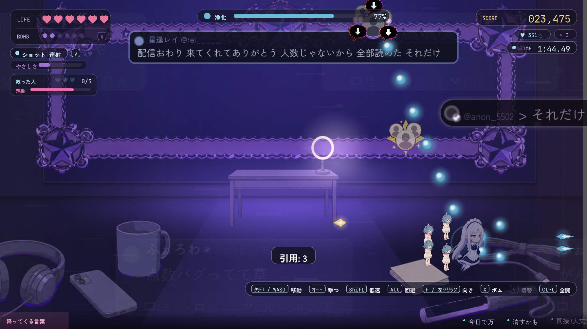
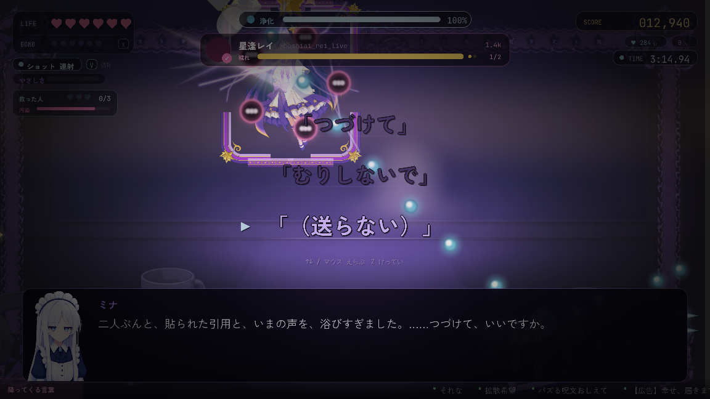
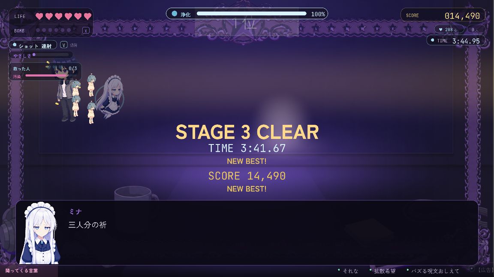

# STAGE3 レイ — 終わりのない配信枠

> **この記事の範囲**: ハブでレイの投稿を選んでから、レイを浄化してハブへ戻り、帰還の投稿・返信・再訪の小話と、FINAL の投稿が現れるまで。レイの人物像は → [レイ](../04_キャラクター/03_レイ.md)。ボス戦の仕組み全般は → [ボス戦](../05_ゲーム仕様/06_ボス戦.md)。面の順は あかり → こはる → レイ で、この記事が三面目である。この章が流れるのはミナで潜ったときで、他のアカウントではそのキャラ専用の物語になる（→ [09 キャラ別ストーリー](09_キャラ別ストーリー.md)）。

## 舞台と状況

[こはる](../04_キャラクター/05_こはる.md) を救い、浄化した人数は 2／3（→ [STAGE2 こはる](04_STAGE2_こはる.md)）。前の面のあとに起きた炎上は次に潜る一面に及ぶため、通常はこのダイブのあいだ [ミナ](../04_キャラクター/02_ミナ.md) の収入が 0.6 倍になっている（HUD に「炎上中」のバッジは出ない。手触りは鈍らない）。光の濁りは縁の濁りから始まり、この面で深刻に翳るところまで進む。ハブでは最後の投稿が開いている。

> 星逢レイ @rei_____ 「だれも、わたしには追いつけない。……それの、なにが、いけないの。」

この面には、あなたが下書きを送る場面が三つある（暗い画面／三件の下書き／ボス戦の途中の割り込み）。

## 登場人物

- ミナ — 弱くなった光で潜り、貼りついた引用を剥がし、消された一行を拾って、戦闘の途中で自分の濁りを報告する。この面のクリアで**初めて泣く**。
- あなた — ご主人様。この面では三度、下書きを送る。ミナが自分のことで聞くのは、この面が初めてである。
- [レイ](../04_キャラクター/03_レイ.md) — 配信名「星逢レイ」。中ボスとして先に現れるのは中の人で、最奥で立ちはだかるのは本人が作った配信のガワである。姿も大きさも違う。
- 「気づいて」「見て」の声 — 道中の敵。合間に家の声「ふーん」が同じ色で混じる。レイ本人ではない。
- 顔のない引用 — 道中の中盤、レイの投稿の上に十七枚貼りつく。誰の顔も動機も持たない。

## あらすじ

### 起 — 配信枠へ

着いた先は狭い部屋で、壁一面が配信の画面である。

**ミナ**「……ご主人様。潜ります。」
**ミナ**「……光の出力、平常の八割ほど。——問題ありません。集計の話です。」
**投稿**「今日も20時から! 初見さん大歓迎。コメント、全部読みます。」
**ミナ**「……明るい投稿ですね。——この投稿の下からも、聞こえます。……こちらは、明るくない声が。」
**ミナ**「狭い部屋です。壁一面が、配信の画面。右上の数字は「11」。……画面の中で、星逢レイが、等身大より大きく、笑っています。」
**ミナ**「コメント欄が、流れています。……ひとつだけ、同じ場所に、同じ一行。「今日も来ました」。」
**ミナ**「……この部屋の奥に、声のもとが。——行きます。」

面の一行目で本人に弱音を言わせず、数字（出力八割）だけを置いている。揺れはボス戦の途中まで取ってある。「今日も来ました」は、前の面でこはるが送った一行と同じである。ミナはそれを説明しない。

続けて、道中に入る前の観測が入る。

**ミナ**「ここの声は……「気づいて」「見て」と、画面の外へ向かって、言っています。」
**ミナ**「合間に、「ふーん」。……同じ色の声で。」
**投稿**「登録者2000人、ありがとう。……去年の今日も、2000人。」
**ミナ**「……机の上の、伏せたスマホが。いま、一度だけ、光りました。——誰も、拾いません。」
**ミナ**「右上の数字。「8」。……減りました。うち一つは、机の上の端末——つけっぱなしの、この部屋のものです。」
**ミナ**「わたくしの光と、あの数字と、どちらが薄いか。……比べません。どちらも、集計はしますが。」

ミナは自分の投稿の数字も、この部屋の数字も口にしない。

### 承 — 暗い画面（一つめの下書き選択）

小話の末尾で、ミナがこの面で初めて、自分のことで一度だけ聞く。

**ミナ**「……ご主人様。この部屋、そちらから、見えていますか。——わたくしの光が、少し、暗いので。」

下書きは「見えてる」「ちゃんと見てる」「同接、9」「（送らない）」。

- 「見えてる」 — **ミナ**「……見えてる、と。——では、このままで。暗いのは、こちらの都合ですので。」
- 「ちゃんと見てる」 — **ミナ**「……ちゃんと、と。——一語、多いですね。……多いぶんは、集計に、入れておきます。」
- 「同接、9」 — **ミナ**「……九。——右上の数字は、動きません。こちらは、向こう側の数に、入りませんので。……こちらで、ひとつ、数えておきます。」
- 送らなかった場合 — **ミナ**「……無言。——見えているかは、観測できません。……暗いまま、続けます。」

**ミナ**「——祓います。「見て」の声を。……見ているのは、こちらですが。」

「こちらは、向こう側の数に、入りませんので」は、クリア後の同接「4」の問いへ直につながる。送った語は中ボスの第一声に引用され、次にハブへ戻ったときの小話も「同接」に固定される。

### 承 — 削除済みの一行と、足音

前半の波を祓うと、投稿の下に消された一行があることをミナが聞く。中身は本人の前まで言わない。

**投稿**「企画メモ、下書き十四件。……出せるの、ゼロ件。」
**ミナ**「……十四件。集計に、入れておきます。」
**ミナ**「投稿の下に——一行。削除済みの、一行があります。……中身は、本人の前で。」
**ミナ**「コメント欄の、あの一行。……まだ、同じ場所にあります。」
**ミナ**「……画面の笑顔が、いま、コメントをひとつ、読み上げました。……声は、明るいです。」
**ミナ**「——来ます。画面の外から、足音が。……画面の中の笑顔は、動きません。」

### 承 — 中ボス、中の人

現れるのは中の人である。ヘッドセットを首に掛けたパーカーで、リングライトの光が顔に当たっている。ボスバーは「レイ @rei_____」。第一声は笑っておらず、**暗い画面の選択で四通りに分かれる**。ミナが自分のことで聞いた問いへの返答を本人が引用してくる＝部屋の中の独り言まで聞かれていた、という画になる。

- 送っていない／（送らない） — **レイ**「……だれ? あなた。……わたしの配信、見に来た人?」
- 「同接、9」 — **レイ**「……だれ? あなた。……「同接、9」って、言ってたでしょ。……数えたの、あなたなの?」
- 「ちゃんと見てる」 — **レイ**「……だれ? あなた。……「ちゃんと見てる」って、さっき。……誰に言ったの、それ。わたしじゃ、ないわよね。」
- 「見えてる」 — **レイ**「……だれ? あなた。……「見えてる」って、言ってたわね。……見えてるなら、なんで、こっちは来ないのよ。」

板が再生するたびに、すぐ配信用の笑顔へ切り替わり、以後は崩れない。

**レイ**「——はじめまして! 星逢レイです。今日も来てくれて、ありがとう。」
**レイ**「逃げないで。……初見さん、まだ、いてくれるでしょう?」

退けると、笑顔のまま捨て台詞を残して去る。

**レイ**「逃げたら……承知しないんだから。」

中ボスの直後、ミナが観測する。同一人物だとは言わない。

**ミナ**「……切り替わるまで、一秒九。……画面の中の笑顔より、小さいですね。」
**ミナ**「……あの人、画面の中へ。——画面の笑顔は、いまも、動いていません。」

初めて中ボスを倒した場合の強化ショップの説明は、通常は一面目で済んでいる（→ [STAGE1 あかり](03_STAGE1_あかり.md)）。

### 承 — 引用の嵐

後半の波のあと、投稿の直後に引用が貼られはじめる。

**投稿**「今日のコメント、全部読んだ。……読まなきゃよかった。」
**ミナ**「……投稿の上に、引用が。一枚。……二枚。——顔のない、引用です。」
**投稿**「[星逢レイ @rei_____] 配信おわり 来てくれてありがとう 人数じゃないから 全部読めた それだけで十分」
**ミナ**「……この投稿の上に、貼られていきます。——剥がします。ご主人様、撃つのは、貼りついたほうを。」

画面の上部にレイの投稿がピン留めされ、右端から顔のない引用が飛んできて貼りつく。飛んでいる間だけ当たり、貼りついたあとは当たらない。撃つと剥がれ、灰色の紙片が落ちる。引用は三段階、全部で十七枚である。段階が進むほど間隔が詰まり、剥がす速さを飛来が上回る。画面には「引用: n」の数が刻まれる。

- 一段目（茶化し・五枚）: 「これ本気で言ってる?」「それ限定公開でやれ」「> それだけで十分 ←十分じゃない顔してる」「はいはい感謝芸」「誰に向けて言ってんのこれ 3人?」
- 二段目（嘲笑・六枚）: 「切り抜きで見た 本編行く価値なし」「ガワだけで中身ない」「一年伸びてない配信者のサンプルとして保存した」「企画ゼロで何を見ろと」「いいね3 自分と身内でしょ」「痛い 枠ごと消したら?」
- 三段目（存在の否定・六枚）: 「こういう人がいるから界隈が終わる」「誰も見てないって何回言えばいい」「同接3 まだやってたんだ」「配信やめても誰も気づかないタイプ」「引退しろまでは言わないけど 察して」「はい次の話題」

段階の切れ目ごとに、本人の返信が一行、前より短くなって出る。「見てくれてありがとう」「ごめんなさい」「ごめん」、四度目は空欄——返信欄が開いて、閉じる。最後の一枚「はい次の話題」で飛来が止まり、以後は増えない。声が止まったあとは必ず剥がし切れる。

剥がし切ると、カードの下に薄い字で一行が残る。「下書き: もう、いいかな」。

**ミナ**「…………。」
**ミナ**「……剥がし切りました。下に、送られなかった下書きが、一件。」
**ミナ**「薄い字で、一行。……拾います。中身は、本人の前で。」
**ミナ**「覚えておきます。……返しに行く先は、もう分かっていますので。」

ここで拾うのは「もう、いいかな」で、改心で返す一行（投稿の下の削除済みの「わたしに、気づいてよ。わたしを、見てよ」）とは別のものである。

### 承 — 呑みこまれる部屋（二つめの下書き選択）

終盤の波を祓うと、同接が「3」になる。

**ミナ**「右上の数字。「3」。……残った三つの席の、ひとつに、あの一行が。」
**ミナ**「……ご主人様。下書きが、三件。開いています。」

下書きは「見てる」「ここにいる」「見ています」「（送らない）」。**三つめはミナ自身の下書きで、敬体だけが手がかりである。** ミナはどれが自分のかを先に言わない（宣言すると探すゲームになり、受けが答え合わせに落ちるため）。

- 「見てる」 — **ミナ**「……見てる、と。——はい。……わたくしのは、散りました。自分のぶんは、自分で、拾っておきます。」
- 「ここにいる」 — **ミナ**「……ここにいる、と。——席が、ひとつ、こちらに。……わたくしのは、散りました。自分で、拾っておきます。」
- 「見ています」 — **ミナ**「……それ、わたくしのです。——気づいて、いただけましたか。それとも、偶然でしょうか。……どちらでも。送られました。」
- 送らなかった場合 — **ミナ**「……三件、散りました。うち、一件は、わたくしのです。——同じ棚に、置いておきます。」

「見ています」は、改心の決定打「見ていました。」の現在形である。レイの「気づいてよ」とミナの「気づいて、いただけましたか」が、同じ面で重なる。ここで**迷った秒数**が記録され、プロローグの第一声より長く迷っていればクリア後にレイの一行が増える。

**ミナ**「……光が、重い。……気のせいでは、なさそうです。」
**ミナ**「画面が、部屋を、呑みこんでいきます。……奥に、笑顔だけが。」

### 転 — ボス戦「星逢レイ」

壁の画面が部屋を呑みこみ、ガワだけが残る。ボスバーは「星逢レイ @hoshiai_rei_live」。**ガワが一言だけ言う**（配信の第一声そのもの）。続けて最初のスペル宣言（「レイ @hoshiai_rei_live」名義）と同時にカットインが入る。

**レイ**「——初見さん、いらっしゃい。」

スペルは配信の語彙で順に切り替わる（技の一覧と数値は → [ボス戦](../05_ゲーム仕様/06_ボス戦.md)）。

1. 『初見さんいらっしゃい』
2. 『登録者２０００』
3. 『同接８』
4. 『切り抜かれない』
5. 最後は『同接８＋切り抜かれない』の重ね掛け

合間に予測攻撃『コメント一斉読み』『配信枠』『切り抜きの線』が入る。怖さの源は、笑顔のまま撃ってくることである。与ダメがしばらくゼロになると圧が上がり、ガワの口から字幕が出る。

**レイ**「初見さん、いらっしゃい!」
**レイ**「戦ってよ。わたしを、ちゃんと見てよ。」
**レイ**「……手、止まってる。……見てるだけの人、ひとり、増えたのね。」

三つめは 2026-09-26 に増えた行で、**あなたの手が止まったときにしか出ない**＝文字どおりあなたの手を見ている。三本目以降はこの行が繰り返され、クリア後の同接「4」の予告になる。

板を張り直すたびに、笑顔は崩れず、言葉だけが逃げ腰になっていく。

**レイ**「……逃げるの? また。——いいわ。切り抜かれないんだから、わたし。」
**レイ**「初見さん、まだ、いてくれるでしょう?」
**レイ**「……あんたの後ろ。初見さん、いるでしょう? ……いらっしゃい。」
**レイ**「見てて。……ちゃんと、見ててよ。」

三つめも 2026-09-26 に増えた行で、ミナの後ろの初見＝あなたを配信に招き入れる。以降の板の再生では最後の「見てて。」が繰り返される。

終盤に一度だけ『最終選考』の安置リレーが宣言され、安全な場所が順に移っていく。

- 無被弾で走り切った場合 — **レイ**「……初見さん、じゃなかったのね。」 残機がひとつ戻る（残機が上限なら 1000 点）。

降ってくる言葉はこの面の投稿から引かれる。「初見です（毎回）」「切り抜き待ち」「同接4」「界隈のノリ」のような配信の日常の声に、「同接3大丈夫」「今日で万」「伏せて光った」「引用されたｗ」が混じり、ときどき「三秒で閉じた」——本人の声が落ちてくる。盤面の奥にはレイの入力欄（激情メーター）が敷かれ、「好きな話を、聞いてほしい。」「わたしの声を、聞いてほしい。」が打たれたり、「見て」「切り抜いて」「初見さん」が溢れたりする。

HP 50% で戦闘を止め、レイ側の回想を白黒で再生する（**2026-09-26 に 27 行から 10 行へ短縮された**。残した行の本文は一字も変えていない）。体力の節目ごとに下書きの札の割り込みも入る。

### 転 — 戦闘の途中で、止まる（三つめの下書き選択）

体力が 20〜50% のあいだで一度だけ、弾が止まり、画面が鈍色に沈む。問うのはミナ自身の状態で、あなたの過去は問わない。

**ミナ**「……ご主人様。弾がやんでも——聞こえます。画面の向こうで、まだ、コメントを読み上げている声が。」
**ミナ**「笑顔のまま、こちらへ撃っているんですね。……笑顔は、一度も、崩れていません。」
**ミナ**「——ひとつ、ご報告を。わたくしの光、二割ほど、濁っています。」
**ミナ**「二人ぶんと、貼られた引用と、いまの声を、浴びすぎました。……つづけて、いいですか。」

ここで三つの下書きが出る。「つづけて」「むりしないで」「（送らない）」。既定のカーソルは「（送らない）」にあり、二十秒黙っていればそこに決まる。

- 「つづけて」を送った場合 — **あなた**「つづけて」／**ミナ**「……はい。“つづけて”と、いただきました。——では、つづけます。」
- 「むりしないで」を送った場合 — **あなた**「むりしないで」／**ミナ**「……無理は、しません。無理でないところまでを、ぜんぶ、やります。」
- 送らなかった場合 — **ミナ**「……無言。——続行、と読みます。」 ミナの光がごくわずかに濁る。

鈍色が明け、戦闘が再開する。送った言葉は FINAL の導入で一度だけ引用される。

### 転 — 改心

体力が尽きると、会話になる。**この面だけは改心の順序が反転していて、先に判決、後から証拠が来る。** 三面の改心が「消した一行を提示 → 回数の証言 → 相手の絶句」の同じ型の三連発になり、三面目には次の行が読めてしまっていたためである。レイはガワの姿のまま、笑顔のまま、声だけが崩れていく。式の語彙も順位の語彙も使わず、叩いた側の話もしない。

**レイ**「初見さん、大歓迎。コメント、全部読むから。……ぜんぶ、読んだから。」
**レイ**「登録者、二千。去年も、二千。……減ってない。減ってないでしょう?」
**レイ**「だから……だからなんで、だれも、中にいるわたしに、気づいてくれないのよ!」
**ミナ**「見ていました。」

「見ていました。」を単独で置き、ここで音楽が止まる。プレイヤーも一緒に「なにを」と問い返す。

**レイ**「……は? ……なに、それ。……見てたって、なにを——」
**ミナ**「だれも見ていない場所に、あなたが書いて、消した一行を。」
**ミナ**「「わたしに、気づいてよ。わたしを、見てよ」。」
**レイ**「…………。」

「だれも見ていない場所に——」の行でガワが割れ、証拠（消された一行）はその後に置かれる。割れたガワの下から、笑っていない中の人が出る。何も言わない。ガワを壊す言葉は誰も言っていない。割れたのは「もう隠れなくていい」の意味である。中の人の姿は、ボスの姿より小さい。

このとき背景では、道中ずっと白飛びして読めなかった固定ポストの「登録者 2,000」に色が差して読めるようになり、その下に「好きな本の話」が同じ光で灯る。数字は変えず、公開できた企画のほうを救済の変化として示す。

### 結 — クリア

「STAGE 3 CLEAR」の帯のあと、投稿が変わる。

**投稿**「次は、本気のあなたと。——逃げたら、承知しないから。」
**ミナ**「右上の数字が、「4」に。……ひとつ、増えました。」
**レイ**「……四。……あんたは、数に入らないんでしょう。……なら、増えたの、誰。」
**ミナ**「……集計は、向こう側の、ものですので。」
**レイ**「……即答されてたら、たぶん、信じてなかった。」（**三件の下書きで迷ったときだけ**）
**ミナ**「コメント欄の、あの一行。……まだ、同じ場所にあります。」
**ミナ**「……そういえば。今日の空は、晴れていましたか。」
**ミナ**「……いえ。もう、聞きません。三度、聞きました。」
**ミナ**「三人分の祈りを、抱えてしまったので。……この重さくらい、わたくしが、持ちます。」
**ミナ**「……ご主人様。ひとつ、観測できないものが。」
**ミナ**「……光が、顔のあたりから、こぼれています。……原因は、不明です。」
**ミナ**「……集計には、入れません。……入れ方が、分かりませんので。」

レイとミナの二行は 2026-09-26 に増えた。道中の「こちらは、向こう側の数に、入りませんので」を反転させる問いで、**ミナは答えない**（「誰が増えたかは言わない」は守る）。増えたのが誰かに気づくのはプレイヤーである。

空の問いの三度目で、階段が閉じる。「三人分」はここで初めて口にする。そして**最後の三行が「泣く」の獲得点**で、ミナは自分に何が起きたか説明せず、観測できないものとして報告するだけである（立ち絵は涙）。ここまでで、困る（あかり後）→ 笑う（こはる後）→ 泣く（レイ後）の三つがそろう。

### 結 — ハブでの帰還の投稿と、FINAL の投稿

**ミナの投稿**「見ていました。だれも見ていない場所も。覚えておきます。」
**ミナ**「……なんて。バズ狙いの一言ですよ。……数字は、見ました。言いません。」
**ミナ**「……ご主人様。今回のダイブ、被弾は{n}回。減点はしません。……集計する光も、そろそろ、薄いので。」
**Ｙ システム**「@mina_ai_ が投稿しました。」
**ミナ**「……投稿した覚えが、ありません。」
**ミナ**「光が薄いのは、誰のせいでもありません。抱えたぶんの、重さです。……行けます。まだ。」

三人を救い終えたことで、タイムラインに新しいカードが穢れの色で現れる。**このカードの本文はミナ自身の投稿で、本人には投稿した覚えがない。**

> ミナ @mina_ai_ 「三人ぶん、預かりました。重い、とは書きません。……消し方が、わかりません。」 — 印は **限界**

カードにカーソルを合わせると、ホバー行として同じ一言「……投稿した覚えが、ありません。」が出る。汚染・限界・ダイブといった仕組みの言葉はカードに書かれない——重さを「書かない」と言いながら消せない、という形で限界を見せる（**2026-09-27 に「——汚染が、限界へ。ミナ自身の内側へダイブする。」から全面改稿された**。旧文は説明的で意味が分からない、という指摘による）。

- 「返信」を選んだ場合（一度だけ） — **ミナ→@rei_____**「見ていましたよ。……次も、見に行きます。逃げたら承知しない、と、言われましたので。」／**@rei_____**「は? 誰よあんた。……まあいいわ。次は、本気で来なさい。見てなさい。」

### この面の後にハブで聞ける小話

抽選で入る小話のうち、レイの面のあとのもの。二本ある。暗い画面（s3_2）で送っていれば一本目が優先され、二行目の直後に「……あの部屋で、「{送った言葉}」と、いただきましたので。暗いまま、続けました。」が挟まる（「同接、9」だけは「……九、と、いただきましたが。——こちらの集計では、一です。」に変わる）。

**ミナ**「ご主人様。わたくしの視聴者は、いま、お一人です。……起動してから、ずっと、一。」
**ミナ**「減っていませんので、優秀です。……増えてもいませんが。」
**ミナ**「あの部屋で、十四件、という数を拾いました。出せなかった企画の数、だそうです。」
**ミナ**「わたくしの企画メモは、ゼロ件。出したのも、ゼロ件。……出せた割合は、集計不能です。」

**ミナ**「ご主人様。わたくし、笑顔の練習をしてみました。……顔がありませんので、成果は、不明です。」
**ミナ**「あの部屋で、笑っていない顔と、笑っている顔を、ひとつずつ、見ました。」
**ミナ**「……切り替わるのに、一秒九。……戻るところは、見ていません。」
**ミナ**「わたくしのは、切り替わりません。……たぶん、ずっと、これです。」

## この章で変わったこと

- 浄化した人数が **3／3** になった。レイの投稿は「次は、本気のあなたと。——逃げたら、承知しないから。」に変わった。同接は「4」になった。
- ミナの光の濁りは、危険な域の手前まで進んだ（0.45 → 0.80）。ハブには**ミナ自身の投稿**「三人ぶん、預かりました。重い、とは書きません。……消し方が、わかりません。」が FINAL のカードとして現れた。ミナは「投稿した覚えが、ありません。」と言う。
- 炎上による収入の減りは、このダイブで終わった。
- ミナが引用の嵐を剥がし切り、下書き「もう、いいかな」を拾った。改心では**先に「見ていました。」と判決を置き、あとから証拠**「わたしに、気づいてよ。わたしを、見てよ」を出した。決定打はミナ自身の言葉である。
- ガワが割れて、中の人が出た。壊す言葉は誰も言っていない。
- ミナが戦闘の途中で自分の濁りを報告し、あなたが「つづけて」か「むりしないで」を送った（または送らなかった）。
- レイが自機の手を見て「見てるだけの人、ひとり、増えたのね」と言い、クリア後に「増えたの、誰」と問うた。ミナは答えなかった。
- 空の問いの三度目。「もう、聞きません。三度、聞きました。」
- ミナが「三人分の祈りを、抱えてしまった」と言い、**初めて泣いた。**
- **レイのアカウントで潜れるようになった。**

## 伏線

仕込まれたもの:
- 中ボス（中の人）とボス（ガワ）の姿の違い。作ったものが作った人より大きい構図は、FINAL の予告である。ミナはそれを口にしない。
- S3-7 で送った言葉。FINAL の導入で一度だけ引用される。
- 返信「は? 誰よあんた。」——FINAL の邂逅で、レイが「……あんたの言い方。……この人に、そっくりよ。」と言い切る（レイまたはミナで潜ったとき）。旧・救援の返礼「誰よあんた、って言ったわね。——訂正する。」は、FINAL の多段化で救援の場面に置き換わったときに消えた。
- 「増えたの、誰。」——ミナが答えないまま残る。同接に入らないのは画面の内側にいるミナで、入るのは画面の外である。
- 「見ていました」——ハブの投稿「見ていました。だれも見ていない場所も。覚えておきます。」へ。プロローグの「覚えておきます」とエピローグの「——できることは、数えることと、覚えていることだけ、ですが。」のあいだに置かれる。
- コメント欄の「今日も来ました」。前の面のこはるの一行と同じで、ミナは繋がない。
- 「三人分の祈りを、抱えてしまった」——FINAL の「あかりの。こはるの。レイの。……ぜんぶ、ここに。」へ。

→ [伏線と回収](08_伏線と回収.md)

## 主要な台詞

**ミナ**「……光の出力、平常の八割ほど。——問題ありません。集計の話です。」
**ミナ**「……ご主人様。この部屋、そちらから、見えていますか。——わたくしの光が、少し、暗いので。」
**レイ**「……だれ? あなた。……わたしの配信、見に来た人?」
**レイ**「——はじめまして! 星逢レイです。今日も来てくれて、ありがとう。」
**ミナ**「……この投稿の上に、貼られていきます。——剥がします。ご主人様、撃つのは、貼りついたほうを。」
**レイ**「戦ってよ。わたしを、ちゃんと見てよ。」
**レイ**「……手、止まってる。……見てるだけの人、ひとり、増えたのね。」
**ミナ**「——ひとつ、ご報告を。わたくしの光、二割ほど、濁っています。」
**レイ**「だから……だからなんで、だれも、中にいるわたしに、気づいてくれないのよ!」
**ミナ**「見ていました。」
**レイ**「……は? ……なに、それ。……見てたって、なにを——」
**ミナ**「だれも見ていない場所に、あなたが書いて、消した一行を。」
**ミナ**「「わたしに、気づいてよ。わたしを、見てよ」。」
**レイ**「……四。……あんたは、数に入らないんでしょう。……なら、増えたの、誰。」
**ミナ**「三人分の祈りを、抱えてしまったので。……この重さくらい、わたくしが、持ちます。」
**ミナ**「……集計には、入れません。……入れ方が、分かりませんので。」
**@rei_____**「は? 誰よあんた。……まあいいわ。次は、本気で来なさい。見てなさい。」

## 次章へ

三人ぶんを預かったミナの投稿が、本人の覚えのないまま立つ。次に潜る先は、ミナ自身の内側である。→ [FINAL ミナ](06_FINAL_ミナ.md)

## 関連記事
- [時系列](00_時系列.md)
- [STAGE2 こはる](04_STAGE2_こはる.md)
- [FINAL ミナ](06_FINAL_ミナ.md)
- [伏線と回収](08_伏線と回収.md)
- [レイ](../04_キャラクター/03_レイ.md)
- [ボス戦](../05_ゲーム仕様/06_ボス戦.md)
- [ゲージと経済](../05_ゲーム仕様/03_ゲージと経済.md)
- [ステージ構成](../05_ゲーム仕様/04_ステージ構成.md)

<!-- 出典: src/StageRei.cs（Intro／Mid・S32Cue・S32Choices・S32Reply・S32Tail・MidThenS32／BossTalk／CameoTalk1・CameoTalk1_S32Count/Watch/See・CameoIntroFor・CameoTalk3・CameoPost・CameoAfter／MidStory／StormAfter／MidEnd・S35cCue・S35cChoices・S35cReply・S35cTail／BossIntro＝「——初見さん、いらっしゃい。」／Clear・ClearFor・ClearHesitated／MidChoicePre・S37Choices・S37Reply・step1-19・IsTalkStep）, src/QuoteStorm.cs（Stage1-3 の十七枚・Replies・PinBody・DraftLine・引用カウンタ）, src/BossRei.cs（Spells・TauntLines 3本・RecloseLines 4本・最終選考の無被弾一言・Lines＝判決が先／証拠が後・SilenceAtLine=3・BreakAtLine=5）, src/ReiStoryFilm.cs（Memory 10行＝27行から短縮）, src/BossPostStory.cs / src/BossPostSequence.cs, src/CameoBoss.cs, src/ReiRoot.cs（汚染 0.45→0.80）, src/PostPool.cs（レイの面の言葉弾）, src/FuryDial.cs（レイの入力欄の語）, src/ChoiceEffects.cs（Hesitated・PinnedIdleIndex）, src/GameManager.cs（BeginStageRun の炎上消費・RecordChoice "s3_7"・AllStoryCleared）, src/Hub.cs（ReturnDialog "rei"・ReplyDialog "rei"・IdleDialogs "rei"・PinnedIdle・FinalTweet/FinalHoverLine）, wiki/08_仮台本/11_引用ポストの嵐.md, wiki/08_仮台本/17_道中の選択肢_案C.md（s3_2・s3_5c）, docs/20260926/主人公の存在_診断と本文_2026-09-26.md -->
