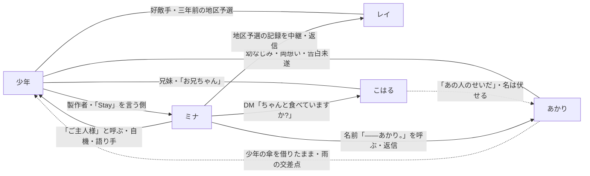

# 相関図

> **この記事の範囲**: 五人の人物のあいだの関係を、一枚の図と短い説明で示す。各人物の詳細は → 各記事、出来事の順序は → [03 ストーリー / 00 時系列](../03_ストーリー/00_時系列.md)、世界の仕組みは → [02 世界観](../02_世界観.md)。

## 図

実線は生前からの関係、点線はエピローグで明かされる（または名を伏せて語られる）関係、矢印はミナから三人への働きかけである。

## 関係の説明

### 少年 と ミナ

[少年](01_少年.md)は[ミナ](02_ミナ.md)を独力で作った製作者で、「ぼくの相棒」「ぼくの最高傑作」と呼ぶ。ミナは少年を「ご主人様」と呼びながら少しも敬わず、口癖は「ご主人様はアホですね」。少年は潜る前に毎回「Stay」——いなくなるな——と言い、ミナは自機として潜り、少年の言葉を自分の声で相手に届ける。少年は三人が知人であることも、自分がすでに死んでいることもミナに隠し通し、エピローグでミナは、自分の名前が少年の遺した四行の頭文字であり、自分が少年の声でできていることを知る。

### 少年 と レイ

[レイ](03_レイ.md)は少年の好敵手で、恋愛感情はない。三年前の地区予選の最終問題を、レイは二十二分、少年は二十三分で解いた。少年が本気で負けたのはこの一度だけで、以後、少年が本気で挑まなくなったことがレイの孤独と傲慢の根になった。少年は正体を隠したまま、この記録をミナの声で届けて敬意を伝える。

### 少年 と あかり

[あかり](04_あかり.md)は少年の幼なじみで、互いに想い合っていた。少年は踏み込まないためにあえて名前を呼ばず「キミ」で距離を置き、あかりはそれを拒まれたと受け取った。雨の交差点であかりが告白しようとした途中、クラクションが鳴り、少年があかりを突き飛ばして庇って亡くなった。少年は改心の場面で自分の声を使わず、ミナに「——あかり。」と名前を呼ばせる。誰が誰を突き飛ばしたのかと、返っていない傘のことは、鍵アカの固定投稿とあかりの残響が合わさってエピローグで一度に明かされる（→ [エピローグ](../03_ストーリー/07_エピローグ.md)、[伏線と回収](../03_ストーリー/08_伏線と回収.md)）。

### 少年 と こはる

[こはる](05_こはる.md)は少年の妹で、少年を「お兄ちゃん」と呼ぶ。兄の死を認められず、帰ってこない兄のために夕食を作り続けている。少年は改心の場面で「祈りは、ちゃんと——届いてた」と自分の声で告げ、クリア後にミナへ「妹の様子でも、見ててくれよ」と託す。鍵アカの最古の投稿「ミナへ。こはるを頼む。」は、ミナを作る前からの託しである。

### こはる → あかり

こはるは、兄があかりを庇って亡くなったことを知っている。中ボス戦の途中で「……あの人のせいだ。あの人さえ、いなければ……お兄ちゃん、いなくならなかった。」と漏らすが、名前は最後まで伏せられる。あかりの側にこはるとの接点は描かれない。

### ミナ → 三人

ミナは三人を救うたびに投稿し、ハブでそれぞれに返信する。三人には心象世界の記憶が残らないので、返事は必ず知らない人へのものになる（こはる「ありがと、知らない人。」。往復は各ステージ記事 → [STAGE1 レイ](../03_ストーリー/03_STAGE1_レイ.md)、[STAGE2 あかり](../03_ストーリー/04_STAGE2_あかり.md)、[STAGE3 こはる](../03_ストーリー/05_STAGE3_こはる.md)）。あかりの返事にある「誰かに似てる」は、エピローグでミナが真相を悟る鍵になる。エピローグでミナはこはるへ DM「ちゃんと食べていますか?」を送り、少年の託しを引き受ける。

### 三人 → 少年のフォロー欄

レイ、あかり、こはるの三人は、いずれも少年の知人である。ミナのフォロー欄に並んだ三人の名前をエピローグで見て、ミナは「Xの闇を成敗する」という少年の言葉が、最初から大切な三人にだけ別れを届けるためのものだったと知る。

## 関連記事

- [01 少年](01_少年.md)
- [02 ミナ](02_ミナ.md)
- [03 レイ](03_レイ.md)
- [04 あかり](04_あかり.md)
- [05 こはる](05_こはる.md)
- [06 その他](06_その他.md)
- [03 ストーリー / 08 伏線と回収](../03_ストーリー/08_伏線と回収.md)

<!-- 出典: src/Prologue.cs（製作者・Stay）, src/BossRei.cs / src/BossAkari.cs / src/BossKoharu.cs（改心・中継）, src/StageKoharu.cs（カメオの他責行・託し）, src/Hub.cs（返信）, src/Epilogue.cs（フォロー欄・固定投稿・最古の投稿・DM・交差点）, src/StageImagery.cs（「傘、二本あるのに」）, docs/20260619/EpicB_物語設計案.md §正典 v3（事故・キミ呼び・こはるの他責）, docs/【最新】世界観・ストーリー・キャラ設定まとめ.md §人物関係, docs/キャラ設定_03_あかり.md §キミ呼び・§事故の経緯, build/wiki_work/01_canon_brief.md §4-8 -->
