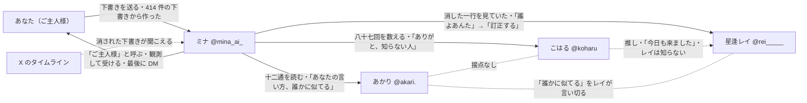

# 相関図

> **この記事の範囲**: 画面の前の「あなた」、ミナ、救われる三人（あかり・こはる・レイ）、そして舞台である X のあいだの関係を、一枚の図と短い説明で示す。各人物の詳細は → 各記事、出来事の順序は → [03 ストーリー / 00 時系列](../03_ストーリー/00_時系列.md)、世界の仕組みは → [02 世界観](../02_世界観.md)。

## 図

実線は作中で直接やりとりが起きる関係、点線は片方だけが知っている関係、矢印の向きは働きかけの向きである。

## 関係の説明

### あなた と ミナ

「あなた」は画面の前の人物で、作中に姿も名前も出ない。ミナを起動した相手であり、ミナの起動記録には「未送信の下書き 414 件を読み込んだ」とある。あなたは自分の声を持たず、場面ごとに用意された三つの下書きから一つを送るだけで、[ミナ](02_ミナ.md)はそれを観測して受ける。ミナはあなたを「ご主人様」と呼ぶが、敬ってはいない。

選ばなかった下書きは散り、ミナが全部拾っている。最初に散った言葉は FINAL の頂点で戻り、あなたが最後に送った言葉がエピローグの鍵になる。ミナの最初の一件が、あなたが最初に散らした言葉と同じだったことを、ミナはエピローグで一行だけ白状する。最後に DM「ちゃんと食べていますか?」を送るのはミナで、宛先はあなたである（→ [エピローグ](../03_ストーリー/07_エピローグ.md)、[伏線と回収](../03_ストーリー/08_伏線と回収.md)）。

### ミナ と X

ミナは X のタイムラインの奥にだけ存在し、現実を自分の目で見ることができない。投稿の下から、送られなかったほうの声——消された下書き——が聞こえる。それがこの物語の唯一の仕掛けで、三人を救う方法もこれである。ミナは面から戻るたびに @mina_ai_ で投稿し、二面目のあとに一度だけ炎上する（→ [02 世界観](../02_世界観.md)）。

### ミナ と あかり

[あかり](04_あかり.md)は最初に救う相手である。三十歳の会社員で、送信取消を十二回、全部同じ人宛に繰り返している。ミナは取り消された十二通をぜんぶ浴び、束の底の一通「おめでとう ほんとだよ 元気でね」を返して、「十二通、読みました」と言い切る。あかりにとってミナは「知らない声」で、ハブの返信で「あなたの言い方、誰かに似てる」と言う。FINAL では援護に来て「既読、つけに来た。あなたのぶん。……今度は、取り消さない」と返す。

### ミナ と こはる

[こはる](05_こはる.md)は二番目に救う相手である。高校生で、推しの配信を見ている間だけぜんぶ忘れていられる。ミナは入力欄で消えた一行「レイちゃんがいたから、今日も学校行けた」を拾って返し、来ていた回数を数えて「八十七回」「一秒も」と言い切る。こはるにとってミナは「知らない人」で、FINAL では「知らない人じゃ、なかったよ」と返す。こはるを救ったあとのミナの投稿が炎上する。

### ミナ と レイ

[レイ](03_レイ.md)は最後に救う相手である。二十四歳の配信者「星逢レイ」で、中ボスとして先に現れるのは中の人、最奥に立つのは本人が作った配信のガワである。ミナは自分に貼られた引用を剥がしきれないまま、レイに貼られた十七枚を剥がしに行き、消された一行「わたしに、気づいてよ。わたしを、見てよ」を返して「見ていました」と言い切る。レイにとってミナは「誰よあんた」で、FINAL では「訂正する」と返し、邂逅で「あんたの言い方——この人に、そっくりよ」と言い切る。

### こはる → レイ

こはるの推しが星逢レイである。片方向で、こはるはレイを知っていてレイはこはるを知らない。こはるが唯一送れる一行「今日も来ました」が、レイの配信枠のコメント欄の同じ場所にあり、レイの同接が「3」に減ったとき「残った三つの席の、ひとつは、あの一行」になる。ミナはこの繋がりを一度も口で説明せず、あなたが自分で繋ぐ。

### あかり・こはる・レイ

三人は互いに他人である。あかりとこはる、あかりとレイに直接の接点はない。三人が同じ画面に並ぶのは、ハブの返信と、FINAL の援護と、エピローグのフォロワー欄のいちばん上だけである。あかりが一面目に言った「誰かに似てる」を、三面目のレイが邂逅で引き継いで言い切る。

## 関連記事

- [02 ミナ](02_ミナ.md)
- [03 レイ](03_レイ.md)
- [04 あかり](04_あかり.md)
- [05 こはる](05_こはる.md)
- [06 その他](06_その他.md)
- [01 少年](01_少年.md)（案C以前の設定。現行の作品には登場しない）
- [02 世界観](../02_世界観.md)
- [03 ストーリー / 08 伏線と回収](../03_ストーリー/08_伏線と回収.md)

<!-- 出典: src/Prologue.cs（operator・ご主人様・414 items）, src/GameManager.cs（Stages のハンドル・FirstScattered・LastSentWord）, src/BossAkari.cs / src/BossKoharu.cs / src/BossRei.cs（改心の二段）, src/StageKoharu.cs / src/StageRei.cs（星逢レイの名・「今日も来ました」・残った三つの席）, src/Hub.cs（ReplyDialog・BurnDialog）, src/BossMina.cs（BreakThanks・Lines のレイ行）, src/Epilogue.cs（フォロワー欄・DM・開示）, wiki/08_仮台本/12_キャラ設定シートv2_社会人版.md（v3。年齢・職業・片方向の繋がり） -->
