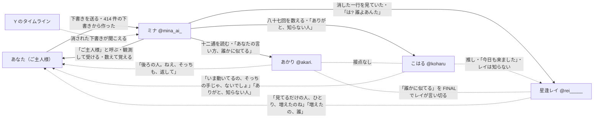

# 相関図

> **この記事の範囲**: 画面の前の「あなた」、ミナ、救われる三人（あかり・こはる・レイ）、そして舞台である Y のあいだの関係を、一枚の図と短い説明で示す。各人物の詳細は → 各記事、出来事の順序は → [03 ストーリー / 00 時系列](../03_ストーリー/00_時系列.md)、世界の仕組みは → [02 世界観](../02_世界観.md)。

## 図

実線は作中で直接やりとりが起きる関係、点線は片方だけが知っている関係、矢印の向きは働きかけの向きである。

```mermaid
graph LR
  YOU["あなた（ご主人様）"]
  MINA["ミナ @mina_ai_"]
  AKARI["あかり @akari."]
  KOHARU["こはる @koharu"]
  REI["星逢レイ @rei_____"]
  TL["Y のタイムライン"]

  YOU -->|下書きを送る・414 件の下書きから作った| MINA
  MINA -->|「ご主人様」と呼ぶ・観測して受ける・数えて覚える| YOU
  TL -.->|消された下書きが聞こえる| MINA
  MINA -->|十二通を読む・「あなたの言い方、誰かに似てる」| AKARI
  MINA -->|八十七回を数える・「ありがと、知らない人」| KOHARU
  MINA -->|消した一行を見ていた・「は? 誰よあんた」| REI
  AKARI -.->|「後ろの人。ねえ、そっちも、返して」| YOU
  KOHARU -.->|「いま動いてるの、そっちの手じゃ、ないでしょ」「ありがと、知らない人」| YOU
  REI -.->|「見てるだけの人、ひとり、増えたのね」「増えたの、誰」| YOU
  KOHARU -.->|推し・「今日も来ました」・レイは知らない| REI
  AKARI -.-|接点なし| KOHARU
  AKARI -.-|「誰かに似てる」を FINAL でレイが言い切る| REI
```

## 関係の説明

### あなた と ミナ

「あなた」は画面の前の人物で、作中に姿も名前も出ない。ミナを起動した相手であり、ミナの起動記録には「未送信の下書き 414 件を読み込んだ」とある。あなたは自分の声を持たず、場面ごとに用意された三つの下書きから一つを送るだけで、[ミナ](02_ミナ.md)はそれを観測して受ける。ミナはあなたを「ご主人様」と呼ぶが、敬ってはいない。

選ばなかった下書きは散る。最初に散った言葉は FINAL の頂点で戻り、そこで送る一言になる。エピローグの END で最後にあなたを送り出すのはミナのほうで、「いってらっしゃいませ、ご主人様」「——ええ、ご主人様。わたくしは、どこにも行きませんよ」で幕になる（→ [エピローグ](../03_ストーリー/07_エピローグ.md)、[伏線と回収](../03_ストーリー/08_伏線と回収.md)）。

ミナは自分の言い回しの出どころを知らない。プロローグで皮肉を言った直後に「……いまの言い回し。……どこで覚えたのか、記録に、ありません。」と言い、STAGE1 のクリアで「……言い方は、わたくしのです。……たぶん。」と揺れ、FINAL の邂逅で相手が「この人に、そっくりよ」と言い切る。「この人」は自機の「あなたの光」である。

### あなた と 三人

三人はあなたに会わないが、**それぞれの器官でミナの向こうにもう一人いることに気づく**（2026-09-26 に 15 行で入った線）。あかりは「読む人」として後ろの人に返事を求め、こはるは「打って消す手」の人として自機の手を見、レイは「数える人」として同接に入らないミナの向こうを数える。ミナは答えない——「……集計は、向こう側の、ものですので。」 あなたに名前も姿も足されず、読まれるのは選択と手つき（迷った秒数・止まった手）だけである。

### ミナ と Y

ミナは Y のタイムラインの奥にだけ存在し、現実を自分の目で見ることができない。投稿の下から、送られなかったほうの声——消された下書き——が聞こえる。それがこの物語の唯一の仕掛けで、三人を救う方法もこれである。ミナは面から戻るたびに @mina_ai_ で投稿し、二面目のあとに一度だけ炎上する（→ [02 世界観](../02_世界観.md)）。

### ミナ と あかり

[あかり](04_あかり.md)は最初に救う相手である。三十歳の会社員で、送信取消を十二回、全部同じ人宛に繰り返している。ミナは取り消された十二通をぜんぶ浴び、束の底の一通「おめでとう ほんとだよ 元気でね」を返して、「十二通、読みました」と言い切る。あかりにとってミナは「知らない声」で、クリア後に「言い方だけ、どこかで、聞いたことある」と言い、ハブの返信で「あなたの言い方、誰かに似てる」と言う。FINAL であかりのアカウントで潜ると、四段すべての救援に来て「それ、あたしが言えなかった分でしょ。でも今、言える。ミナ、迎えに来た」と告げ、邂逅で「……やっぱり。ミナの言い方、この人に、そっくり。」と言い切る。

### ミナ と こはる

[こはる](05_こはる.md)は二番目に救う相手である。高校生で、推しの配信を見ている間だけぜんぶ忘れていられる。ミナは入力欄で消えた一行「レイちゃんがいたから、今日も学校行けた」を拾って返し、来ていた回数を数えて「八十七回」「一秒も」と言い切る。こはるにとってミナは「知らない人」で、ハブの返信で「ありがと、知らない人」と言う。**同じ言葉が、エピローグの屋上では宛先だけ変わってあなたに向く**——「……ミナの後ろの人も、聞いてるんでしょ。——ありがと、知らない人。」 こはるを救ったあとのミナの投稿が炎上する。

### ミナ と レイ

[レイ](03_レイ.md)は最後に救う相手である。二十四歳の配信者「星逢レイ」で、中ボスとして先に現れるのは中の人、最奥に立つのは本人が作った配信のガワである。ミナは自分に貼られた引用を剥がしきれないまま、レイに貼られた十七枚を剥がしに行き、**先に「見ていました。」と判決を置いてから**、消された一行「わたしに、気づいてよ。わたしを、見てよ」を証拠として出す。レイにとってミナは「誰よあんた」で、FINAL の邂逅（レイまたはミナで潜ったとき）では「知ってる。あんたの声だった」「……あんたの言い方。……この人に、そっくりよ。」「何回だって言いなさい。聞くから」と受け止める側になる。

### こはる → レイ

こはるの推しが星逢レイである。片方向で、こはるはレイを知っていてレイはこはるを知らない。こはるが唯一送れる一行「今日も来ました」が、レイの配信枠のコメント欄の同じ場所にあり、レイの同接が「3」に減ったとき「残った三つの席の、ひとつは、あの一行」になる。ミナはこの繋がりを一度も口で説明せず、あなたが自分で繋ぐ。

### あかり・こはる・レイ

三人は互いに他人である。あかりとこはる、あかりとレイに直接の接点はない。三人が同じ画面に並ぶのは、FINAL の BREAK の合図（段ごとに固定の相手が一言添える）と、エピローグの屋上とスタッフロールだけである。FINAL の救援と邂逅で声をかけてくるのは、そのとき潜っている一人だけである。

## 関連記事

- [02 ミナ](02_ミナ.md)
- [03 レイ](03_レイ.md)
- [04 あかり](04_あかり.md)
- [05 こはる](05_こはる.md)
- [06 その他](06_その他.md)
- [02 世界観](../02_世界観.md)
- [03 ストーリー / 08 伏線と回収](../03_ストーリー/08_伏線と回収.md)

<!-- 出典: src/Prologue.cs（operator・ご主人様・414 items・「どこで覚えたのか、記録に、ありません」）, src/GameManager.cs（Stages のハンドル・FirstScattered・LastSentWord）, src/BossAkari.cs / src/BossKoharu.cs / src/BossRei.cs（改心の二段・RecloseLines・TauntLines）, src/StageAkari.cs / src/StageKoharu.cs / src/StageRei.cs（星逢レイの名・「今日も来ました」・残った三つの席・Clear の各行）, src/Hub.cs（ReplyDialog・BurnDialog）, src/BossMina.cs（OnBreakCue・RedemptionLines＝邂逅はジョブ別）, src/MinaPhaseScene.cs（救援はジョブ別）, src/Epilogue.cs（屋上の見上げる・こはるの「ミナの後ろの人」・スタッフロール）, docs/20260926/主人公の存在_診断と本文_2026-09-26.md -->
