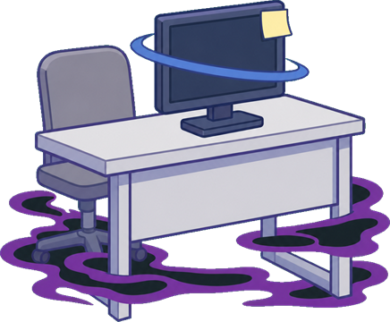
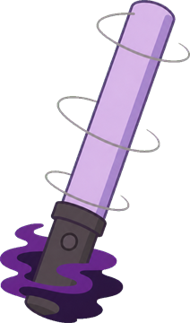
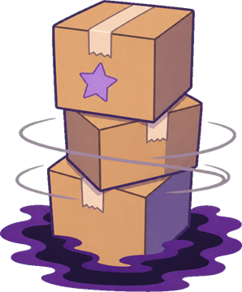

# 敵

> **この記事の範囲**: 道中に出る雑魚の全種類と共通の仕組み。ボスと中ボスは → [ボス戦](06_ボス戦.md)、湧き方と数は → [ステージ構成](04_ステージ構成.md)、雑魚が物語の中で何を表すかは → [その他の登場人物](../04_キャラクター/06_その他.md)。

敵の名称は画面には出ない。この記事の表にある名称は本 wiki での呼称である。

## 共通の仕組み

- 雑魚は黒い吹き出しの「パネル」を身のまわりに回している。パネルは 1 枚ごとに耐久があり、自機の弾を当てるたびに削れる。全パネルを剥がすとその敵は浄化（撃破）される。通常の雑魚はパネル 3 枚 × 耐久 2 = 6 ヒット。
- 浄化すると、スコア・コンボ・インプレッション・やさしさが入り（→ [ゲージと経済](03_ゲージと経済.md)）、その場から半径 46 px の波紋が 0.35 秒広がって、触れた周囲の敵のパネルを剥がす。連鎖して次々に浄化が起きることがある。
- 道中で 3 体浄化するごとに、浄化した本人が随伴フォロワーとして自機に付いてくる（最大 4 体。→ [自機とショット](02_自機とショット.md)）。
- 敵の本体に触れると被弾する。浄化済みの敵は無害。
- 画面に入ると x 120〜270 のどこかに居座り、上下に ±14 px/s で往復する（画面外へは出ない）。進入の速さは最低 78 px/s で、居座ってから 0.55 秒後に最初の弾を撃つ。
- 弾の数は難易度の弾数倍率（Dn）、間隔は間隔倍率（Di）、速さは弾速倍率で変わる（→ [難易度](08_難易度.md)）。下表の値は基準値。

ボスのパネルと無防備窓（SHIELDED → BREAK → EXPOSED）の仕組みは → [ボス戦](06_ボス戦.md)。

## 雑魚一覧

Dn＝難易度の弾数倍率、Di＝間隔倍率（→ [難易度](08_難易度.md)）。

| 名称 | 出る面 | 耐久（パネル枚数 × 1 枚の耐久） | 動き | 攻撃 | 基礎点 | 特徴 |
|---|---|---|---|---|---|---|
| 向かいの席の机 | STAGE 1 | 3 × 2 | 46 px/s | 左へ ±35° に Dn × 5 way のばらまき、80 px/s（±5° ゆらぐ）。間隔 Di × 2.0 秒 | 100 | 速い方の種。弾は穢れ桃の玉 |
| 送信取消の束 | STAGE 1 | 3 × 2 | 30 px/s、±16 px うねる | 真下 ±20° に Dn × 3 way、50 px/s。間隔 Di × 3.2 秒 | 80 | 遅い方の種。弾は薄紫の米粒 |
| ペンライト | STAGE 2 | 3 × 2 | 60 px/s | 0.4 秒の予告ののち、自機の方向 ±12° に 3 本の針弾、130 px/s（本数は難易度で変わらない）。間隔 Di × 1.6 秒 | 100 | 速い方の種。弾は桃色の針 |
| グッズの箱 | STAGE 2 | 3 × 2 | 24 px/s、±10 px うねる | 自機狙いの超低速弾 45 px/s を Dn × 1 発。間隔 Di × 3.0 秒 | 80 | 遅い方の種。弾は橙の玉 |
| 視聴者アイコン | STAGE 3 | 3 × 2 | 56 px/s で進入 | ロックオンビーム: 自機の方向に予告（Di × 0.5 秒）ののち、長さ 240 px・太さ 11 px の金色のビームが着弾。間隔 Di × 2.2 秒 | 100 | 速い方の種 |
| 空の吹き出し | STAGE 3 | 3 × 2 | 26 px/s、上下に ±12 px うねる | 全方位に Dn × 6 発のリング弾、55 px/s。間隔 Di × 3.6 秒 | 80 | 遅い方の種。弾はリング形 |
| 引用リプ | 全面。道中の進行が半分を過ぎてから、湧きの 15% | 3 × 2 | 右から画面の上端（y 16）または下端（y 200）を 110 px/s で走り抜け、自機の後方（x 40、y 64 または 152）に着座 | 着座後、右向きに 70 px/s の弾を Dn × 1 発。間隔 Di × 2.4 秒。走っている間は撃たない | 100 | 見た目はその面の速い方の種と同じ。弾は穢れ桃の玉 |
| バズ壁 | 全面。道中B・C のみ、湧きの 10% | 5 × 3（15 ヒット） | 18 px/s で x 160〜260 に陣取る | 撃たない | 220 | 見た目はその面の遅い方の種で、一回り大きい |
| 祈り運び | STAGE 2。湧きの 10% | 2 × 1 | 34 px/s で画面を横切る（約 11 秒）。居座らない | 撃たない。「祈り弾」を 3 発ぶら下げて運ぶ | 60 | 祈り弾は自機の弾で消せる（1 発 +15 点・やさしさ +0.02）。本体を倒すと残った祈り弾もまとめて受け止めたことになる。左へ抜けると消える |
| 言葉の残滓 | STAGE 1 のボス戦「雨の帰り道」の間（4 / 7 / 10 秒目に 1 体ずつ） | 1 × 1 | 通路の中央線を壁と同じ速さで流れる。触れても被弾しない | 撃たない | 200 | 倒すとボスの総 HP の 4% 分のダメージが直接入る（画面に「-4%」） |
| ダミー（練習の的） | ステージ0（れんしゅう） | 3 × 2 | 50 px/s、x 120〜270 に居座り ±16 px/s で往復 | 撃たない | 100 | 被弾しても残機は減らない |

- 祈り弾は暖白のハロをまとった暖色の玉。
- 引用リプは自機の後ろに回り込んで撃つので、後方弾（→ [自機とショット](02_自機とショット.md)）か向き反転で対処する。

## 図鑑

穢れた姿（左）と浄化後の姿（右）。名称は上の表と同じ。

 

 

 

 

 

 

 

引用リプ・バズ壁・祈り運びは専用の絵を持たず、表の「特徴」欄のとおり同じ面の種の姿で出る。言葉の残滓も専用の絵を持たず、小さな黒い吹き出しとして描かれる。

## 関連記事
- [ボス戦](06_ボス戦.md)
- [ステージ構成](04_ステージ構成.md)
- [ゲージと経済](03_ゲージと経済.md)
- [難易度](08_難易度.md)
- [その他の登場人物](../04_キャラクター/06_その他.md)

<!-- 出典: src/EnemySpec.cs（StageTheme Rei/Akari/Koharu の二種と v3 の絵・Flanker・BuzzWall・PrayerCarrier）; src/MidEnemy.cs 76-131, 146-169, 299-488; src/Spawner.cs 25-43, 87-151; src/Enemy.cs 9-23; src/Ripple.cs 8-9; src/Player.cs 45-46, 106-117, 1138-1143; src/GlyphMote.cs 8-52; src/StageZero.cs; src/CorridorRun.cs 68, 181-190, 267-300, 302-307; src/Bullet.cs 300-312; src/GameManager.cs Stages（面の順 あかり→こはる→レイ）; 図鑑の画像は char/v3/enemy_*_pre/post.png と char/enemy_anti_pre/post.png（src/EnemySpec.cs, src/TrainingDummy.cs, src/Follower.cs が参照する実アセット） -->
