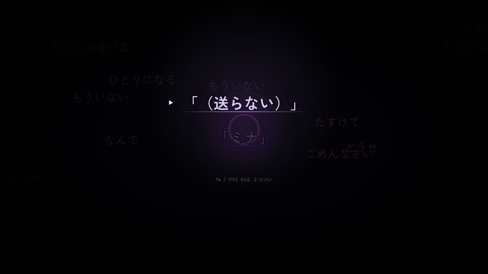

# 画面（UI）

> **この記事の範囲**: 実際のゲーム画面を、画面の種類ごとに写真で紹介する。各画面で「何ができるか」の仕様は → [画面一覧](../05_ゲーム仕様/10_画面一覧.md)、キャラクターの絵そのものは → [キャラクターアート](02_キャラクターアート.md)。
>
> **この記事の画像は 2026-09-06 に撮ったもので、いまの画面とは違う。** その後に HUD のサイドパネル・ポーズメニュー・投稿詳細・タイトルが作り直され、ハブはスマホのホーム画面を持ち、ボスの体力は**ボスの頭上のゲージ**になり、会話枠には**アイコンのボタン列**が付いた。**現在の仕様は各記事の本文が正典**で、ここの画像は「その時点の画」として読むこと（撮り直し待ち）。差分の大きい箇所は各節に注記した。
>
> **どの画面にも共通で入ったもの（2026-09-26〜27）**
>
> - **会話枠の上辺に、右寄せでアイコンのボタン列**が付く（左から 自動送り ▶／既読スキップ ▶▶／ログ（横線3本）／メニュー（歯車））。文字ラベルとキー表記は載せず、マウスを乗せると名前の吹き出しが出る。キーボードは A / S / L / M、パッドは Y / RB / View / ≡、クリックでも押せる。既読スキップは画面が切り替わっても保たれ、会話枠が出ていない間は画面右上に小さな「▶▶」が出る。出るのは Hud が描く全ての会話枠と、枠を自前で描く 4 画面（プロローグ・Final・エピローグ・ハブの返信会話）。
> - **戦闘画面とカットシーンの右下の「M メニュー」チップは廃止**された。非戦闘のスマホ系画面（ハブ・ショップ・記録・カスタマイズ・写真・潜り方）では、画面下端のヒント帯の右端に「メニュー」として畳まれている（クリックでも開く）。

## タイトル

はじめから／つづきから／設定／クレジットが並ぶ最初の画面である。**画像は刷新前のもの**——いまは画面いっぱいのミナの一枚絵に「Refrain」のロゴが載り、項目もこの 4 つになっている（→ [画面一覧](../05_ゲーム仕様/10_画面一覧.md)）。

## プロローグ

物語の始まり。ミナが起動し、あなたの最初の言葉と命名が交わされる（→ [プロローグ](../03_ストーリー/01_プロローグ.md)）。

## ハブ（タイムライン）

投稿カードの右上のピルが NEW／CLEAR／LOCKED を示し、ここからダイブ・返信へ移る。いまのハブはスマホのホーム画面を持ち、強化・記録へはホームのアプリ（SNS／強化ショップ／記録／写真／カスタマイズ）から移る（画像はホーム化前のもの。→ [画面一覧](../05_ゲーム仕様/10_画面一覧.md)）。

**2026-09-27 にキーの案内と切り替えが付いた。** 項目ごとに散っていた「J」「C」「X」のキー表記をやめ、操作は「矢印で選ぶ・Z で決める・Esc／X でもどる」に絞って、その案内を**画面下端の右寄せ一行**（暗い角丸の板の上）に出す。右端の「メニュー」はクリックでも開く。加えて**左パネルの左下＝スマホ本体の左隣に「キャラ切り替え」ボタン**があり、Tab／パッド Y／クリックで押すとアカウント切り替えが開く（もう一度押すと閉じる）。効くのはホーム・SNS・投稿詳細・写真アプリで、会話中とアプリ起動の演出中は薄くなって反応しない。仲間のアバター列はこのボタンの右隣に並ぶ。

## 潜り方（難易度）

いまは難易度を選ぶ専用の画面は無く、ハブの投稿詳細に「潜り方」4 段として吸収されている（画像は吸収前の単体画面のもの。→ [難易度](../05_ゲーム仕様/08_難易度.md)）。

## ステージ本編（HUD）

道中では画面下のティッカーに「降ってくる言葉」が流れ、ボス戦では Y 風の宣言カードがスペルの切り替えを告げる（→ [ボス戦](../05_ゲーム仕様/06_ボス戦.md)）。

**ボスの体力は 2026-09-27 に画面上端のカードをやめ、ボス本体の頭上の簡略ゲージになった**（作者指示「実際に動いてるボスの上部に表示」）。頭上に出るのは「いまの1本」のバーと残り本数の点だけで、アイコン・名前・ハンドル・リプ数は出ない。位置と表示はボスに追従し、ボスが消えれば一緒に消える。塗りで状態を言い分ける——**無敵（今は通らない）＝灰＋斜線のハッチ／BREAK（殴れる）＝金**で、割れた一拍は白へ光り、そのあとは脈打つ。スペル色は残り本数の点に残る。上の 3 枚はどれもカード時代の画。

**サイドパネルは 2026-09-16〜17 に作り直された。** 画像に写っている「やさしさ」「汚染」のバーは既に無く、いまは上から アカウントの見出し（顔・名前・ハンドル）→ LIFE（キャラの核マーク）→ BOMB → 浄化 → SCORE → TIME → **LOCK-ON** → COMBO → 集中 の並びである。LOCK-ON の行は 2026-09-26 に足された（作者指示「ステータス欄でロックオンモードが分かるように」）——OFF は灰、**待機**（モードは立っているが画面に敵が居ない）は青緑でゆっくり明滅、**追尾中**はそのキャラの色で、行の右に状態の語と点が出る。画面に敵が居ない間は盤面に照準マーカーが出ないので、この行が唯一の手がかりになる（→ [画面一覧](../05_ゲーム仕様/10_画面一覧.md)）。

## 会話・改心の画面

会話は下部のバーで進み、ボスの HP が尽きると涙の立ち絵で改心の会話が始まる。レイ戦では会話の途中に三択が挟まる。あなたの言葉を選ぶ画面は、冒頭の三度、道中の七か所（あかり 2・こはる 3・レイ 2）、あかり面の束、レイ面の割り込み、FINAL の頂点、エピローグの END にある。

**会話枠の上辺には、いまはアイコンのボタン列が載る**（記事の冒頭の注記。上の 4 枚はどれもボタン列が付く前の画）。

## ショップ

浄化した心を使って強化を買う画面（→ [ショップと強化](../05_ゲーム仕様/07_ショップと強化.md)）。列は**一本道 14 段**（2026-09-22 に回避を段に加えて 13→14）。**画像は文言整理の前のもの**——いまは見出しが「SHOP」だけになり、詳細パネルの対比も「買う前の値 → 買った後の値」の矢印 1 行、フッタの「上から順に買えます」も消えている。操作も 2026-09-27 に揃った——↑↓ で段を選び、**←→ で詳細パネルの [強化する] [ためし撃ち] を切り替えて Z**（旧 T キーの置き換え）。キーの案内は右下のヒント帯に出る。

## 記録

## 設定

## クレジット

## Final・エピローグ

FINAL のボスを改心させたあとの結末はカットシーンで語られる（→ [FINAL ミナ](../03_ストーリー/06_FINAL_ミナ.md)、[エピローグ](../03_ストーリー/07_エピローグ.md)）。**どちらも画像は作り直し前のもの**——Final は真っ暗な空間に悲鳴の語が漂う画だったが、いまは「待っている三人」の一枚絵の上で語りが進む。エピローグも夜の屋上の一枚絵から始まり、途中にエンディングフィルムが入る。

## 関連記事
- [画面一覧](../05_ゲーム仕様/10_画面一覧.md)
- [キャラクターアート](02_キャラクターアート.md)
- [敵の技](03_敵の技.md)
- [ボス戦](../05_ゲーム仕様/06_ボス戦.md)

<!-- 出典: build/shots/ の実機画面一式（2026-09-06 撮影。撮り直し待ち）; src/TitleMenu.cs, src/Prologue.cs, src/Hub.cs（HintItems／DrawHintBar／DrawSwitchButton／HomeApps）, src/DiffSelect.cs（通常導線なし・デバッグとスクショ用）, src/Hud.cs（サイドパネルの行順・RowLock／DrawLockOn）, src/BossGauge.cs（ボス頭上の簡略ゲージ・無敵=灰＋ハッチ／BREAK=金）, src/DialogToolbar.cs（会話枠のアイコン列 AUTO/SKIP/LOG/MENU とラッチ印）, src/PauseMenu.cs:898（右下「M メニュー」チップの廃止）, src/ChoiceOverlay.cs, src/StageKoharu.cs, src/Shop.cs, src/Records.cs, src/Settings.cs, src/Credits.cs, src/Final.cs, src/Epilogue.cs; wiki/05_ゲーム仕様/10_画面一覧.md -->
