# キャラクターアート

> **この記事の範囲**: ゲーム内で実際に使われている立ち絵・表情差分・戦闘スプライト・カットイン・背景のアート集。各表情がどの場面で出るかの詳細は → [キャラクター](../04_キャラクター/00_相関図.md) の各記事、実戦での見え方は → [敵の技](03_敵の技.md)。

## キービジュアル

## ミナ

自機として飛ぶ小さな姿と、会話用の立ち絵 5 表情を持つ。メイド服の白と髪の白がそのままシルエットになり、暗い盤面の上で最も明るい一点として読める。

## 少年

プロローグからの相棒であり、FINAL では自機として立つ。表情は 6 種で、うろたえた顔がプロローグ以降に出ないこと、こわばった顔が STAGE2 から増えることが内面の推移を担う（→ [少年](../04_キャラクター/01_少年.md)）。

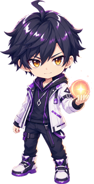
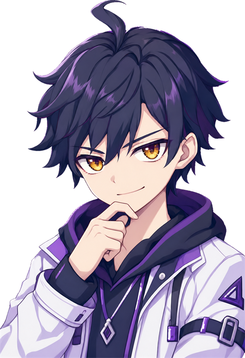
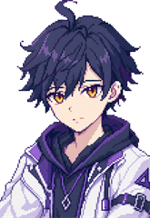
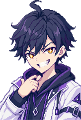
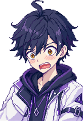
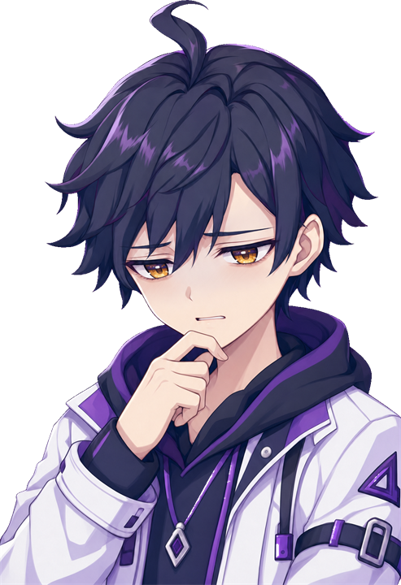
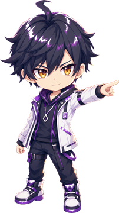

## レイ「孤高のわたし」

会話立ち絵 2 表情と、戦闘スプライト 3 段（穢れ→涙→浄化後）、スペル宣言のカットインを持つ。菫色のパーカーと「2位」の名札が、順位に縛られた穢れの記号になっている。

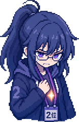
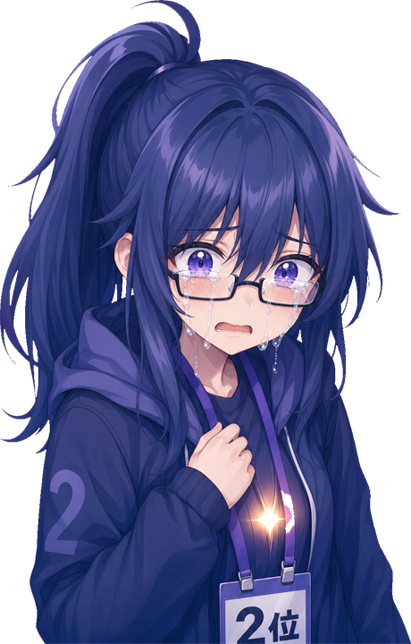
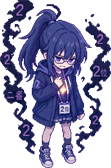
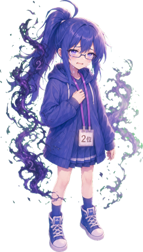
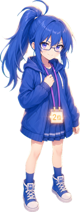
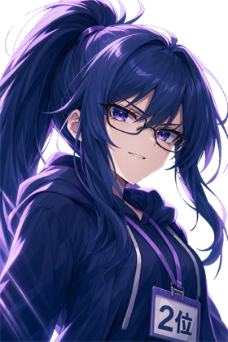

## あかり「あふれるわたし」

セーラー服の雨青が STAGE2 の画面全体の色と呼応する。3 段の戦闘スプライトとカットイン、泣き顔の立ち絵を持つ。

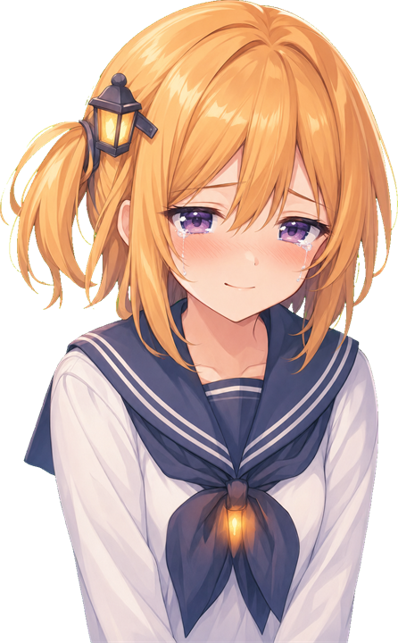
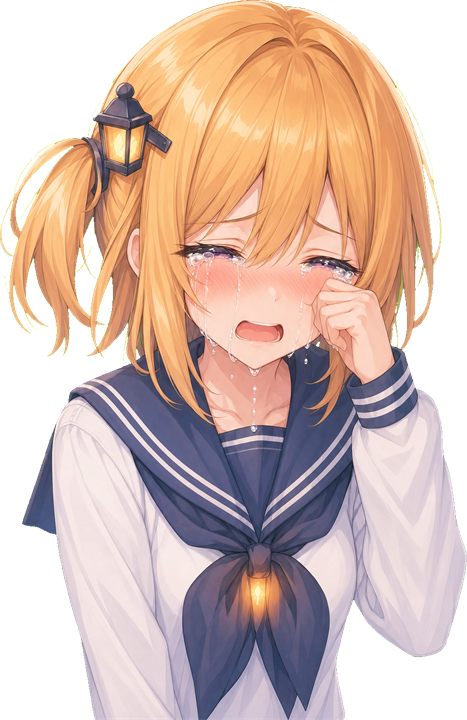
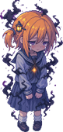
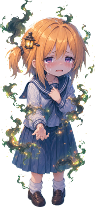
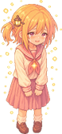
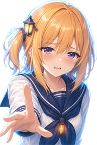

## こはる「とまれないわたし」

会話立ち絵に泣き顔はなく、蒼白の顔が絶望を担う（→ [こはる](../04_キャラクター/05_こはる.md)）。エプロンの暖色が台所のステージ色と揃えてあり、健気さと危うさが同じ色で描かれる。

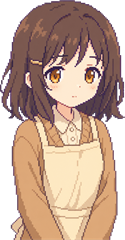
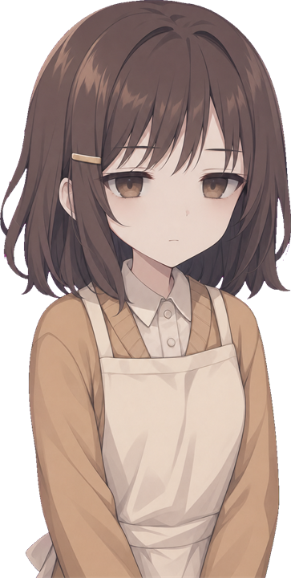
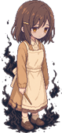
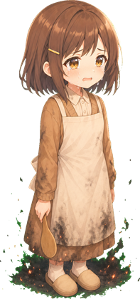
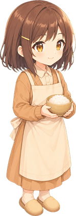
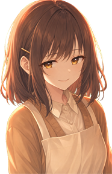

## ミナ「穢れたわたし」（FINAL）

FINAL のボスとしてのミナ。普段の白いシルエットが穢れに沈み、浄化後に戻る対比が終幕の絵になる。

## 道中の敵

雑魚はステージのテーマに合わせた「穢れた物」で、浄化すると同じ物の晴れた姿に変わる。穢れ→浄化の 2 枚 1 組で並べる（呼称は → [敵](../05_ゲーム仕様/05_敵.md)）。

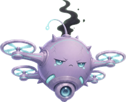
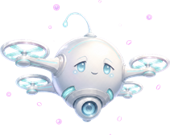
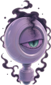

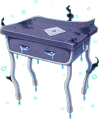
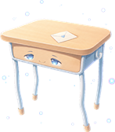
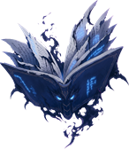
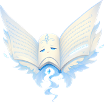
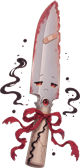

## 背景

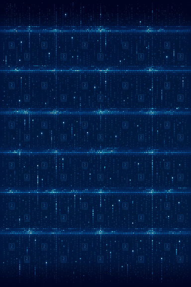
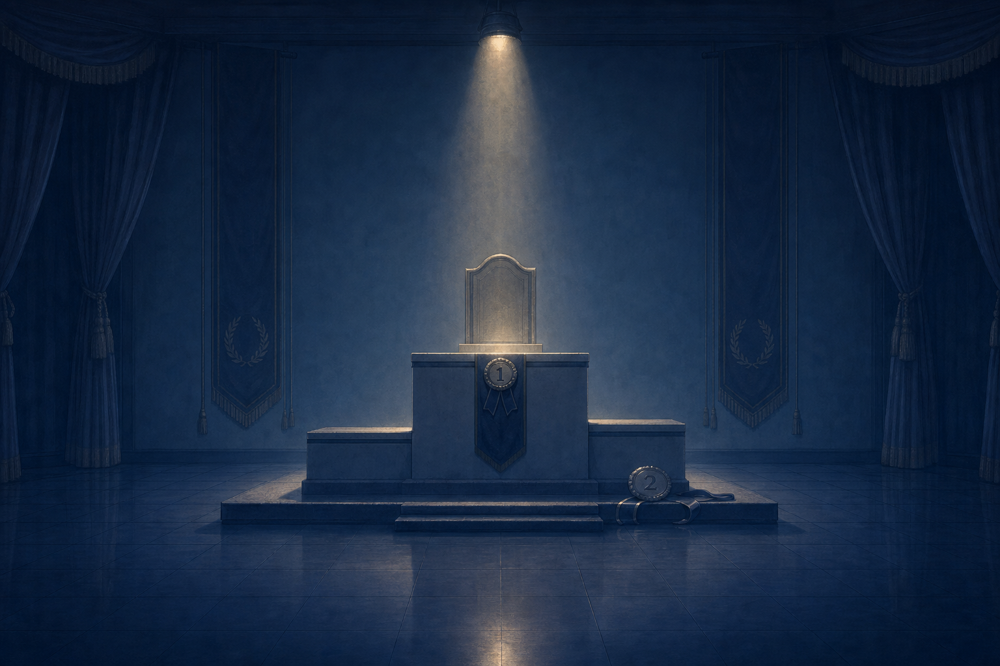
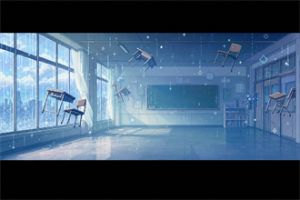
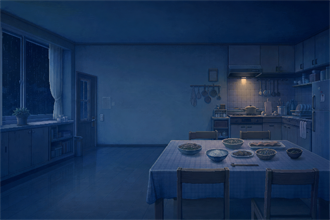

## 関連記事
- [少年](../04_キャラクター/01_少年.md)／[ミナ](../04_キャラクター/02_ミナ.md)／[レイ](../04_キャラクター/03_レイ.md)／[あかり](../04_キャラクター/04_あかり.md)／[こはる](../04_キャラクター/05_こはる.md)
- [敵](../05_ゲーム仕様/05_敵.md)
- [画面（UI）](01_画面.md)
- [敵の技](03_敵の技.md)

<!-- 出典: src/Player.cs 348-352, 384; src/Shop.cs 403, 1959-1965; src/TitleMenu.cs 117-118; src/Hud.cs（会話の表情指定）; src/StageRei.cs, src/StageAkari.cs, src/StageKoharu.cs, src/BossMina.cs, src/DiffSelect.cs 24-30, src/Prologue.cs 75, src/Epilogue.cs 117-124（表情の使用行）; src/EnemySpec.cs 74-110; src/MidEnemy.cs 91; src/GlyphMote.cs 29-31; src/Follower.cs 18; src/ReiRoot.cs 37-38, src/AkariRoot.cs 37-38, src/KoharuRoot.cs 38-39, src/MinaRoot.cs 88-92, src/ScrollFx.cs 63-65; wiki/04_キャラクター/01〜05 の表情差分節 -->
