# キャラクターアート

> **この記事の範囲**: ゲーム内で実際に使われている立ち絵・表情差分・戦闘スプライト・カットイン・背景のアート集。各表情がどの場面で出るかの詳細は → [キャラクター](../04_キャラクター/00_相関図.md) の各記事、実戦での見え方は → [敵の技](03_敵の技.md)。

## キービジュアル

## ミナ

自機として飛ぶ小さな姿と、会話用の立ち絵 5 表情を持つ。メイド服の白と髪の白がそのままシルエットになり、暗い盤面の上で最も明るい一点として読める。

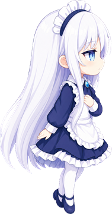

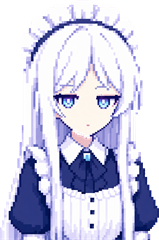

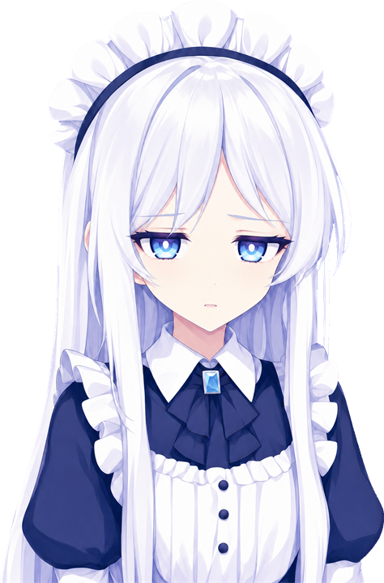
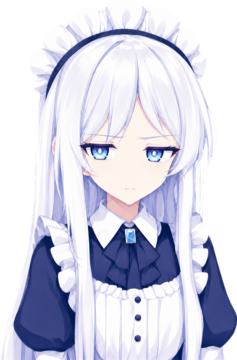
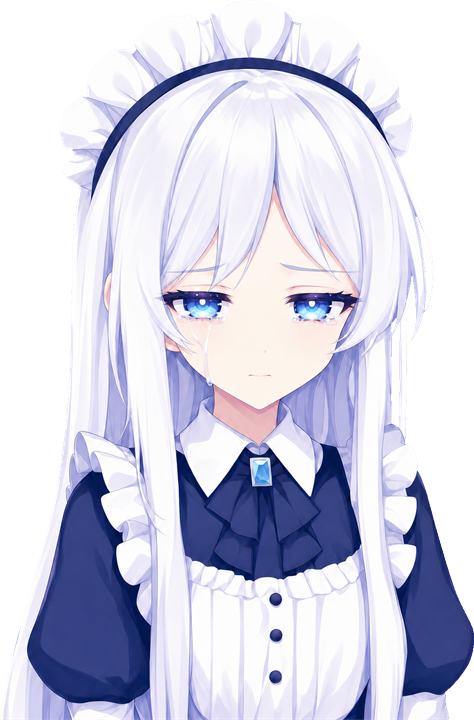

## レイ「星逢レイ」

会話立ち絵は中の人の 3 表情（平常・配信用の笑顔・泣き顔）に、配信のガワの一枚が加わる。戦闘の姿は中ボスが中の人、ボスがガワで、姿も大きさも違うこと自体が仕込みになっている（→ [レイ](../04_キャラクター/03_レイ.md)）。

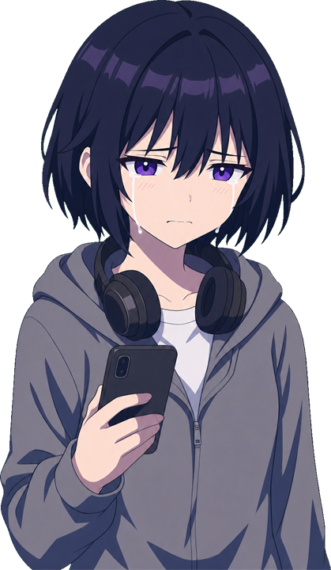

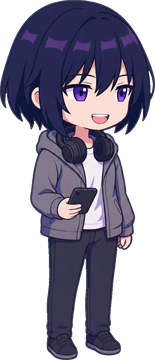
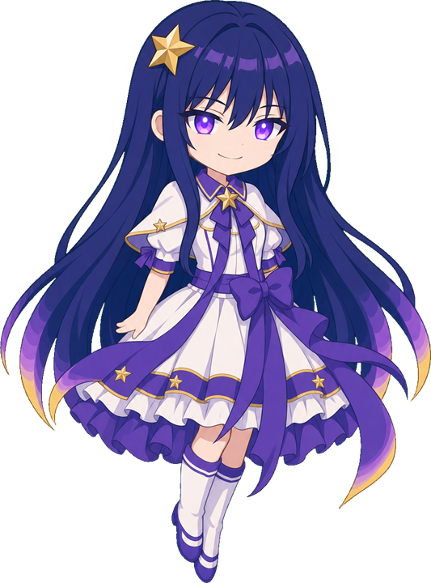
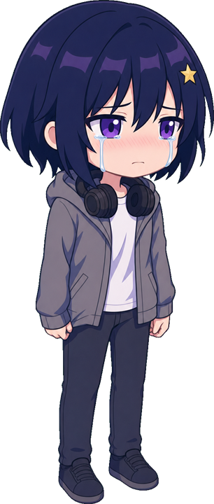
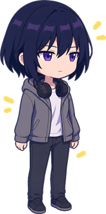
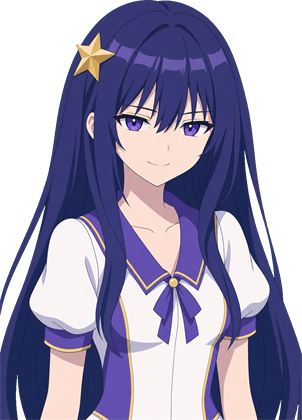

## あかり「あふれるわたし」

社員証のストラップと片手のスマホが目印で、雨青の色掛けが STAGE1 の画面全体と呼応する。会話立ち絵 3 表情と、中ボス・ボス・涙・浄化後の戦闘スプライト、カットインを持つ。

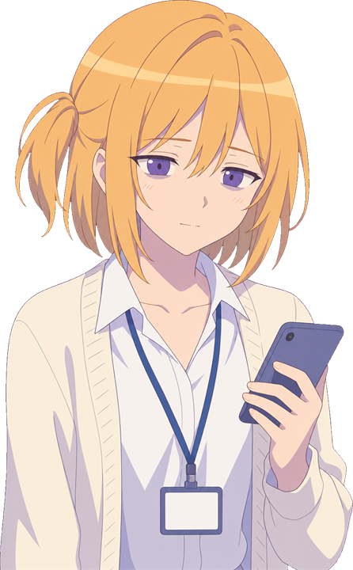
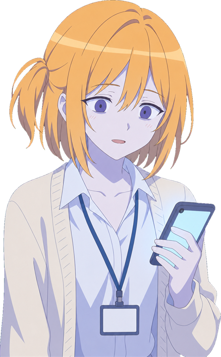
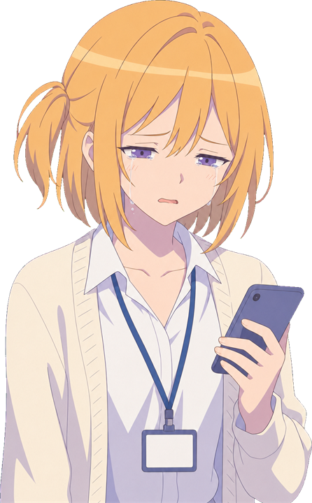
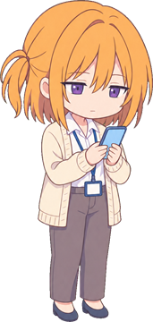
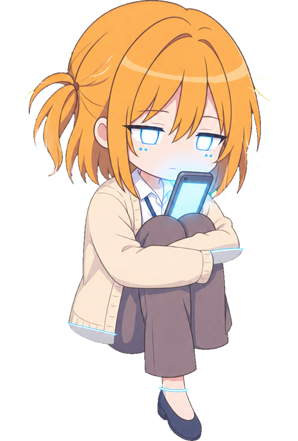
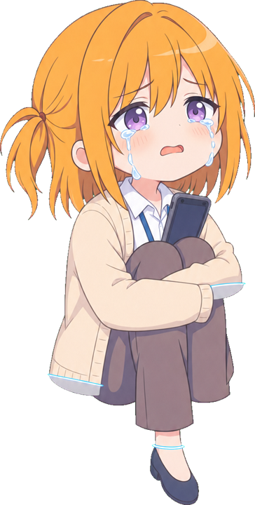
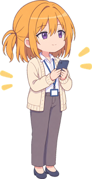
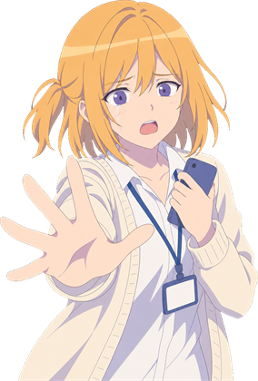

## こはる「我に返るわたし」

会話立ち絵に泣き顔はなく、蒼白の顔が絶望を担う（→ [こはる](../04_キャラクター/05_こはる.md)）。ブレザーの紺とペンライトの紫が配信の部屋のステージ色と揃えてあり、明るさと危うさが同じ色で描かれる。

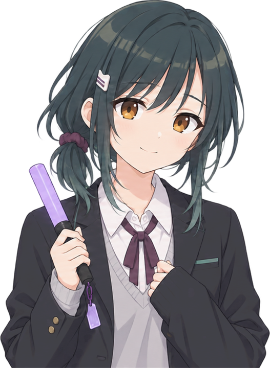
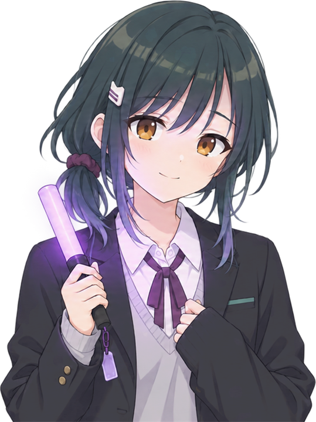
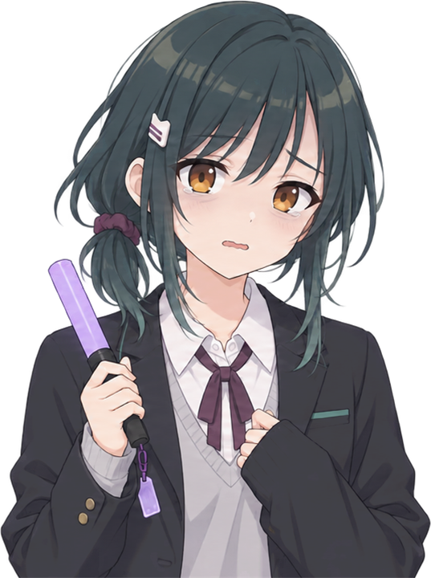
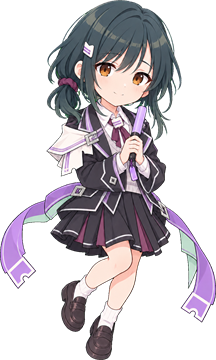
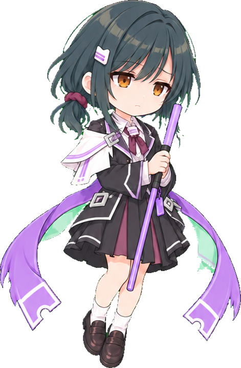
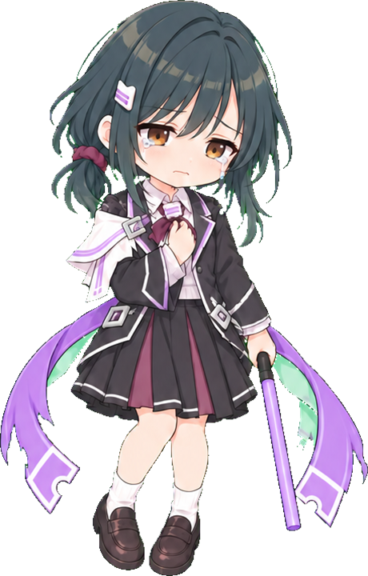
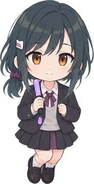
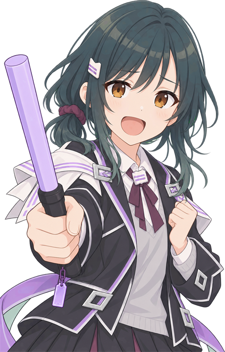

## ミナ「穢れたわたし」（FINAL）

FINAL のボスとしてのミナ。普段の白いシルエットが穢れに沈み、浄化後に戻る対比が終幕の絵になる。

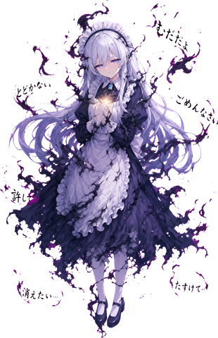
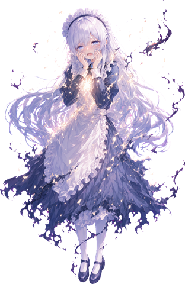
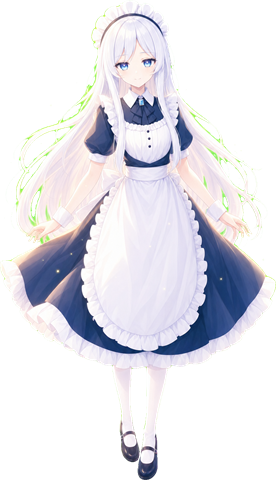
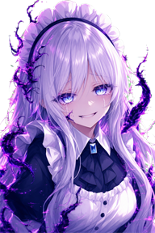

## 道中の敵

雑魚はステージのテーマに合わせた「穢れた物」で、浄化すると同じ物の晴れた姿に変わる。穢れ→浄化の 2 枚 1 組で並べる（呼称は → [敵](../05_ゲーム仕様/05_敵.md)）。

## 背景

背景は遠景・中景・近景・光の層を重ねた奥行きのある一枚で、自機の位置に合わせてわずかにずれる。ここでは各面の開幕の画面で示す。

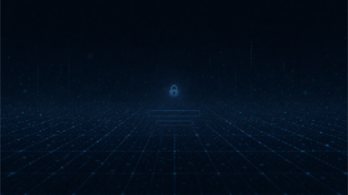
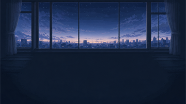

## 関連記事
- [ミナ](../04_キャラクター/02_ミナ.md)／[レイ](../04_キャラクター/03_レイ.md)／[あかり](../04_キャラクター/04_あかり.md)／[こはる](../04_キャラクター/05_こはる.md)
- [敵](../05_ゲーム仕様/05_敵.md)
- [画面（UI）](01_画面.md)
- [敵の技](03_敵の技.md)

<!-- 出典: src/Player.cs 354-355, 390; src/Shop.cs 403; src/TitleMenu.cs; src/Hud.cs 675-680（カットイン絵とセリフ）; src/StageRei.cs 61-63, 498-500, src/StageAkari.cs 37-38, 508-510, src/StageKoharu.cs 76-78, 565-567（会話の顔・中ボスの絵）; src/BossRei.cs 63, 98, 148-155, src/BossAkari.cs 70, 116-123, src/BossKoharu.cs 30-31, 173-180, src/BossMina.cs 101-105（ボスの Pre/Cry/Post）; src/DiffSelect.cs 24-30, src/Prologue.cs 80-82, src/Epilogue.cs 179-186（表情・エピローグ背景）; src/EnemySpec.cs 79-98; src/GlyphMote.cs 29-30; src/AkariRoot.cs 42-50, src/KoharuRoot.cs 19-41, src/ReiRoot.cs 44-61（背景の層）; build/shots/akari_00.png, koharu_00.png, rei_00.png; wiki/04_キャラクター/02〜05 の表情差分節 -->
