# 敵の技

> **この記事の範囲**: ボス 4 人のスペルと固有ギミックを、原画・弾道の模式図・動く弾幕・実戦の画面で HP の推移順に紹介する。模式図の数値は基準値（Dn＝弾数倍率・Di＝間隔倍率 → [難易度](../05_ゲーム仕様/08_難易度.md)）。各弾道図の下の「動く弾幕」は、ゲームと同じ数値（Normal の実効値＝弾数 ×0.7・発射間隔 ×1.35・弾速 ×0.85 を適用済み）で弾だけを飛ばし続けるシミュレーション。クリックで再生/停止できる。弾数・速度・切り替えしきい値などの数値は → [ボス戦](../05_ゲーム仕様/06_ボス戦.md)、道中の雑魚の一覧は → [敵](../05_ゲーム仕様/05_敵.md)。面の順は STAGE 1 あかり → STAGE 2 こはる → STAGE 3 レイ → FINAL ミナ。

## あかり「あふれるわたし」（STAGE 1）


スペルは HP の残りが 78%／52%／26% を割るたびに切り替わり、『ねえ、こっち見て』→『すきって言って』→『ずっと一緒』→『離さない』と進む。最後のバーの残り半分でフィナーレに入り、1 面目の 2 つが重なる。

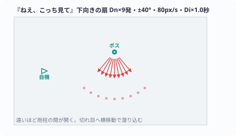

```sim
{
  "title": "動く弾幕『ねえ、こっち見て』。雨青の針 6 本が真下 ±40° の扇で降る（68px/s・1.35 秒ごと）",
  "src": "BossAkari 38-40, 104, 111-112, 206, 223-232 / Normal: Dn(9)=6 spd 80x0.85 Di 1.0x1.35",
  "loop": 10, "seed": 51,
  "phases": [
    { "t": 0, "label": "下向きの扇6本・±40°・68px/s・1.35sごと",
      "emit": [ { "kind": "fan", "n": 6, "center": 90, "spread": 80, "speed": 68, "interval": 1.35, "shape": "needle", "color": "#6c9cd8", "r": 3 } ] }
  ]
}
```


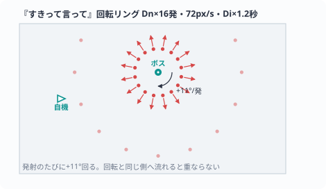

```sim
{
  "title": "動く弾幕『すきって言って』。藍のひし形リング 11 発が発射ごとに +11° 回りながら重なる（61.2px/s・1.62 秒ごと）",
  "src": "BossAkari 113-115, 207, 234-243 / Normal: Dn(16)=11 spd 72x0.85 Di 1.2x1.35",
  "loop": 10, "seed": 61,
  "phases": [
    { "t": 0, "label": "リング11発・61.2px/s・1.62sごと・+11°/発",
      "emit": [ { "kind": "ring", "n": 11, "speeds": [61.2], "interval": 1.62, "step": 11, "shape": "diamond", "color": "#4a6aa0", "r": 3 } ] }
  ]
}
```


中盤の『ずっと一緒』は淡青の玉を、終盤の『離さない』は白い針の螺旋を、どちらも自機へ向けて放つ。この 2 つは「キミ弾」——かすめる（グレイズする）と減速して色が薄くなる弾で、あえて弾のそばを通るほど楽になる。フィナーレでは効かない。

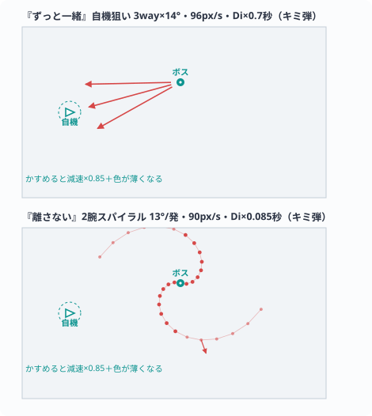

```sim
{
  "title": "動く弾幕『ずっと一緒』→『離さない』。淡青の玉が自機狙い 3way（14° 刻み・81.6px/s・0.95 秒ごと）→白い針の 2 腕スパイラル（+13°/発・76.5px/s・0.115 秒ごと）。実戦ではどちらもキミ弾＝かすめると減速する",
  "src": "BossAkari 116-120, 208-209, 248-268 / Normal: spd 96x0.85 / 90x0.85, Di 0.7x1.35 / 0.085x1.35",
  "loop": 12, "seed": 71,
  "phases": [
    { "t": 0, "label": "ずっと一緒 — 自機狙い3way・14°刻み・81.6px/s・0.95sごと",
      "emit": [ { "kind": "nway", "ways": 3, "stepDeg": 14, "speed": 81.6, "interval": 0.945, "shape": "orb", "color": "#a8c8e8", "r": 4 } ] },
    { "t": 6, "label": "離さない — 2腕スパイラル・+13°/発・76.5px/s・0.115sごと",
      "emit": [ { "kind": "spiral", "arms": 2, "step": 13, "speed": 76.5, "interval": 0.11475, "shape": "needle", "color": "#e8f0ff", "r": 2.6 } ] }
  ]
}
```


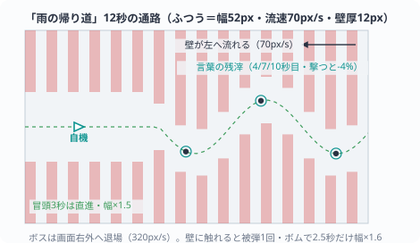

```sim
{
  "title": "動く通路「雨の帰り道」（Normal）。厚さ 12px の壁カラムが 24px 間隔で左へ 70px/s、通路幅 52px・蛇行の最大縦速 80px/s。非致死プレビュー 1.5 秒→本番 12 秒、冒頭 3 秒は直進・広幅（×1.5）の学習区間。緑の三角＝中央線を走る想定自機",
  "src": "CorridorRun 22-35, 79-110 / BossAkari 27-35, 186-198 / Normal: gap52 scroll70 maxVy80",
  "loop": 14.5, "seed": 81, "boss": [420, 70],
  "phases": [
    { "t": 0, "label": "プレビュー1.5s→本番12s — 壁厚12・間隔24・幅52・流れ70px/s・蛇行80px/s",
      "emit": [ { "kind": "corridor", "gap": 52, "scroll": 70, "maxVy": 80, "preview": 1.5, "run": 12, "color": "#6c9cd8", "hot": "#a9dcff" } ] }
  ]
}
```


固有ギミック「雨の帰り道」は HP52% で一度だけ起きる。あかりは画面の右外へ退がって弾を止め、代わりに壁の通路が左から流れてくる。1.5 秒の非致死プレビューのあと本番 12 秒。完走するとご褒美にパネルが全部砕けて、殴れる窓が開く。


予測攻撃は縦のカラムが降る『豪雨予報』と、円が広がる『沈黙の波紋』の 2 種。点滅する輪郭が消える瞬間だけ判定が出る。あかりだけは 1 枚目を自機の現在地に置かない＝予兆はいつも自機の外側から来る。

## こはる「我に返るわたし」（STAGE 2）


スペルは HP78%／50%／26% で切り替わり、『ちゃんとしなきゃ』→『みんな見てる』→『期待』→『我に返る』と進む。合間に固有ギミックが 2 つ（HP52% と 28%）挟まる。

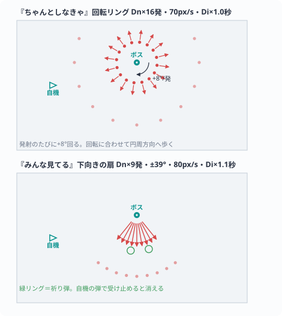

```sim
{
  "title": "動く弾幕『ちゃんとしなきゃ』→『みんな見てる』。琥珀のリング 11 発（59.5px/s・1.35 秒ごと・+8°/発）→深紅のひし形 6 本の下向き ±39° の扇（68px/s・1.49 秒ごと）。扇は祈り弾＝暖白のハロをまとい、実戦では自機弾で受け止められる",
  "src": "BossKoharu 96-102, 227-228, 245-253, 259-269 / Normal: Dn(16)=11 Dn(9)=6 spd 70x0.85 / 80x0.85",
  "loop": 12, "seed": 91,
  "phases": [
    { "t": 0, "label": "ちゃんとしなきゃ — リング11発・59.5px/s・1.35sごと・+8°/発",
      "emit": [ { "kind": "ring", "n": 11, "speeds": [59.5], "interval": 1.35, "step": 8, "shape": "orb", "color": "#e8a24a", "r": 3 } ] },
    { "t": 6, "label": "みんな見てる — 下向き±39°の扇6本・68px/s・1.49sごと（祈り弾）",
      "emit": [ { "kind": "fan", "n": 6, "center": 90, "spread": 78, "speed": 68, "interval": 1.485, "shape": "diamond", "color": "#d6443f", "r": 3.6, "halo": true } ] }
  ]
}
```


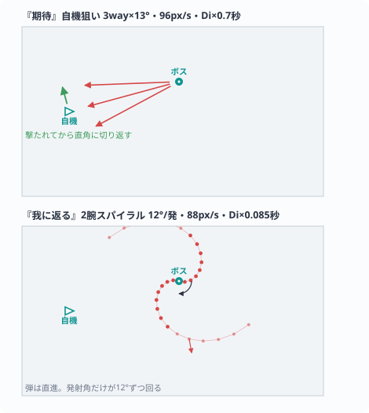

```sim
{
  "title": "動く弾幕『期待』→『我に返る』。橙の針が自機狙い 3way（13° 刻み・81.6px/s・0.95 秒ごと）→燃え残りの粒弾の 2 腕スパイラル（+12°/発・74.8px/s・0.115 秒ごと）",
  "src": "BossKoharu 96-102, 229-230, 441-460 / Normal: spd 96x0.85 / 88x0.85, Di 0.7x1.35 / 0.085x1.35",
  "loop": 12, "seed": 101,
  "phases": [
    { "t": 0, "label": "期待 — 自機狙い3way・13°刻み・81.6px/s・0.95sごと",
      "emit": [ { "kind": "nway", "ways": 3, "stepDeg": 13, "speed": 81.6, "interval": 0.945, "shape": "needle", "color": "#e87a3c", "r": 4 } ] },
    { "t": 6, "label": "我に返る — 2腕スパイラル・+12°/発・74.8px/s・0.115sごと",
      "emit": [ { "kind": "spiral", "arms": 2, "step": 12, "speed": 74.8, "interval": 0.11475, "shape": "rice", "color": "#ffa14a", "r": 2.6 } ] }
  ]
}
```


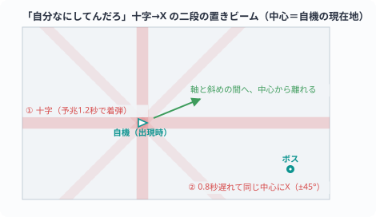

```sim
{
  "title": "動く「自分なにしてんだろ」。宣告 0.7 秒後、自機の現在地に琥珀の十字（横全幅＋縦全高・半太さ 7px・予兆 1.2 秒）→ 0.8 秒遅れて同じ中心に深紅の X（±45°・長さ 460px・半太さ 6px・予兆 1.2 秒）。進行中は通常弾が止まる",
  "src": "BossKoharu 67-85, 381-439, 495-502 / Normal: WarnMul1.0",
  "loop": 6, "seed": 111,
  "phases": [
    { "t": 0, "label": "宣告0.7s→十字（予兆1.2s）→+0.8sでX（予兆1.2s）→各0.2s着弾",
      "emit": [ { "kind": "gotoku", "firstDelay": 0.7, "secondDelay": 0.8, "warn": 1.2, "halfH": 7, "halfX": 6, "diagLen": 460,
        "color": "#e8945a", "hot": "#ffc06a", "xColor": "#d6443f", "xHot": "#ff8a7a" } ] }
  ]
}
```


最後のバーの残り半分（Easy でも HP18% を上限）でフィナーレに入り、『ちゃんとしなきゃ＋みんな見てる』＝琥珀のリングと祈り弾の扇が同時に来る。祈り弾を受け止めてやさしさを稼ぎながら耐えるのが正解。

「自分なにしてんだろ」は HP28% で一度だけ。自機の行と列に琥珀の十字が置かれ、対角へ逃げた先を 0.8 秒後に同じ中心の深紅の X が追う。次は軸の方へ戻れ、という読み筋が幾何で示されている。

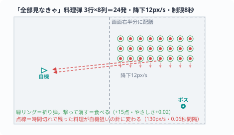

```sim
{
  "title": "動く「全部見なきゃ」。宣告 0.9 秒後に画面右半分へアーカイブの弾 3 行 ×8 列＝24 発が並ぶ（20px 格子・10.2px/s で降下）。8 秒の制限が切れると、見残した弾が 0.06 秒間隔で順に深紅の針（110.5px/s）になって自機へ飛ぶ——この sim は 1 発も見なかった場合＝全 24 発が飛んでくる",
  "src": "BossKoharu 42-65, 159-174, 272-336 / Normal: fall 12x0.85 needle 130x0.85",
  "loop": 13.5, "seed": 121,
  "phases": [
    { "t": 0, "label": "配膳24発（x214+20列・y44+20行・降下10.2px/s）→8s→0.06s間隔で針110.5px/s",
      "emit": [ { "kind": "meal", "rows": 3, "cols": 8, "x0": 214, "y0": 44, "sx": 20, "sy": 20,
        "serve": 0.9, "window": 8, "fall": 10.2, "convStep": 0.06, "needleSpeed": 110.5,
        "mealColor": "#e8a24a", "needleColor": "#d6443f", "rMeal": 3.6, "rNeedle": 3.8 } ] }
  ]
}
```


固有ギミック「全部見なきゃ」は HP52% で一度だけ。画面の右半分にアーカイブの弾（祈り弾）がずらりと並び、時間内に撃って「見る」。残すと、残った分が深紅の針になって一斉に自機へ飛んでくる。被弾もボムもなしに全部見切ると残機が贈られる。


予測攻撃は円の『画面の光』・矩形の『視線のかたまり』・±26° の深紅の一閃が交差する『既読の線』の 3 種。1 枚目は必ず自機の現在地に置かれる＝一歩動けば必ず外れる。

## レイ「星逢レイ」（STAGE 3）


ボスのレイは本人ではなく、本人が被っている配信のガワ。笑顔で固定されていて、被弾しても笑顔は崩さず姿勢だけ落とす。スペルは HP78%／50%／26% で『初見さんいらっしゃい』→『登録者２０００』→『同接８』→『切り抜かれない』と進む。

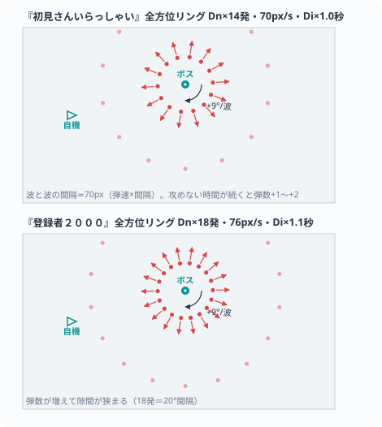

```sim
{
  "title": "動く弾幕『初見さんいらっしゃい』→『登録者２０００』。銀のリング 10 発（59.5px/s・1.35 秒ごと）→菫のリング 13 発（64.6px/s・1.49 秒ごと）、どちらも発射ごとに +9° 回る",
  "src": "BossRei 57-59, 132-141, 272-273, 290-298 / boss_stats [rei] / Normal: Dn0.7 Di1.35 spd0.85",
  "loop": 12, "seed": 11,
  "phases": [
    { "t": 0, "label": "初見さんいらっしゃい — リング10発・59.5px/s・1.35sごと・+9°",
      "emit": [ { "kind": "ring", "n": 10, "speeds": [59.5], "interval": 1.35, "step": 9, "shape": "orb", "color": "#b9c2d0", "r": 3 } ] },
    { "t": 6, "label": "登録者２０００ — リング13発・64.6px/s・1.49sごと・+9°",
      "emit": [ { "kind": "ring", "n": 13, "speeds": [64.6], "interval": 1.485, "step": 9, "shape": "diamond", "color": "#9a72d9", "r": 3 } ] }
  ]
}
```


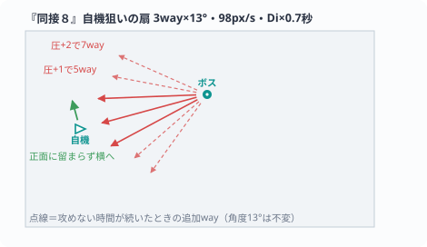

```sim
{
  "title": "動く弾幕『同接８』。金の星が自機狙いの扇（13° 刻み・83.3px/s・0.95 秒ごと）。攻めの手を止めた「圧」で 3way→5way→7way と広がる",
  "src": "BossRei 44-54, 274, 300-310 / Normal: spd 98x0.85 Di 0.7x1.35",
  "loop": 12, "seed": 21,
  "phases": [
    { "t": 0, "label": "圧+0 — 自機狙い3way・13°刻み・83.3px/s・0.95sごと",
      "emit": [ { "kind": "nway", "ways": 3, "stepDeg": 13, "speed": 83.3, "interval": 0.945, "shape": "star", "color": "#e8c45a", "r": 4 } ] },
    { "t": 4, "label": "圧+1 — 5way（角度は不変＝扇が広がる）",
      "emit": [ { "kind": "nway", "ways": 5, "stepDeg": 13, "speed": 83.3, "interval": 0.945, "shape": "star", "color": "#e8c45a", "r": 4 } ] },
    { "t": 8, "label": "圧+2 — 7way（上限）",
      "emit": [ { "kind": "nway", "ways": 7, "stepDeg": 13, "speed": 83.3, "interval": 0.945, "shape": "star", "color": "#e8c45a", "r": 4 } ] }
  ]
}
```

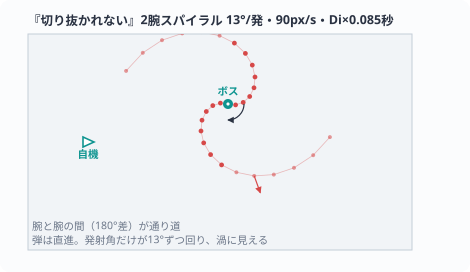

```sim
{
  "title": "動く弾幕『切り抜かれない』。ティールのリング弾の 2 腕スパイラル。発射ごとに +13° 回り、1 発 76.5px/s で直進する（0.115 秒ごと）",
  "src": "BossRei 275, 312-320 / Normal: spd 90x0.85 Di 0.085x1.35",
  "loop": 10, "seed": 31,
  "phases": [
    { "t": 0, "label": "2腕スパイラル・+13°/発・76.5px/s・0.115sごと",
      "emit": [ { "kind": "spiral", "arms": 2, "step": 13, "speed": 76.5, "interval": 0.11475, "shape": "ring", "color": "#5fb8c0", "r": 2.6 } ] }
  ]
}
```


単独の『同接８』は金の星を自機めがけて扇状に放ち、『切り抜かれない』はティールのリングを螺旋で撒く。最後の 1 本が削れるとこの 2 つが重なってフィナーレになる。レイだけは「攻めない時間」に圧がかかる仕組みを持っていて、与ダメがゼロのまま 6 秒で +1、以降 4 秒ごとに +1（上限 +2）。リングの弾数と自機狙いの扇の枚数に乗り、1 発当てるたびに 1 段階すぐ緩む。

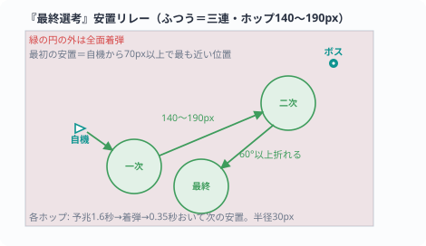

```sim
{
  "title": "動く安置リレー「最終選考」（Normal＝三連）。宣告 0.7 秒→予兆 1.6 秒→着弾 0.2 秒→間 0.35 秒を 3 ホップ。安置は半径 30px、次の安置へは 140〜190px のジグザグ。リレー中は通常弾が止まる",
  "src": "BossRei 353-367 / AreaSpellCaster 98-114, 116-139, 178-231 / Normal: hops3 140-190 WarnMul1.0",
  "loop": 12, "seed": 41,
  "phases": [
    { "t": 0, "label": "最終選考・三連 — 予兆1.6s・着弾0.2s・間0.35s・安置r30・ホップ140–190px",
      "emit": [ { "kind": "aoe", "color": "#e8c45a", "hot": "#ffe39a",
        "casts": [ { "hops": 3, "hopMin": 140, "hopMax": 190, "safeR": 30, "warn": 1.6, "gap": 2.0 } ] } ] }
  ]
}
```


固有ギミック「最終選考」は HP26% で一度だけ。全画面が危険域になり、緑の円の内側だけが助かる。円は Normal で 3 回続けて移り、次の安置へは 140〜190px のジグザグ。無被弾で完走すると、レイが初めて認める一言とハートが 1 個返ってくる。


予測攻撃は横ビームの『コメント一斉読み』・矩形の『配信枠』・もう 1 本の横ビーム『切り抜きの線』の 3 種。宣告から予兆までは 0.7 秒、予兆は 1.1〜1.6 秒。こはると同じく 1 枚目は自機の現在地に置かれる。

## ミナ「穢れたわたし」（FINAL）


FINAL では、これまでのボスたちの弾幕を穢れた色で引き継いだスペルが順に来る。HP82%／62%／42%／22% で切り替わり、『レイの渦＋あかりの雨』→『こはるの怒り＋レイの星』→『あかりの落下＋こはるの扇』→『心象の核』→『世界中の悲鳴』と進む。HP バーはラスボス格で 2 本多い（Normal で 6 本）。

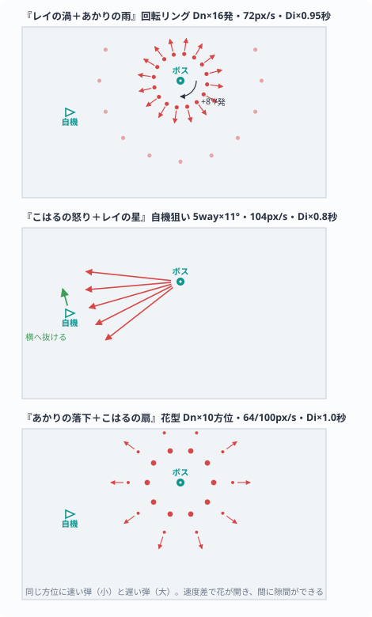

```sim
{
  "title": "動く継承の弾幕。『レイの渦＋あかりの雨』＝濁紫のリング 11 発（61.2px/s・1.28 秒ごと・+8°/発）→『こはるの怒り＋レイの星』＝濁桃の星の自機狙い 5way（11° 刻み・88.4px/s・1.08 秒ごと）→『あかりの落下＋こはるの扇』＝濁藍の花型 7 花弁 × 二重速度（54.4px/s の大粒と 85px/s の小粒・1.35 秒ごと）",
  "src": "BossMina 32-34, 41-48, 151-158, 172-202 / Normal: Dn(16)=11 Dn(10)=7 spd x0.85 Di x1.35",
  "loop": 12, "seed": 131,
  "phases": [
    { "t": 0, "label": "レイの渦＋あかりの雨 — リング11発・61.2px/s・1.28sごと・+8°/発",
      "emit": [ { "kind": "ring", "n": 11, "speeds": [61.2], "interval": 1.2825, "step": 8, "shape": "diamond", "color": "#b07cd0", "r": 3 } ] },
    { "t": 4, "label": "こはるの怒り＋レイの星 — 自機狙い5way・11°刻み・88.4px/s・1.08sごと",
      "emit": [ { "kind": "nway", "ways": 5, "stepDeg": 11, "speed": 88.4, "interval": 1.08, "shape": "star", "color": "#e0648c", "r": 4 } ] },
    { "t": 8, "label": "あかりの落下＋こはるの扇 — 花型7花弁×二重速度（54.4/85px/s）・1.35sごと",
      "emit": [ { "kind": "flower", "petals": 7, "slow": 54.4, "fast": 85, "rSlow": 4, "rFast": 2.6, "interval": 1.35, "shape": "rice", "color": "#9a8cd0" } ] }
  ]
}
```


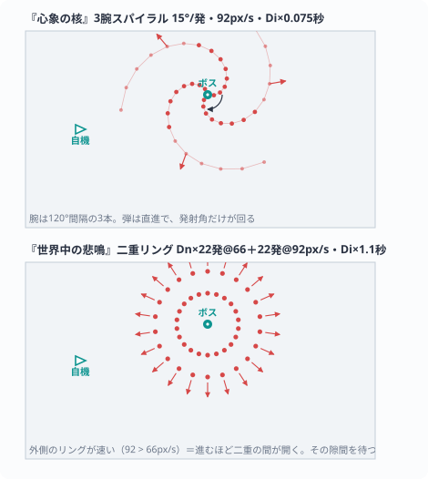

```sim
{
  "title": "動く弾幕『心象の核』→『世界中の悲鳴』。濁金のリング弾の 3 腕スパイラル（+15°/発・78.2px/s・0.10 秒ごと）→濁桃の二重リング各 15 発（内 56.1px/s／外 78.2px/s・1.49 秒ごと）。内外の速度差で隙間が開いていく",
  "src": "BossMina 46-47, 156-157, 204-212 / Normal: Dn(22)=15 spd 66x0.85 / 92x0.85, Di 0.075x1.35 / 1.1x1.35",
  "loop": 12, "seed": 141,
  "phases": [
    { "t": 0, "label": "心象の核 — 3腕スパイラル・+15°/発・78.2px/s・0.10sごと",
      "emit": [ { "kind": "spiral", "arms": 3, "step": 15, "speed": 78.2, "interval": 0.10125, "shape": "ring", "color": "#f0d98a", "r": 2.6 } ] },
    { "t": 6, "label": "世界中の悲鳴 — 二重リング各15発・56.1/78.2px/s・1.49sごと",
      "emit": [ { "kind": "ring", "n": 15, "speeds": [56.1, 78.2], "interval": 1.485, "step": 8, "shape": "orb", "color": "#e0729c", "r": 3 } ] }
  ]
}
```


戦いの節目には、全画面の範囲攻撃が 3 回ある。予告から着弾までは通常弾が止まり、ミナは詠唱の構えをとる。

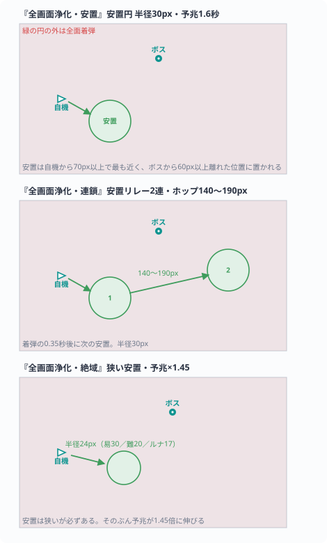

```sim
{
  "title": "動く全画面浄化 3 種（Normal）。『安置』＝単発・安置半径 30px・予兆 1.6 秒 →『連鎖』＝安置リレー 2 連（ホップ 140〜190px・間 0.35 秒）→『絶域』＝安置半径 24px・そのぶん予兆 2.32 秒。緑の円の内側だけが助かる。予告〜着弾中は通常弾が止まる",
  "src": "BossMina 29, 35, 98-99, 237-250 / AreaSpellCaster 44-63, 88-114 / Normal: r30 / r24 warn 1.6x1.45",
  "loop": 14, "seed": 151,
  "phases": [
    { "t": 0, "label": "安置（単発r30・予兆1.6s）→連鎖（2連・140–190px）→絶域（r24・予兆2.32s）",
      "emit": [ { "kind": "aoe", "color": "#e072ac", "hot": "#ff8cc4",
        "casts": [
          { "hops": 1, "safeR": 30, "warn": 1.6, "gap": 1.2 },
          { "hops": 2, "hopMin": 140, "hopMax": 190, "safeR": 30, "warn": 1.6, "gap": 1.2 },
          { "hops": 1, "safeR": 24, "warn": 2.32, "gap": 2.0 }
        ] } ] }
  ]
}
```


『安置』は HP62% の学習用で安置が広い（半径 30px）。『連鎖』は HP42% で 2 連のリレーになる。『絶域』はフィナーレ突入の合図で、安置は Normal で半径 24px と狭いかわりに予兆が 1.45 倍（2.32 秒）に伸びる。安置は必ず在る＝ボムを持っていなくても走って入れる。


予測攻撃は『全テレグラフ同時』と『濁渦と雨』の 2 種。どちらも形を固定せず、横ビーム・縦カラム・円・矩形の 4 種から毎回引き直す＝ミナの予兆だけは「次に何の形が来るか」が読めない。予兆は 0.8〜1.2 秒と全ボスで最も短い。

## 道中の敵の攻撃


道中の中ボスはスペルを持たない（宣言カードも出ない）。雑魚の種類と攻撃の一覧は → [敵](../05_ゲーム仕様/05_敵.md)。

## 関連記事
- [ボス戦](../05_ゲーム仕様/06_ボス戦.md)
- [敵](../05_ゲーム仕様/05_敵.md)
- [難易度](../05_ゲーム仕様/08_難易度.md)
- [キャラクターアート](02_キャラクターアート.md)
- [あかり](../04_キャラクター/04_あかり.md)／[こはる](../04_キャラクター/05_こはる.md)／[レイ](../04_キャラクター/03_レイ.md)／[ミナ](../04_キャラクター/02_ミナ.md)

<!-- 出典: build/shots/ の実機画面一式（spell_*.png は各ボス戦のスペル発動中を撮り直したもの）; wiki/05_ゲーム仕様/06_ボス戦.md（技名・挙動の正）; src/BossAkari.cs 43-50, src/BossKoharu.cs 95-102, src/BossRei.cs 74-81, src/BossMina.cs 40-48（スペル名の正典）, src/AreaSpellCaster.cs 259-310（宣告名）, src/CorridorRun.cs, src/PostBullets.cs, src/MidEnemy.cs; 原画は char/enemy_akari_pre.png ほか（各 Boss*.cs の PreTexPath が参照する実アセット）; 弾道模式図 図/*.svg は src/BossAkari.cs 226-271, src/BossKoharu.cs 245-269, 381-460, src/BossRei.cs 290-320, src/BossMina.cs 172-212, src/AreaSpellCaster.cs 88-139, 178-257, src/CorridorRun.cs 22-51, config/boss_stats.ini 19-163 の値から作図; sim フェンス（動く弾幕）の数値は同じ Boss*.cs の該当行（各 sim JSON の src フィールド参照）に GameManager.cs 61-64, 110 の Normal 実効倍率（弾数 Dn=round(n×0.7)・間隔 Di=×1.35・弾速 ×0.85・WarnMul 1.0）を掛けた値。描画・駆動は tools/wiki_site.mjs 埋め込みの共有ランタイム -->
