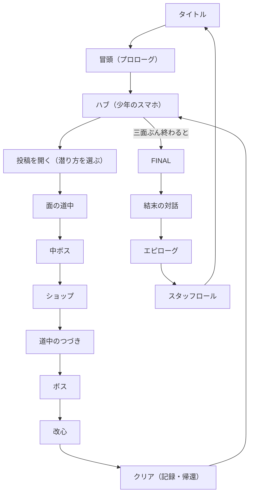
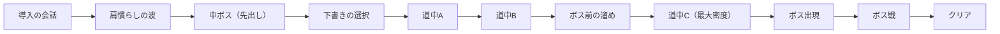

# 全体の流れ

> **この記事の範囲**: 起動から結末まで、遊びが一本の筋としてどう繋がっているか。各段で遊び手が何をし、何が記録され、次の段へ何が渡るか。画面そのものの地図は → [02 画面遷移](02_画面遷移.md)、部品ごとの数値は → [05 ゲーム仕様](../05_ゲーム仕様/01_操作.md)。物語の中身は扱わない（→ [03 ストーリー / 00 時系列](../03_ストーリー/00_時系列.md)）。

## 一本の筋

起動から結末までは、大きく次の順に進む。

三つの面（あかり → こはる → レイ）を順に片づけ、そのたびにハブへ帰り、三つ揃うと FINAL が開く。**ハブが中心にある**構造で、面はそこから出て、そこへ戻る。

## 起動 — タイトル

起動すると最初に出るのはタイトルである。ここには「はじめから／つづきから／設定」が並ぶ。

| 遊び手がすること | 変わるもの |
|---|---|
| 「はじめから」を選ぶ | 持ち物（お金・強化・記録）を初期化して冒頭へ。機器の選択は挟まない（ボタン表記は触った機器へ自動で追従する） |
| 「つづきから」を選ぶ | オートセーブまたはスロット1〜3を読み込んでハブへ。記録が無ければその旨が出る |

練習面の導線（「チュートリアル」の項目）は今は出ない（→ [04 機能の棚卸し](04_機能の棚卸し.md)）。

## 冒頭 — 起動の場面

タイトルから「はじめから」で入る、会話だけの場面。ここで**この作品の入力の作法**（読む・選ぶ・送る）を、練習面ではなく物語の中で覚える。

| 遊び手がすること | 記録される値 |
|---|---|
| 会話を読み進める | 読んだ行が既読として端末に残る（周回の高速送りに効く） |
| 三度の下書き選択を送る（第一声・命名・タイムラインの受け） | 選んだ言葉、選ばなかった言葉（＝散る）、迷った秒数、命名の道すじ |

読み終わるとハブへ直行する。**ここで「選ばなかった言葉が散って積まれる」仕掛けが始まり**、その積み荷は終盤で戻ってくる。

## ハブ — 少年のスマホ

面と面のあいだに必ず戻る場所で、少年のスマホの形をしている。最初は SNS のタイムラインだけが映るが、**最初の面をクリアするとホーム画面が現れ**、SNS・強化ショップ・記録の 3 つのアプリを行き来する形になる。タイムラインには上から下へ投稿カードが並び、そのうち何枚かが「潜れる投稿」である。

| 遊び手がすること | 変わるもの |
|---|---|
| ↑↓ で投稿を辿り、声のする投稿で Z を押す | その投稿の詳細が開く |
| クリア済みの投稿に C で返信する | お金が増え、フォロワーが12人増える。返信は1つの投稿につきそのプレイ中1回だけ |
| ホームのアプリから強化ショップ・記録へ | 画面が移る（どちらも解禁後。強化は最初の面、記録はどれか一面のクリア） |
| J でアカウント（＝ジョブ）を切り替える | 一緒に潜る子が変わる。撃ち方と体力の型が変わり、その子の会話が同行する。結び手以外は各キャラの面のクリアで開く |
| 帰還したときの会話を読む | 直前にクリアした面に応じた会話。ミナの投稿が最上段に固定される |

**難しさの選択もここが吸収する。** 投稿を開くと、本文・消された一行の伏字・ミナの一言と一緒に、潜り方の4段（浅く／いつも通り／深く／底まで）がその場に並ぶ。前回の段が既定なので、**Z を二度押せばそのまま潜れる。**

入口（最初から／中ボスから／ボスから）を問う画面は廃止されている。クリア済みの面でも投稿詳細から直接、必ず道中の最初に落ちる。ボスからの再開は、ゲームオーバー時の選択肢「（ボスからやり直す）」だけが使う（→ [05 ゲーム仕様 / 04 ステージ構成](../05_ゲーム仕様/04_ステージ構成.md)）。

## 面の道中

面はどれも同じ骨格を持つ。会話と戦闘が交互に来て、山が二つ（中ボスとボス）ある。

道中で遊び手がすることは、**避ける・撃つ・拾う**の三つである。

| 遊び手がすること | 記録される値 |
|---|---|
| 敵を撃って浄化する | 浄化した数（面ごとの目標に対する進み）、スコア、コンボ、お金 |
| 敵弾をかすめる（グレイズ） | スコアのみ。ほかの効果は付かない |
| 回避で弾をよけながら突っ切る | 高めのスコアと、お金が付く。コンボの猶予も伸びる |
| 病みサインの投稿を撃って届ける | スコア・お金・届けた数。撃ち漏らしても咎めは無い |
| 会話に挟まる下書きの選択を送る | 送った言葉と、送らなかった言葉（散る）。送らないと光がわずかに濁る |

**画面の右へ寄るほど進みが速く、敵も多く湧く。** 攻めるほど早く終わり、そのぶん危ない。左へ引くと安全だが進まない。これが道中の基本の賭けである。

## 中ボスとショップ

道中の途中で、その面のボスが一度だけ「先出し」で割り込んでくる。倒すとスコアが大きく入り、♥ とボムが1ずつ戻る（上限は超えない）。

**全ゲームを通して初めて中ボスを倒したときだけ**、そこで一度ショップの説明へ抜ける。説明を読み終えるとショップが開き、ショップを出ると中断した面の続きへ戻る。二度目からは抜けず、そのまま道中が続く。

ショップですることは一つだけで、**貯めたお金で強化を買う**。強化は分岐しない一本道の 13 段で、買えるのはいつも上からひとつだけである（→ [05 ゲーム仕様 / 07 ショップと強化](../05_ゲーム仕様/07_ショップと強化.md)）。買ったものは被弾でもやり直しでも消えない。

## ボスと改心

面の終わりに本物のボスが立つ。ボス戦は「盾を剥がす → 無防備な窓で本体を殴る → 盾が張り直される」の繰り返しでできている。

| 段 | 起きること |
|---|---|
| 盾のある間 | ボスの周りをパネルが回り、弾を遮る。弾幕とスペル（宣言つきの技）が来る |
| 盾が全部割れた | 短い崩れの間 |
| 無防備な窓 | 本体に傷が通る。近いほど得が大きく、1回の窓で通せる量には上限がある |
| 張り直し | 弱気な一言のあと、盾が戻る |

本数ぶんの窓を通し切ると**改心**が始まる。ボスは倒されるのではなく、絵が別のものへ入れ替わり、短いやりとりが入る。ここで面は決着する。

## クリア — 記録と帰還

改心が終わると、面のクリアが確定する。

| 記録される値 | 中身 |
|---|---|
| ベストタイム | 面 × 難しさごとの最速。速ければ更新される |
| ベストスコア | 面 × 難しさごとの最高点 |
| クリア済み | この面を片づけた印。次の面が開く |
| 中ボス撃破の印 | 「中ボスから」で始められるようになる |
| 大口の報酬 | お金とフォロワーがまとめて入る |

そしてオートセーブが走り、帰還の会話を読んでハブへ戻る。**ハブに戻ると、いま片づけた面のカードが「届いた」に変わり、ミナの投稿が最上段に固定される。** 二面目を片づけた直後だけ、続けて炎上の会話が入る。炎上は次に潜る1つの面だけを弱くする（発射が遅く、動きが鈍く、稼ぎが減る）。

## 三面ぶん終わったあと — FINAL

三つの面がすべて「届いた」になると、ハブのタイムラインに**限界**の印がついたカードが加わる。これが FINAL である。FINAL には潜り方の段が出ず、そのまま潜る。

FINAL の面では自機が「素の光」に変わり、**買った強化が一切乗らない**。ここまで積み上げたものを外して、素手で最後の相手に向かうことになる。ボス戦の骨格は同じだが、盾の本数が二本ぶん多い。

## 結末 — 対話・エピローグ・スタッフロール

FINAL のボスが改心すると、戦闘は終わって会話の画面に移る。

| 段 | 遊び手がすること | 記録される値 |
|---|---|---|
| 結末の対話 | 語りを読み、最初に散らした言葉を送る | 最後に送った言葉 |
| エピローグ | 屋上で空を見上げる会話を読み、その後の日々のフィルムを見る | 読んだ行の既読 |
| スタッフロール | 流れるのを見る（送ることもできる） | — |
| END | 最後の下書き選択を送る | 最後に送った言葉・迷った秒数 |

**最後に送った言葉は、スタッフロールの最後の一行として、そのまま画面に出る。** END を送り切るとタイトルへ戻り、一巡する。

## 二度目に潜ったとき

この作品の周回は「最初からやり直す」のではなく、**進行の途中でも同じ面へ何度でも潜り直せる**形になっている。

| 何が変わるか | 中身 |
|---|---|
| 会話が速く送れる | 一度読んだ行だけを長押しで飛ばせる。読んでいない行では止まる。既読は端末に残るので、スロットを替えても「はじめから」でも消えない |
| 稼ぎが減る | 同じ面へ同じ難しさ以下で連続して潜ると、お金とフォロワーの取り分が段々細る（下限まで）。別の面へ移るか、難しさを上げると戻る |
| くじけても続けられる | 残機が尽きたときに「ボスからやり直す」を選べば、直前のボス戦の頭から再開できる。ハブへ戻り直さなくてよい |
| 難しさの上が開く | フォロワーが一定に届くか、火力の強化を伸ばし切ると、いちばん深い段が選べるようになる |
| 強化は消えない | お金・フォロワー・買った強化はやり直しでも被弾でも溶けない。積み上げだけが残る |

**面の順そのものは動かない。** 未クリアの面は物語順で次の一つしか開かず、一本道が保たれる。

## 関連記事

- [02 画面遷移](02_画面遷移.md)（画面の地図）
- [03 機能一覧](03_機能一覧.md)（この筋を支えている機能の目録）
- [05 ゲーム仕様 / 04 ステージ構成](../05_ゲーム仕様/04_ステージ構成.md)（面ごとの構成の詳細）
- [05 ゲーム仕様 / 06 ボス戦](../05_ゲーム仕様/06_ボス戦.md)（盾と窓の数値）
- [05 ゲーム仕様 / 09 セーブと周回](../05_ゲーム仕様/09_セーブと周回.md)（保存と周回の詳細）
- [03 ストーリー / 00 時系列](../03_ストーリー/00_時系列.md)（同じ順序を物語として読む）

<!-- 出典: src/GameManager.cs（Stages の並び・IsStageUnlocked・CompleteStage・RegisterStageClear・BeginStageRun の周回逓減・ShouldBurnAfter/TriggerBurn・RecordClearTime/RecordScore・TickProgress と PosFactor/SpawnRateMul・AddPurify/AddGraze/AddDodgeGraze/AddPostDelivered・RewardCameoDefeat・ReadLog の既読・IsLunaticUnlocked・DiffBarBonus）, src/TitleMenu.cs（項目と初期化）, src/Prologue.cs（会話→ハブ直行・三度の選択）, src/Hub.cs（feed・ホーム画面と3アプリ・アカウント切り替え・投稿詳細の潜り方4段・返信の報酬・帰還会話・FINAL カード・Dive と入口の問い分け）, src/DiffSelect.cs（入口の選択）, src/StageAkari.cs（面の骨格 step 1〜15・Step_Clear の記録）, src/StageMina.cs（FINAL の素の光）, src/Enemy.cs（盾→崩れ→窓→張り直し）, src/CameoBoss.cs（中ボスと初回ショップ導線）, src/Shop.cs（一本道13段の画面）, src/ChoiceEffects.cs（送らないと濁る）, src/Final.cs / src/Epilogue.cs（結末の対話・見上げる／歩く／スタッフロール／END）, src/GameManager.cs:1432-1466（ゲームオーバーの選択UI）, src/Hub.cs:1283-1289（入口を問う画面の廃止＝Detail 確定で常に StageEntry.Start・そのまま Dive）, src/GameManager.cs:1198（TutorialEnabled=false）, src/TitleMenu.cs:7-16（タイトルの項目は はじめから/つづきから/設定・チュートリアル項目の脱落） -->
