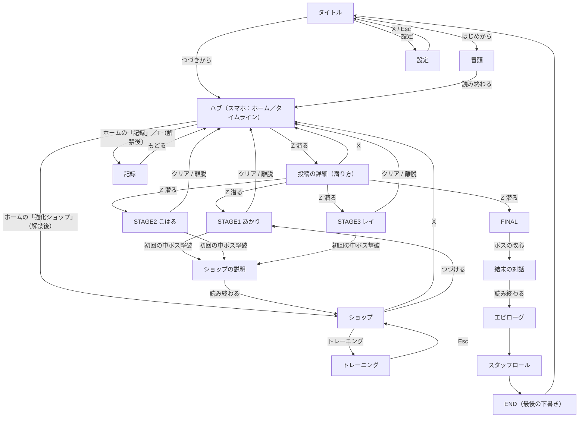
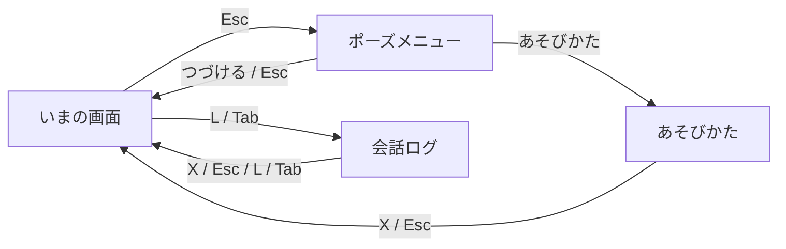
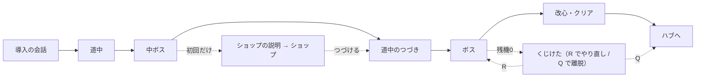

# 画面遷移

> **この記事の範囲**: 画面がいくつあり、どこからどこへ、どのキーで移るか。図と表で示す。各画面の中で何ができるかは → [05 ゲーム仕様 / 10 画面一覧](../05_ゲーム仕様/10_画面一覧.md)、キーの割り当ての全体は → [05 ゲーム仕様 / 01 操作](../05_ゲーム仕様/01_操作.md)。

## 遷移図

矢印の脇はその移動を起こすキーである。パッドでの対応は → [操作](../05_ゲーム仕様/01_操作.md)。

**重なる画面**（遷移ではなく、いまの画面の上に開いて閉じると戻る）。

## 画面ごとの入口と出口

| 画面 | ここへ来る道 | ここから出る道（キー） |
|---|---|---|
| タイトル | 起動時。スタッフロールの終わり。ポーズメニューの「タイトルへ」。設定から戻る | はじめから → 冒頭／つづきから → ハブ／設定（項目はこの3つだけ。チュートリアルの項目は練習面と一緒に畳まれている） |
| 冒頭 | タイトルの「はじめから」 | 読み終わる → ハブ。R 長押しで冒頭の最初へ |
| ハブ | 冒頭の終わり。面のクリア・離脱。ショップ・記録から戻る。最初の面をクリアするまではタイムラインだけ、以後はホーム画面から始まる | ホームのアプリ → SNS（タイムライン）・強化ショップ（最初の面をクリアするまで鍵）・記録（どれか一面をクリアするまで鍵）／タイムラインで Z → 投稿の詳細／J（RB）→ アカウント切り替え（その場で開く4択。結び手以外は各キャラの面のクリアで解禁）／X（B）→ ホーム／T → 記録／Esc → ポーズメニュー |
| 投稿の詳細 | ハブで声のする投稿に Z | Z → 面／X → ハブ |
| STAGE1〜3 | 投稿の詳細 | クリア → ハブ／ゲームオーバーの「（ステージから抜ける）」または Q（パッドは ×/B）→ ハブ／初回の中ボス撃破 → ショップの説明 |
| FINAL | 三面すべてクリア後、ハブの限界カードに Z | ボスの改心 → 結末の対話 |
| ショップの説明 | 全ゲームで初めて中ボスを倒したとき | 読み終わる → ショップ |
| ショップ | ハブのホームで「強化ショップ」。ショップの説明の終わり | X → ハブ／初回の導線から来たときは「つづける」→ 中断した面／「トレーニング」→ トレーニング |
| トレーニング | ショップの「トレーニング」 | Esc → ショップ |
| 記録 | ハブのホームで「記録」、またはタイムラインで T | 「もどる」→ ハブ |
| 設定 | タイトルの「設定」 | X・Esc → タイトル（保存して戻る） |
| 結末の対話 | FINAL のボスの改心 | 読み終わる → エピローグ。R 長押しでこの場面の最初へ |
| エピローグ | 結末の対話の終わり | 進めきる → スタッフロール。R 長押しで冒頭へ |
| スタッフロール | エピローグの終わり | 流れ切る／Z → タイトル。R 長押しでタイトルへ |

## 重なる画面

シーンを移らず、いまの画面の上に開く。閉じると元の画面がそのまま続く。

| 画面 | 開くキー | 開ける場所 | 閉じるキー |
|---|---|---|---|
| ポーズメニュー | Esc（OPTIONS / MENU） | 面、ハブ、ショップ、記録、ステージ0、ショップの説明 | 「つづける」／Esc |
| あそびかた | ポーズメニューの項目から | ポーズメニュー | X・Esc（× / B） |
| 会話ログ | L / Tab（SHARE / VIEW） | 会話の出る画面 | X・Esc・L・Tab |

ポーズメニューからは、手動セーブ（スロット1〜3）、音量の調整、面の途中なら「さいしょからやりなおす」「ハブへもどる」、そして「タイトルへ」が選べる。**「ハブへもどる」と「タイトルへ」を通るときはオートセーブが走る**ので、稼いだお金は捨てられない。

## 面の中の遷移

面のシーンは一つだが、その中は段で進む。段のあいだにシーンの移動は起きない。

残機が尽きても画面は移らない。**その場に縦積みの選択肢**「（ボスからやり直す）／（最初からやり直す）／（ステージから抜ける）」が出る（既定は一番上）。抜けるときだけハブへ移り、そのときオートセーブが走る。以前からの R / Shift+R / Q も同じように効く。

## 図の外 — 辿り着けない画面

仕組みは残っているが、今の導線からは到達しない。遊び手の目には触れない。

| 画面 | 状態 | なぜ辿り着かないか |
|---|---|---|
| 練習面「れんしゅう」 | 無効 | 切り替えの一箇所で止めてある。タイトルの項目から落ち、冒頭のあとの受講確認も出ずハブへ直行する。戻す余地はある（→ [04 機能の棚卸し](04_機能の棚卸し.md)） |
| W0 の試作面 | 未到達 | 初期の試作で、正典の導線に繋がっていない。ここでしか出ない敵（ヒカゲ系統）と、そこにぶら下がる自機の技も同じく到達しない |
| 難易度選択（単体画面） | 未到達 | 潜り方の選択はハブの投稿詳細が吸収し、さらに「どこから始めますか?」の入口の問いも廃止された。画面そのものは残っているが、通常の導線からは開かない |
| クレジット | 未到達 | 画面は残っているが、タイトルの項目からクレジットへの導線が今は無い |

この四つは上の遷移図に含めていない。**図に描かれている画面がすべて、今の遊び手が見る画面である。**

## 関連記事

- [01 全体の流れ](01_全体の流れ.md)（この遷移を筋として読む）
- [03 機能一覧](03_機能一覧.md)（画面ごとに乗っている機能）
- [04 機能の棚卸し](04_機能の棚卸し.md)（辿り着けない画面をどうするか）
- [05 ゲーム仕様 / 10 画面一覧](../05_ゲーム仕様/10_画面一覧.md)（各画面の中身）
- [05 ゲーム仕様 / 01 操作](../05_ゲーム仕様/01_操作.md)（キーの割り当て）

<!-- 出典: src/Hub.cs:40,45（強化・記録の解禁ゲート）・116-124, 231-241, 844-951（ホーム画面と3アプリ・HomeReveal・鍵つきの拒否）・1160-1168, 1738-1751（X＝ホーム・T＝記録・フッタ「アカウント」）・1002（入口を問う画面の廃止）, src/DiffSelect.cs:5-7,178,193（通常プレイでは到達しない）, src/Epilogue.cs:17,272-309（EPI → ROLL → END → タイトル）, src/GameManager.cs:1432-1466（ゲームオーバーの選択UI）, project.godot（main_scene=TitleMenu・autoload の PauseMenu/HowTo/Backlog）, 各 .tscn（Akari/Koharu/Rei/MinaBattle/Hub/Shop/ShopTutorial/Training/DiffSelect/Records/Settings/Credits/Prologue/Final/Epilogue/Stage0/TitleMenu/Main）, src/TitleMenu.cs（Item の分岐・Go・Tutorial 項目の脱落）, src/Prologue.cs（読み終わりの遷移・TutorialEnabled 分岐）, src/Hub.cs（Z/X/T の分岐・Dive・入口の問い分け）, src/DiffSelect.cs（Z 決定・X 戻り）, src/Shop.cs（X 退出・トレーニング入口・PendingResumeScene）, src/ShopTutorial.cs, src/TrainingRoot.cs（Esc 戻り）, src/Records.cs, src/Settings.cs, src/Credits.cs, src/StageZero.cs, src/Final.cs / src/Epilogue.cs（結末の連鎖と R 長押し）, src/PauseMenu.cs（開閉と「ハブへもどる」「タイトルへ」のオートセーブ）, src/HowToPlay.cs / src/Backlog.cs（開閉キー）, src/GameManager.cs（HandleGameOverExit の R/Q プロンプト・TutorialEnabled）, src/StageW0.cs / src/BossHikage.cs（非正典・到達しない） -->
