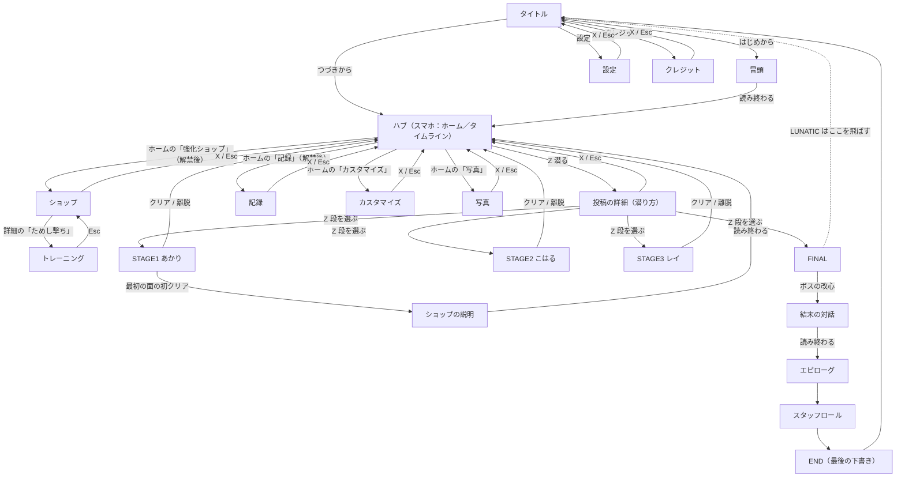
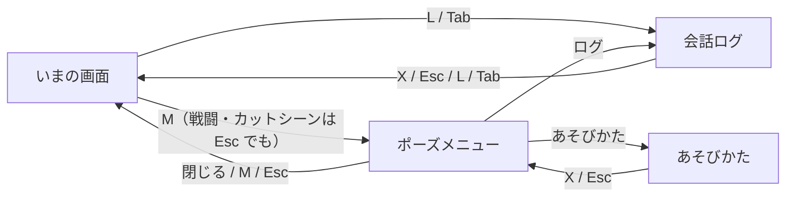
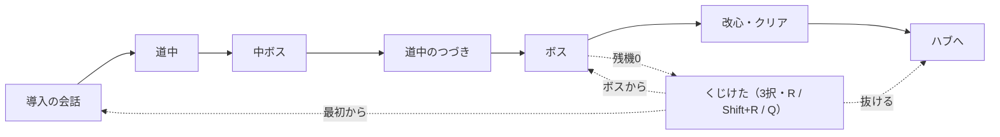

# 画面遷移

> **この記事の範囲**: 画面がいくつあり、どこからどこへ、どのキーで移るか。図と表で示す。各画面の中で何ができるかは → [05 ゲーム仕様 / 10 画面一覧](../05_ゲーム仕様/10_画面一覧.md)、キーの割り当ての全体は → [05 ゲーム仕様 / 01 操作](../05_ゲーム仕様/01_操作.md)。

## 遷移図

矢印の脇はその移動を起こすキーである。パッドでの対応は → [操作](../05_ゲーム仕様/01_操作.md)。

```mermaid
flowchart TD
  TITLE["タイトル"]
  PRO["冒頭"]
  HUB["ハブ（スマホ：ホーム／タイムライン）"]
  DETAIL["投稿の詳細（潜り方）"]
  SHOP["ショップ"]
  SHOPTUT["ショップの説明"]
  TRAIN["トレーニング"]
  REC["記録"]
  CUS["カスタマイズ"]
  PHOTO["写真"]
  SET["設定"]
  CRED["クレジット"]
  ST1["STAGE1 あかり"]
  ST2["STAGE2 こはる"]
  ST3["STAGE3 レイ"]
  FIN["FINAL"]
  FTALK["結末の対話"]
  EPI["エピローグ"]
  ROLL["スタッフロール"]
  END["END（最後の下書き）"]

  TITLE -->|はじめから| PRO
  TITLE -->|つづきから| HUB
  TITLE -->|設定| SET
  TITLE -->|クレジット| CRED
  CRED -->|X / Esc| TITLE
  SET -->|X / Esc| TITLE

  PRO -->|読み終わる| HUB

  HUB -->|Z 潜る| DETAIL
  HUB -->|ホームの「強化ショップ」（解禁後）| SHOP
  HUB -->|ホームの「記録」（解禁後）| REC
  HUB -->|ホームの「カスタマイズ」| CUS
  HUB -->|ホームの「写真」| PHOTO
  DETAIL -->|X / Esc| HUB
  REC -->|X / Esc| HUB
  CUS -->|X / Esc| HUB
  PHOTO -->|X / Esc| HUB
  SHOP -->|X / Esc| HUB

  DETAIL -->|Z 段を選ぶ| ST1
  DETAIL -->|Z 段を選ぶ| ST2
  DETAIL -->|Z 段を選ぶ| ST3
  DETAIL -->|Z 段を選ぶ| FIN

  ST1 -->|クリア / 離脱| HUB
  ST2 -->|クリア / 離脱| HUB
  ST3 -->|クリア / 離脱| HUB

  ST1 -->|最初の面の初クリア| SHOPTUT
  SHOPTUT -->|読み終わる| HUB
  SHOP -->|詳細の「ためし撃ち」| TRAIN
  TRAIN -->|Esc| SHOP

  FIN -->|ボスの改心| FTALK
  FTALK -->|読み終わる| EPI
  EPI --> ROLL
  ROLL --> END
  END --> TITLE
  FIN -.->|LUNATIC はここを飛ばす| TITLE
```

**重なる画面**（遷移ではなく、いまの画面の上に開いて閉じると戻る）。

```mermaid
flowchart LR
  ANY["いまの画面"]
  PAUSE["ポーズメニュー"]
  LOG["会話ログ"]
  HOWTO["あそびかた"]
  ANY -->|M（戦闘・カットシーンは Esc でも）| PAUSE
  PAUSE -->|閉じる / M / Esc| ANY
  ANY -->|L / Tab| LOG
  LOG -->|X / Esc / L / Tab| ANY
  PAUSE -->|ログ| LOG
  PAUSE -->|あそびかた| HOWTO
  HOWTO -->|X / Esc| PAUSE
```

## 画面ごとの入口と出口

| 画面 | ここへ来る道 | ここから出る道（キー） |
|---|---|---|
| タイトル | 起動時。スタッフロールの終わり。ポーズメニューの「タイトルへ」。設定・クレジットから戻る | はじめから → 冒頭／つづきから → ハブ／設定／クレジット（項目はこの4つ。チュートリアルの項目は練習面と一緒に畳まれている） |
| 冒頭 | タイトルの「はじめから」 | 読み終わる → オープニングフィルム（スキップ可） → ハブ。R 長押しで冒頭の最初へ |
| ハブ | 冒頭の終わり。面のクリア・離脱。ショップ・記録・カスタマイズ・写真から戻る。ショップの説明の終わり。最初の面をクリアするまではタイムラインだけ、以後はホーム画面から始まる | ホームのアプリ → SNS（タイムライン）・強化ショップ（最初の面をクリアするまで鍵）・記録（どれか一面をクリアするまで鍵）・写真・カスタマイズ／タイムラインで Z → 投稿の詳細／**Tab（パッド Y）またはスマホの左隣の「キャラ切り替え」ボタン** → アカウント切り替え（その場で開く4択＋性能パネル。ミナ以外は各キャラの面のクリアで解禁）／X・Esc（B）→ ホーム／M → ポーズメニュー |
| 投稿の詳細 | ハブで声のする投稿に Z | Z で段（難易度）を選ぶ → 面／X・Esc → ハブ。**FINAL も段を選ぶ**（初挑戦をミナで開いているときだけ段が出ず「アカウントを選ぶ」になる） |
| STAGE1〜3 | 投稿の詳細 | クリア → ハブ／ゲームオーバーの「（ステージから抜ける）」または Q（パッドは B）→ ハブ／**最初の面の初クリアのときだけ、ハブの帰還会話のあとショップの説明へ** |
| FINAL | 三面すべてクリア後、ハブの限界カードに Z | ボスの改心 → 結末の対話。**LUNATIC では結末の対話もエピローグも流さず、3 秒のリザルトのあとタイトルへ直行** |
| ショップの説明 | 最初の面を初めてクリアしてハブへ帰った回（帰還会話とホーム解禁の演出のあと） | 読み終わる → **ハブのホーム**（強化ショップのアイコンが誘導表示で光る） |
| ショップ | ハブのホームで「強化ショップ」 | X・Esc → ハブ／詳細パネルの「ためし撃ち」→ トレーニング |
| トレーニング | ショップの詳細パネルの「ためし撃ち」 | Esc・BackSpace（B）／左下の「ショップへもどる」→ ショップ |
| 記録 | ハブのホームで「記録」 | X・Esc（B）→ ハブ |
| カスタマイズ／写真 | ハブのホームで「カスタマイズ」「写真」 | X・Esc（B）→ ハブ |
| 設定 | タイトルの「設定」 | X・Esc → タイトル（保存して戻る）。「もどる」はクリックでも押せる |
| クレジット | タイトルの「クレジット」（2026-09-17 に導線が復活） | X・Esc → タイトル |
| 結末の対話 | FINAL のボスの改心 | 読み終わる → エピローグ。R 長押しでこの場面の最初へ |
| エピローグ | 結末の対話の終わり | 進めきる → スタッフロール。R 長押しで冒頭へ |
| スタッフロール | エピローグの終わり | 流れ切る／Z → タイトル。R 長押しでタイトルへ |

## 重なる画面

シーンを移らず、いまの画面の上に開く。閉じると元の画面がそのまま続く。

| 画面 | 開くキー | 開ける場所 | 閉じるキー |
|---|---|---|---|
| ポーズメニュー | **M**（Menu(≡)）。**戦闘画面とカットシーン（冒頭・FINAL・エピローグ）では Esc でも開く**。会話ボックス上辺の歯車ボタンからも | タイトル・設定・スタッフロールを除く全画面 | 「閉じる」／M・Start（どの階層からでも）／トップでの Esc |
| あそびかた | ポーズメニューの「あそびかた」行 | ポーズメニューが開ける場所すべて | X・Esc（B）／「とじる」 |
| 会話ログ | L / Tab（View）／ポーズメニューの「ログ」／会話ボックス上辺の一覧ボタン | 会話の出る画面（ハブとトレーニングでは Tab に別の役があるので L / View で） | X・Esc・L・Tab・右クリック |

ポーズメニューからは、あそびかた、手動セーブとロード（スロット 1〜3）、歯車から音量と画面モード、面の途中なら「離脱」「リスタート」「ログ」、そして「タイトルへ」が選べる（→ [10 画面一覧](../05_ゲーム仕様/10_画面一覧.md)）。**「離脱」と「タイトルへ」を通るときはオートセーブが走る**ので、稼いだお金は捨てられない。さらに**「タイトルへ」とウインドウの × では「セーブしますか？」の 3 択が挟まる**（セーブする→スロット選択／セーブしない／キャンセル）。

**右下の「Esc メニュー」チップは 2026-09-27 に廃止された。** クリックで開く役目は、スマホ系の画面（ハブ・ショップ・記録・カスタマイズ・難易度選択）の右下ヒント帯の「メニュー」項目が継いでいる——**戦闘画面にはヒント帯そのものが出ない**ので、自機がカーソルを追っている最中に誤ってメニューが開くことはない。

## 面の中の遷移

面のシーンは一つだが、その中は段で進む。段のあいだにシーンの移動は起きない。

```mermaid
flowchart LR
  A["導入の会話"] --> B["道中"]
  B --> C["中ボス"]
  C --> D["道中のつづき"]
  D --> E["ボス"]
  E --> F["改心・クリア"]
  F --> G["ハブへ"]
  E -.->|残機0| GO["くじけた（3択・R / Shift+R / Q）"]
  GO -.->|ボスから| E
  GO -.->|最初から| A
  GO -.->|抜ける| G
```

残機が尽きても画面は移らない。**その場に縦積みの選択肢**「（ボスから・スコア半分消費）／（最初からやり直す）／（ステージから抜ける）」が出る（既定は一番上）。先頭の行は**そのランでボスが出たあと**にだけ出る（道中で倒れたときは 2 択）。抜けるときだけハブへ移り、そのときオートセーブが走る。以前からの R / Shift+R / Q も同じように効く。**FINAL でも同じ 3 択が出る**（「ボスから」は導入と残響の三波を飛ばしてミナ戦から）。

**ショップの説明は面の途中には入らない**（2026-09-22 まではここに割り込んでいた）。いまは「最初の面のクリア → ハブの帰還会話 → ホーム解禁の演出 → ショップの説明 → ハブのホーム」の順で、面のシーンから離れない。

## 図の外 — 辿り着けない画面

仕組みは残っているが、今の導線からは到達しない。遊び手の目には触れない。

| 画面 | 状態 | なぜ辿り着かないか |
|---|---|---|
| 練習面「れんしゅう」 | 無効 | 切り替えの一箇所で止めてある。タイトルの項目から落ち、冒頭のあとの受講確認も出ずハブへ直行する。戻す余地はある（→ [04 機能の棚卸し](04_機能の棚卸し.md)） |
| W0 の試作面 | 未到達 | 初期の試作で、正典の導線に繋がっていない。ここでしか出ない敵（ヒカゲ系統）と、そこにぶら下がる自機の技も同じく到達しない |
| 難易度選択（単体画面） | 未到達 | 難易度の選択はハブの投稿詳細が吸収し（**2026-09-27 に FINAL も含めて全面そろった**）、さらに「どこから始めますか?」の入口の問いも廃止された。画面そのものは残っているが、通常の導線からは開かない |

この三つは上の遷移図に含めていない。**図に描かれている画面がすべて、今の遊び手が見る画面である。**

> **クレジットはこの表から外れた。** 2026-09-17 にタイトルメニューへ「クレジット」項目が追加され、到達できるようになった（楽曲のライセンス表記義務を果たす唯一の導線）。

> **あそびかたもこの表から外れた。** 2026-09-22 にポーズメニューへ「あそびかた」行が戻り、面の中でも外でも開けるようになった（→ 上記「重なる画面」）。

## 関連記事

- [01 全体の流れ](01_全体の流れ.md)（この遷移を筋として読む）
- [03 機能一覧](03_機能一覧.md)（画面ごとに乗っている機能）
- [04 機能の棚卸し](04_機能の棚卸し.md)（辿り着けない画面をどうするか）
- [05 ゲーム仕様 / 10 画面一覧](../05_ゲーム仕様/10_画面一覧.md)（各画面の中身）
- [05 ゲーム仕様 / 01 操作](../05_ゲーム仕様/01_操作.md)（キーの割り当て）

<!-- 出典: src/Hub.cs:49,1099（強化・記録の解禁ゲート）・1084（HomeApps＝SNS/強化ショップ/記録/写真/カスタマイズ）・231-241, 844-951（ホーム画面・HomeReveal・鍵つきの拒否）・1838-1842（X・Esc＝ホーム。C／J／T の直行キーは廃止）・2261-2320（キャラ切り替えボタン＝Tab / パッド Y）・2860-2875（フッタは「ホーム」「アカウント」の2項目）・1891-1899（FINAL も段を出す）・1054-1069（ショップ説明の発火＝最初の面クリア→ハブ帰還→ハブへ戻す）, src/ShopTutorial.cs 3-9, 128-143, src/PauseMenu.cs 62-84（あそびかたの行）・160-197（セーブしますか？）・305-323（CanOpenHere / EscOpensHere）・898-901（右下チップの廃止）, src/HowToPlay.cs 18-25（ポーズからの導線）, src/StageMina.cs 364-386（LUNATIC はタイトルへ直行）, src/DiffSelect.cs:5-7,178,193（通常プレイでは到達しない）, src/Epilogue.cs:17,272-309（EPI → ROLL → END → タイトル）, src/GameManager.cs:1898-1982（ゲームオーバーの選択UI＝3択の文言・2択への切り替え）, project.godot（main_scene=TitleMenu・autoload の PauseMenu/HowTo/Backlog）, 各 .tscn（Akari/Koharu/Rei/MinaBattle/Hub/Shop/ShopTutorial/Training/DiffSelect/Records/Settings/Credits/Prologue/Final/Epilogue/Stage0/TitleMenu/Main）, src/TitleMenu.cs（Item の分岐・Go・Tutorial 項目の脱落）, src/Prologue.cs（読み終わりの遷移・TutorialEnabled 分岐）, src/Hub.cs（Z／X・Esc の分岐・Dive・入口の問い分け）, src/DiffSelect.cs（Z 決定・X 戻り）, src/Shop.cs（X 退出・トレーニング入口・PendingResumeScene）, src/ShopTutorial.cs, src/TrainingRoot.cs（Esc 戻り）, src/Records.cs, src/Settings.cs, src/Credits.cs, src/StageZero.cs, src/Final.cs / src/Epilogue.cs（結末の連鎖と R 長押し）, src/PauseMenu.cs（開閉と「離脱」「タイトルへ」のオートセーブ）, src/HowToPlay.cs / src/Backlog.cs（開閉キー）, src/GameManager.cs（HandleGameOverExit の R/Q プロンプト・TutorialEnabled）, src/StageW0.cs / src/BossHikage.cs（非正典・到達しない） -->
